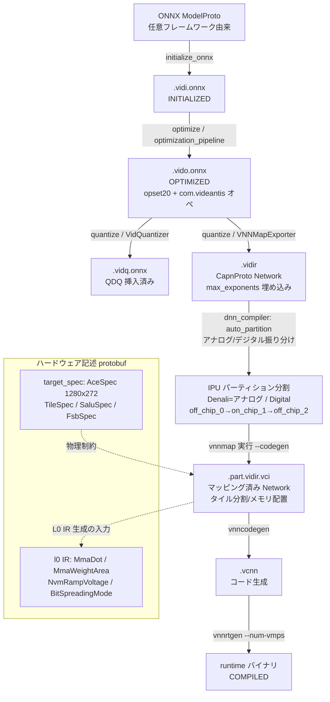

# Mythic M2000 AI アクセラレータ SDK コンパイラ 解析ドキュメント (01: コンパイルフロー)

対象 SDK: `vnnsdk 26.05` / 解析対象展開先: `mythic_sdk/_extracted_compiler/`

> 表記規約:
> - **断定**: ソースコードから直接確認できた事実。ファイルパス:行番号を併記する。
> - **[推測]**: コードから直接は確定できないが、シンボル名・文字列・コメントから合理的に推定した内容。
> - コンパイル済みバイナリ由来の根拠は「strings」として引用元を明記する。

---

## 1. 概要

Mythic M2000 は、フラッシュ (NVM) メモリセルをアナログ乗算器として用いる **アナログ compute-in-memory** 型 AI アクセラレータである。SDK のコンパイラは ONNX モデルを入力とし、以下の 4 状態を経て、ハードウェア用ランタイムバイナリ (`.vcnn`) を生成する。

状態遷移 (`vnnort/models/vid_model.py:26-32`, `ModelState(IntEnum)`):

```
INITIALIZED (0) → OPTIMIZED (1) → QUANTIZED (3) → COMPILED (4)
```

各状態は `VidModel` の `initialize()` / `optimize()` / `quantize()` / `compile()` により遷移する (`vid_model.py:78-83`)。状態ごとに ONNX ファイル拡張子が対応する (`vnnort/models/model_archive.py:20-24`):

| 状態 | ファイル拡張子 | 生成関数 |
|---|---|---|
| INITIALIZED | `.vidi.onnx` | `VidModel.__init__` → `initialize_onnx()` |
| OPTIMIZED | `.vido.onnx` | `VidModel.optimize()` (`vid_model.py:256`) |
| QUANTIZED | `.vidq.onnx` (+`.vidir`) | `VidModel.quantize()` (`vid_model.py:280`) |
| COMPILED | (バイナリ) | `vnncodegen.run_codegen()` |

コンパイルフローは「opset20化(.vidi)→最適化(.vido)→量子化(.vidir)→vnnmapマッピング(.vci)→vnncodegen(.vcnn)」の順に進む。各段階の詳細は以下の通り。

- **`.vidir`** は量子化完了時に `CapnprotoNetwork.save()` で書き出される Cap'n Proto 形式ネットワーク (`vid_model.py:321-323`)。ONNX 側の `.vidq.onnx` とは別に生成される。
- opset 目標バージョンは **20** (`vnnort/models/__init__.py:15`, `ONNX_OPSET_VERSION = 20`)。最適化パイプラインの `update_onnx_opset_version()` がこの値へ変換する (`vnnort/optimizer/utils.py:146,163`)。
- カスタムオペのドメインは **`com.videantis`** バージョン **1** (`vnnort/utils/onnx_utils/__init__.py:1-2`, `VIDEANTIS_ONNX_DOMAIN="com.videantis"`, `VIDEANTIS_ONNX_VERSION=1`)。

> 用語補足: SDK 内部では旧社名 **videantis** 由来の `vid*` プレフィックスと、`v-NN Mapper`(vnnmap) という呼称が一貫して使われる。ハードウェア (M2000) の物理仕様は `mythic.*` protobuf 側に定義される。

---

## 2. データフロー図



パイプライン全体を段階別に見た概念図:

```
[ONNX] --最適化--> [標準ONNX→vidオペ/融合] --量子化--> [8bit固定小数点+max_exponents]
   --エクスポート--> [.vidir CapnProto] --vnnmap--> [.vci タイル分割+メモリ配置]
   --vnncodegen--> [.vcnn] --vnnrtgen--> [nMPs別ランタイム]
```

---

## 3. フェーズ別詳細

### 3.1 最適化フェーズ (optimizer)

エントリは `optimization_pipeline()` (`vnnort/optimizer/optimizer.py:44-119`)。実行順は以下の通り (ログ文字列がそのまま段階名):

1. `move_static_cons_to_wgts` — 静的接続を重みへ移動
2. `remove_unused_wgts` / `remove_unused_nodes` — 未使用ノード/重み除去
3. `update_onnx_opset_version` — **opset 20 へ変換** (`utils.py:136`)
4. `infer_shapes_runtime` — 形状推論 (実データを流して確定)
5. **`pattern_match`** — パターン書換え (中核, `pattern_detection.py:298`)
6. `fuse_muls` / `fuse_reshape_modes` — 乗算・reshape_mode 融合
7. `optimize_execution_order` → `standardize_naming` → 最終形状推論

> 注記: `run_optimization()` (`optimizer.py:27-41`) は「TODO: 未実装」で、実体は `optimization_pipeline()` 側にある。

#### 3.1.1 パターン書換えの仕組み

`pattern_match()` (`pattern_detection.py:298-335`) は `onnxscript.rewriter` を用いる。全ルールは `patterns.py` 内で `RewriteRuleClassBase` を継承したクラスとして定義され、`fetch_pattern_rules()` (`patterns.py:17-48`) が全サブクラスを収集し **`level` 属性の降順** に適用する。`level` 未定義のクラスは 1 とみなされる (`patterns.py:38-39`)。`ShortcutPatternLinear` / `vidConvShortcutPreFuse` / `vidConvShortcutPostFuse` は自動収集から除外され、`ShortcutPatternLinear` はパイプライン末尾で個別適用される (`patterns.py:44`, `pattern_detection.py:331-334`)。

`patterns.py` 内の `RewriteRuleClassBase` 継承クラスは **64 個** 存在する (`grep -c` により確認)。各ルールは `pattern()`(検出), `check()`(条件, 任意), `rewrite()`(置換) を持つ。

#### 3.1.2 主要 RewriteRule 分類表

以下は `patterns.py` の全 RewriteRule を機能別に分類したもの。level は適用優先度 (高いほど先)。

**(A) 行列積 → Conv 統一 (MatMul/Gemm を Conv に一本化)**

| クラス | 行 | level | 元パターン | 変換先 | 条件 |
|---|---|---|---|---|---|
| `GemmConvReplace2D` | 1127 | 0 | `Gemm(transB=1)` | `vidConv(dim=2)` | 入力2次元 |
| `MatMulConvPattern4Dim` | 1675 | 1 | `MatMul+Add` | `Transpose→Conv→Transpose` | 入力4D・bias1D |
| `MatMulConvPattern3Dim` | 1702 | 0 | `MatMul+Add` | `Transpose→Unsqueeze→Conv→Squeeze→Transpose` | 入力3D・bias1D |
| `MatMulConvPattern3DimNoBias` | 1737 | 0 | `MatMul` | 同上(bias無) | check=False で無効化中 |
| `MatMulConvPattern2Dim` | 1768 | 1 | `MatMul+Add` | `Unsqueeze→Conv→Squeeze` | 入力2D |
| `ConvToVidConv` | 1200 | 0 | `Conv(bias有)` | `vidConv` | 入力4D |
| `ConvToVidConvNoBias` | 1150 | -1 | `Conv(bias無)` | `vidConv` | 入力4D |
| `VidConvwReshape` | 1795 | 1 | `vidConv+Reshape` | `vidConv(reshape_mode=FLATTEN_W)` | reshape が[1,C,1,-1] |

行列積を Conv に統一する狙いは、後段のアナログ MMA(行列積エンジン)へすべてを畳み込み表現でマップするため。MatMul の重みは `Transpose(1,0)` + `Unsqueeze` で `[Cout,Cin,1,1]` の Conv カーネルに整形される (`patterns.py:1726-1728` など)。

**(B) Conv 融合系 (BatchNorm/スケール/並列統合)**

| クラス | 行 | level | 内容 |
|---|---|---|---|
| `ConvBatchNormFuse` | 820 | 2 | Conv+BN(Mul) 融合 |
| `ConvParallelBatchNorm` | 841 | 3 | 並列 BN を Conv へ吸収 |
| `ParallelConvFuse` | 919 | 4 | 並列 Conv を結合 |
| `ConvNoNormFuse` | 1545 | 2 | vidConv→Squeeze→Flatten→vidNoNorm 融合 |
| `ConvMulPostFuse` / `ConvMulPostFuse3DWGT` | 3148/3271 | 1 | Conv 後段の Mul を重みへ |
| `ConvMulAddPreFuse` | 3299 | 2 | Conv 前段の Mul+Add を吸収 |
| `vidConvShortcutPreFuse`/`PostFuse` | 3175/3219 | 1 | Shortcut と Conv の融合(個別適用) |
| `MergeScalarIntoConvTranspose(WithBias/NoBias)` | 3609/3667/3680 | 2 | ConvTranspose へスカラー融合 |
| `ConvTransposePadFuse` | 1252 | 1 | Pad を ConvTranspose へ融合 |

**(C) 活性化/正規化検出**

| クラス | 行 | level | 変換先オペ |
|---|---|---|---|
| `SwishPattern` | 1023 | 12 | `Swish` (com.videantis) |
| `MishPattern` / `MishPattern2` | 1040/1060 | 12 | `Mish` |
| `GeluPattern` / `GeluPattern_2` | 3057/3077 | 10 | Gelu 検出 |
| `ClipToRelu6` | 3545 | 2 | `Relu6` |
| `ElemLayerNormPattern`(3種) | 1465/1489/1513 | 2 | `vidLayerNorm` |
| `ElemRMSNormPattern` | 3523 | 2 | `RMSNormalization` |
| `SoftmaxToVidSoftmax` | 3574 | 2 | `vidSoftmax` |
| `LlamaRotaryPositionalEmbeddings` | 1424 | 3 | `vidRope` [推測: LLaMA系RoPE] |

**(D) プーリング/形状操作**

| クラス | 行 | level | 変換先 |
|---|---|---|---|
| `VidAveragePoolPattern` | 703 | 10 | `vidAveragePool` |
| `VidGlobalAveragePoolPattern` | 528 | 1 | `vidAveragePool` |
| `VidMaxPoolPattern` | 632 | 1 | `vidMaxPool` |
| `VidReduceMeanPattern` | 488 | -1 | (平均プール等価) |
| `VidConcatPattern` | 559 | 1 | `vidConcat(axis=1)` |
| `VidFlattenPattern` | 687 | 1 | `vidFlatten(axis=1)` |
| `SplitToSlice` | 447 | 1 | Split→Slice |
| `TransposeSplit`/`doubleTranspose`(系) | 1644/3098… | 1-15 | Transpose 正規化・除去 |
| `IdentityPattern`/`RemoveIdentityLayer` | 1627/3693 | 1/2 | Identity 除去 |
| `MultiQueryExpand` | 1078 | 8 | `vidMultiQueryExpand` [推測: GQA/MQAのKV展開] |

**(E) Swin Transformer 系ウィンドウ分割**

| クラス | 行 | level | 変換先 |
|---|---|---|---|
| `PartitionWindows` / `PartitionWindowsReverse` | 293/375 | 1 | `vidPartitionWindows(Reverse)` |
| `PartitionWindowsShifted` / `...ShiftedReverse` | 51/178 | 1 | シフト窓分割 |

> ここでの "Partition" は Swin のウィンドウ分割であり、後述のハードウェアのタイル分割 (vnnmap) とは無関係な別概念である点に注意。

**(F) Shortcut (残差加算/乗算)**

| クラス | 行 | level | 変換先 |
|---|---|---|---|
| `ShortcutPatternLinear` | 782 | 1 | `Shortcut(mode=addition)` (末尾個別適用) |
| `ShortcutMulPatternLinear` | 748 | 1 | `Shortcut(mode=multiplication)` |

**(G) Attention / Transformer 書換え (最重要)**

Attention 系は level=6〜8 で優先的にマッチされる。共通方針は **「Q/K/V 射影とスコア計算 (QKᵀ, softmax, ·V, 出力射影) をすべて Conv + Shortcut + vidSoftmax に分解し、行列積をアナログ MMA が処理できる Conv 表現へ変換する」** こと。

| クラス | 行 | level | 対象アーキテクチャ |
|---|---|---|---|
| `AttentionDetr` / `AttentionDetr2` / `AttentionDetr3` | 2083/2258/2433 | 8 | DETR 型 (位置エンコーディングbias有) |
| `TruncatedAttentionDetr` / `...Detr2` | 1836/1951 | 6 | デコーダ先頭ブロックの短縮版 |
| `AttentionBERT` / `AttentionBERT2` / `AttentionBERT3` | 2597/2734/2922 | 8 | BERT 型 |
| `AttentionViT` | 3365 | 8 | Vision Transformer 型 |
| `FFNTransformer` / `...GELU` / `...GELUConvNext` | 1294/1338/1382 | 6 | Transformer FFN ブロック |

`AttentionDetr.rewrite` (`patterns.py:2141-2255`) の具体変換を例示すると:

- Q 射影: 重み `Q_W` を `div` で除算しスケール吸収 (`patterns.py:2169-2170`)、`Transpose(1,0)+Unsqueeze` で Conv カーネル化 (`2177-2178`)、入力を `Transpose(2,1,0)+Unsqueeze` して `op.Conv(q, Q_W2)` + `Shortcut`(bias加算) (`2185-2194`)。
- K 射影: 同様に Conv 化し、`Shortcut(reshape_mode="TRANSFORMER_QK", group=[8])` (`2214-2222`)。
- QKᵀ: `op.Conv(q, k, group=8)` として畳み込みで実装 (`2224`)、続いて `vidSoftmax(group=[8])` (`2225`)。
- V 射影: `vidConv(reshape_mode="TRANSFORMER_V")` (`2236-2244`)。
- ·V と出力射影: `op.Conv(qk, v_new3, group=8)` → `op.Conv(qkv, O_W2, O_B)` (`2246-2250`)。

すなわち **アテンションヘッド数は `group=8` としてグループ畳み込みに写像**され、QKᵀ とアテンション重み ·V が「動的重みを持つ畳み込み」として表現される。`reshape_mode` はこのアテンション用の内部並べ替えを表す (次節)。

#### 3.1.3 vidConv カスタムオペ schema と reshape_mode

`vidConv` の定義は `vnnort/optimizer/functions.py:522-656` (`@script(values.Opset("com.videantis", 1))`)。属性:

| 属性 | 型/既定 | 意味 |
|---|---|---|
| `dilations` | `(1,1)` | 膨張 |
| `group` | `1` | グループ数 |
| `kernel_shape` | `(1,1)` | カーネル形状 |
| `pads` | `(0,0,0,0)` | pad_top,left,bottom,right |
| `strides` | `[1,1]` | ストライド |
| `dim` | `4` | 2 or 4。2 の場合 Unsqueeze で疑似4D化 (`functions.py:568-572`) |
| `reshape_mode` | `"None"` | 出力の並べ替えモード(下表) |
| `reshape_mode_groups` | `[1]` | TRANSFORMER_QK のグループサイズ |
| `reshape_swin` | `[0,0,0,0]` | Swin 用 reshape |
| `auto_pad` | `"NOTSET"` | ONNX auto_pad |

**reshape_mode 列挙の意味** (`functions.py:550-655`, および `vnnmap_export.py:272-288` の CapnProto `ConvAttributes.ReshapeMode` 対応):

| reshape_mode | CapnProto 値 | 挙動 (functions.py) |
|---|---|---|
| `None` | `none` | 変形なし |
| `MUL_EXPAND` | `mulExpand` | ブロードキャストスケーリング用に対角展開(`EyeLike` 乗算, `functions.py:609-620`)。要素積を Conv で近似 |
| `TRANSFORMER_V` | `transformerV` | `Transpose(perm=(1,3,0,2))` で V 射影を整形 (`621-622`) |
| `TRANSFORMER_QK` | `transformerQK` | チャネルを `reshape_mode_groups` でグループ化し `Reshape→Transpose(1,3,2,0,4)→Reshape` (`623-637`)。ヘッド分割 |
| `FLATTEN_W` | `flattenW` | `[N,C,H,W]→[N,C,1,H*W]` に平坦化 (`638-646`) |
| `SWIN_QK` | (export 未対応) | Swin 用 `Reshape+Transpose(0,1,3,2)` (`647-654`) |

その他の `com.videantis` カスタムオペ (functions.py 内 `@script` 定義):
`Shortcut`(96), `Swish`(143), `Mish`(160), `Relu6`(180), `vidFlatten`(660), `vidConcat`(678), `vidMaxPool`(696), `vidAveragePool`(734), `vidSoftmax`(788), `vidSoftmax_Mask`(836), `vidLayerNorm`(867), `vidMultiQueryExpand`(964), `vidConv_ATTN_V/QK/QK_s`(1051/1106/1129), `vidRope`(1151), `vidScatter`(1195), `vidGridSample`(1222), `vidPartitionWindows(Shifted/Reverse)`(197/285…)。

`vidSoftmax` (`functions.py:788-`) は グループ化 softmax で、`[N, group*C, ...]` を `[N*group, C, -1]` に reshape して axis=1 に softmax をかける (`804-827`)。これがアテンションのヘッドごと独立 softmax を実装する。

`Shortcut` (`functions.py:96-`) は `reshape_mode` 属性を持ち、`TRANSFORMER_QK` 指定時にアテンションスコア整形を行う (`functions.py:124-`)。

---

### 3.2 量子化フェーズ (quantizer)

エントリは `VidQuantizer.run()` (`vnnort/quantizer/vid_quantizer.py:90-116`)。処理順:

1. `_gather_tensor_quant_infos` — 各レイヤハンドラから `TensorQuantInfo` 収集
2. `_collect_tensor_statistics` — キャリブレーションデータで統計収集(ヒストグラム)
3. `_calculate_quantization_ranges` — パーセンタイルから範囲決定
4. `_quantization_range_postprocessing` — power-of-two 化 + レイヤ別調整
5. `_add_fake_quant_layers` — QDQ ノード挿入
6. `VNNMapExporter.export()` — CapnProto (`.vidir`) へエクスポート

#### 3.2.1 量子化フォーマット

固定小数点は **8bit 対称・power-of-two スケール (max_exponent 表現)**。中核は `quant_utils.py`:

- 量子化スケール: `quantize_values()` (`quant_utils.py:163-202`)。
  - `max_value = 2**(n_bits-1)` (符号1bit, `line 197`)
  - `scale_factors = max_value / (2.0**max_exponents)` (`line 198`)
  - `result = clip(round(fp_data * scale_factors), -max_value, max_value-1)` (`199-200`)
- power-of-two 化: 範囲を `round_up_to_power_of_two()` (`quant_utils.py:11-25`) で `2**ceil(log2(x))` に切り上げ。
- max_exponent 変換: `power_of_two_values_to_exponents()` (`138-160`) で `round(log2(|range|))` を **int8** で表現。power-of-two でなければ例外。

`TensorQuantInfo` (`quant_utils.py:233-263`) フィールド: `n_bits`, `n_fraction_bits`, `axis`, `power_of_two_scaling_only`, `quantization_ranges`, `max_exponents`, `adjusted_max_exponents`。

`_quantization_range_postprocessing` (`vid_quantizer.py:235-266`) では常に `power_of_two_scaling_only = True` を設定 (`line 250`)、範囲を power-of-two に切り上げ、`max_exponents` と初期 `adjusted_max_exponents` を計算する。

#### 3.2.2 ビット幅・軸のポリシー (layer_handlers.py)

`QUANT_HANDLER_OP_REGISTRY` (`layer_handlers.py:663-679`) が op_type → ハンドラを対応付ける。既定 (`DefaultLayerHandler`, `layer_handlers.py:56-82`): **8bit, 7 fraction bits, axis=1 (チャネル軸 C)**。

| テンソル | ビット | fraction | 軸 | 根拠 |
|---|---|---|---|---|
| 活性化(既定) | 8 | 7 | 1 (C) | `layer_handlers.py:73-76` |
| vidConv 重み(静的) | 8 | 7 | 0 (Cout, **per-channel**) | `layer_handlers.py:113` |
| vidConv bias | **16** | 14 (2s14) | 0 | `layer_handlers.py:120-125` |
| LayerNorm scale | 8 | 7 | 0 | `layer_handlers.py:455-459` |
| LayerNorm bias | **16** | 15 | 0 | `layer_handlers.py:464-468` |
| 最終層 (GRAPH_OUTPUT) | 8 | 7 | **per-tensor 強制** | `vid_quantizer.py:242-248` |

最終層 per-tensor 強制: `disable_last_layer_channelwise=True`(既定, `quantization_config.py:28`) のとき、`make_quantization_ranges_tensor_wide()` で全チャネルを最大値に揃える (`vid_quantizer.py:245-248`)。分類モデルでキャリブレーションに全クラスが現れない場合の劣化を防ぐため。

キャリブレーション設定 (`quantization_config.py`): `calibration_dataset_size=20`, `percentile=100.0`, `percentile_histogram_bins=64`。

#### 3.2.3 max_exponent 整合アルゴリズム (tensor_range_postprocess の数式化)

各ハンドラの `tensor_range_postprocess()` は、ハードウェアのアナログ乗算の制約に合わせて `adjusted_max_exponents` を調整する。**アナログ MMA は「1つの出力への全入力積が同一の指数(スケール)を共有」する必要がある** ([推測]: `_adjust_max_exponents` コメント "the inner sum between weights and inputs is always the same … implemented by shifting the mantissa of the weights" `layer_handlers.py:260-261`)。演算別に整理:

**(1) VidConv (`VidConvHandler._adjust_max_exponents`, layer_handlers.py:233-291)**

重み指数を入力指数へ整合させる。表記: 入力指数 `e_in[Cin]`、重み指数 `e_w[Cout]`(1D→2D展開)、グループ数 `G`。

- 重みを入力チャネル方向に複製: `e_w2[Cout, Cin] = repeat(e_w)` (`line 265`)
- 各出力チャネルの積指数: `s[Cout, Cin] = e_w2 + e_in` (グループ単位, `266-269`)
- 各出力チャネルの最大: `M[Cout] = max_over_Cin(s)` (`line 271`)
- 調整量: `adjustment = M[:,None] - s` (`line 272`)
- 調整後重み指数: `e_w_adj = e_w2 + adjustment` (`line 273`)

これにより **同一出力チャネル内の全 (weight+input) 指数和が `M` に揃う**。数式では、任意の入力チャネル c について `e_w_adj[o,c] + e_in[c] = M[o]` (定数)。

bias 整合 (`layer_handlers.py:277-289`): bias 指数 `e_b[Cout]` と `M+1` を比較し、
- `e_b > M+1` (bias が大): 重み側を `e_b - M` だけ引き上げ (`282-284`)
- それ以外: bias を `M` に揃える (`286-287`)

サニティチェック (`layer_handlers.py:205-213`): `weight_input_mul_exponents` と bias 指数が一致しなければ例外。

さらに **プリ/ポスト活性化指数の飽和処理** (`layer_handlers.py:215-231`):
- `diff = output_max_exponents - weight_input_mul_exponents`
- `mask = (diff > 2) & (output_max_exponents > 5)` の箇所を `weight_input_mul_exponents + 2` にクリップ (`max_dev=2`, `line 223-225`)。
- 後続が `Swish` の場合はその活性化テンソルも同様にクリップ (`227-231`)。
- `reshape_mode != "None"` の場合はこの飽和処理をスキップ (`216-217`)。

**(2) Relu (`ReluHandler`, layer_handlers.py:606-616)**
入力と出力の指数を一致させる要求。出力指数を入力へコピー: `input.adjusted_max_exponents[:] = output.adjusted_max_exponents` (`line 616`)。負値はどのみち 0 にクリップされるため、入力を出力指数にクリップして精度を稼ぐ。

**(3) Sigmoid (`SigmoidHandler`, layer_handlers.py:619-641)**
出力指数を常に 0 に固定: `output.adjusted_max_exponents.fill(0)` (`line 641`)。Sigmoid 出力は [0,1] 範囲のため指数=0 (=範囲2⁰)。

**(4) vidSoftmax (`SoftmaxHandler`, layer_handlers.py:505-558)**
グループ (アテンションヘッド) 間で指数を共有。入出力とも `reshape([groups,-1]).max(axis=-1)` で各グループ最大を取り、グループ内チャネル数だけ繰り返して割当 (`line 550-558`)。

**(5) MaxPool / Resize (`MaxPoolHandler`/`ResizeHandler`, layer_handlers.py:491-502, 378-389)**
入力と出力の指数を同一にする(v-NN Mapper の要件)。`output.adjusted_max_exponents = input.adjusted_max_exponents.copy()`。

**(6) Concat / Shortcut / LayerNorm / Gather / GridSample**
主に `tensor_quant_infos()` で量子化対象を宣言。Shortcut の指数整合ロジックはコメントアウトされ現在無効 (`layer_handlers.py:334-362`)。

#### 3.2.4 CapnProto (.vidir) へのエクスポート (vnnmap_export.py)

`VNNMapExporter` (`vnnort/utils/vnnmap_export.py:44-`) が ONNX グラフを Cap'n Proto ネットワークへ変換する。

**ONNX オペ → CapnProto 変換辞書** (`vnnmap_export.py:65-89`, `onnx_to_capnproto_convert`):

| ONNX op_type | 変換関数 | CapnProto LayerType |
|---|---|---|
| `vidConv` | `_parse_vid_conv` | `conv` |
| `ConvTranspose` | `_parse_conv_transpose` | `convTranspose` |
| `vidMaxPool` | `_parse_max_pool` | `maxPool` |
| `vidAveragePool` | `_parse_average_pool` | `averagePool` |
| `Shortcut` | `_parse_shortcut` | `shortcut` |
| `vidFlatten` | `_parse_flatten` | `flatten` |
| `Concat` | `_parse_concat` | `concat` |
| `Resize` | `_parse_resize` | `resize` |
| `vidLayerNorm` | `_parse_layer_norm` | `layerNorm` |
| `RMSNormalization` | `_parse_rms_norm` | `rmsNormalization` |
| `vidSoftmax` | `_parse_softmax` | `softmax` |
| `Squeeze` / `Reshape` / `Transpose` / `Slice` / `Gather` | 各 | `squeeze`/`reshape`/`transpose`/`slice`/`gather` |
| `vidRope` | `_parse_rope` | `rope` |
| `Expand` | `_parse_expand` | `expand` |
| `RETRTransformation`/`RTRTransformation`/`RERTransformation` | 各 | `retr`/`rtr`/`rer` |
| `vidScatter` | `_parse_scatter` | `scatter` |
| `vidGridSample` | `_parse_grid_sample` | `gridSample` |

**活性化融合** (`vnnmap_export.py:335-343, 1154-1162`): vidConv/Shortcut/ConvTranspose の直後に活性化(1消費者)があれば、その活性化を conv 属性に融合する。`activation` 属性に `_parse_activation_type()` (`223-257`) で対応する `ActivationType`(relu/relu6/swish/hardswish/clip/hardsigmoid/sigmoid/gelu/mish/leakyrelu) を設定し、`preActivationOutput` に活性化前テンソルを、`output` に活性化後テンソルを紐付ける。活性化ノード自体は `_add_layers` でスキップ (`186-188`)。活性化判定は `_is_activation_function()` (`1213-1229`): Gelu/Sigmoid/Swish/HardSigmoid/Relu/Relu6/Mish/LeakyRelu/HardSwish。LeakyRelu は alpha=0.1、HardSigmoid は alpha=1/6・beta=0.5 のみ許可 (`1218-1226`)。

**テンソルへ渡すメタデータ** (`_add_tensors`, `vnnmap_export.py:105-176` → `network.add_tensor`, `network.py:226-305`):

- `max_exponents` (int8 バイト列, `network.py:274-277`, フィールド `tensor.maxExponents`)
- `adjusted_max_exponents` (int8, `network.py:279-282`, `tensor.adjustedMaxExponents`) ← 実際に量子化で使う指数
- `n_bits` (`tensor.nBits`, `network.py:269-270`)
- `quant_axis` (`tensor.quantAxis`, `network.py:271-272`) ← 重みの2D軸 `(0,1)` は先頭のみ渡す (`vnnmap_export.py:124-127`)
- `shape` / `tensor_type` (graphInput/graphOutput/dynamic/static, `vnnmap_export.py:199-221`) / `data`(静的重みの実データ)

重要: `_add_tensors` は max_exponents が3次元以上だと例外 (`vnnmap_export.py:129-130`)。動的バッチ (-1) は 1 に固定 (`140-141`)。整数テンソル(position_ids 等)は量子化なしで別途追加される (`155-176`)。fixed_point_data は `None` で渡され、固定小数点計算はコメントアウト済み (「TODO: capnproto schema から除去予定」`vnnmap_export.py:133-134`)。

---

### 3.3 アナログ/デジタル振り分けとグラフ分割 (dnn_compiler)

アナログ/デジタルの振り分けを行う本体は **`dnn_compiler` バイナリ** (`/mythic/dnn_compiler`, 約23MB ELF) であり、`strings` 解析によって**振り分けの所在・単位・判定基準が具体的に判明している**。振り分けは後述 3.4 の `vnnmap`(v-NN Mapper) ではなく、この `dnn_compiler` の役割である。

#### 3.3.1 振り分けの実装場所

`dnn_compiler` の strings から、パーティショニング(分割)を行うソースファイルが特定できた:

```
mythic/optimizer/high/passes/auto_partition.cpp / auto_partition.hpp
mythic/optimizer/high/passes/partition.cpp
mythic/optimizer/high/passes/joint_parallelize_and_partition.cpp
mythic/optimizer/l0/passes/inherit_sections_and_threads.cpp
mythic/optimizer/l0/passes/keep_only_sections.cpp
mythic/hw/ipu.cpp
```

すなわち **High-level IR 上の最適化パス `auto_partition` がグラフ分割の中核**である [strings 根拠]。

#### 3.3.2 用語体系: Denali = アナログ IPU

- **Denali** = アナログ IPU (compute-in-memory コア) の内部コード名。判定関数 `hw::IsDenali(Ipu)` が存在する [strings: `CHECK FAILED: hw::IsDenali(crate.Ipu())`, `Denali-specific lowering called on non-Denali IPU!`]。
- **Digital** = デジタル実行。Conv 単位で `conv.IsDigital()` により判定される [strings: `CHECK FAILED: conv.IsDigital()`]。
- **IPU** (= Inference Processing Unit) が分割の単位。ターゲットは複数 IPU を持ちうる [strings: `Target must contain at least one Ipu`, `IPU's, but Target only has`]。
- artifact 内の `compiler_ready_artifact` (`off_chip_0`/`on_chip_1_bcm`/`off_chip_2`) を生成するのもこの `dnn_compiler` 系である (Python 側には `off_chip`/`on_chip`/`compiler_ready_artifact` 生成コードは**存在しない**ことを grep で確認済み)。

#### 3.3.3 振り分けの判定基準

strings から復元した、アナログ(Denali)かデジタルか、および分割数を決める基準:

1. **演算種別による可否判定** — その演算がアナログコアで実行可能かをチェックし、不可ならデジタル/ホスト側へ落とす:
   - `"! DepthwiseConv is not supported on Denali."` — DepthwiseConv はアナログ不可
   - `"! Only digital Convs are supported."` — 特定条件の Conv はデジタルのみ
   - `"CHECK FAILED: !hw::IsDenali(GetCrate(depthwise_conv).Ipu())"` — DepthwiseConv が Denali IPU に置かれていないことを保証
   - ACE で扱えない活性化: `" is not supported by ACE activations on target "`

2. **物理 SRAM サイズ制約による分割** — オンチップ SRAM に収まらなければパーティションを増やす [strings]:
   - `"exceeds the max partition size."`
   - `"partitions due to the physical SRAM size requirements"`
   - `CHECK FAILED: total_used_sram < sram_features.eff_available_sram_size * num_partitions_`
   - `CHECK FAILED: num_partitions_ <= static_cast<int>(mma_dot_weights_.size())` — 分割数は重み行列数以下

3. **分割境界の infeed/outfeed 接続** — 分割ステージ間はフィード(ストリーム)で接続され、これが artifact の `off_chip → on_chip → off_chip` 連鎖に対応する [strings]:
   - `"Snip commands produced offchip connection from outfeed \""`
   - `"Snip commands produced following outfeed->infeed connections:"`
   - `"Graph is partitioned into "`, `"Finished partitioning"`, `"Empty partition!"`

#### 3.3.4 High IR が扱う演算ノード種別

`dnn_compiler` の High IR ノード variant (strings のデマングルより) は以下を含む。これがアナログ/デジタル/フィードへ振り分けられる対象演算の全体像である:

```
Function, ElementWise, Upsample, Pad, Reshape, Rescale, AveragePool, MaxPool,
Dense, Conv, DepthwiseConv, MmaDot, GlobalAveragePool, Slice, Cat, Add, Infeed, Outfeed, Constant
```

このうち **`MmaDot` / `Conv` / `Dense` がアナログ行列積 (Denali/ACE) の対象**、`DepthwiseConv` や一部の活性化・整形演算はデジタル側という振り分けになる [strings 根拠 + 3.3.3 の判定基準からの整理]。

#### 3.3.5 判明していないこと (限界)

原理・判定基準・実装ファイル名は判明したが、以下は **C++ バイナリの逆アセンブルが必要で未確定**:
- 最適な分割点(どのノード境界で切るか)を選ぶ探索アルゴリズムとコスト関数の詳細
- `auto_sectioning_mgr` による section 数の上下限決定ロジック (`upper_bound_section_num_`)
- 複数の分割解が存在する場合の選択優先順位

> 要約: アナログ/デジタル振り分けは **`dnn_compiler` の `auto_partition` パスが、①演算種別のアナログ実行可否 (`IsDenali`/`IsDigital`)、②物理 SRAM 容量、を基準に IPU パーティションへ振り分ける**。未確定なのは探索アルゴリズムの内部実装のみ。

---

### 3.4 マッピングフェーズ (vnnmap / v-NN Mapper)

`.vidir` (CapnProto Network) を入力に、レイヤをタイル分割しメモリ配置を決め、`.vci` を生成する。**実体はコンパイル済み C++ バイナリ** (`vnnmap`, 約3MB ELF)。Python (`vnnmap/*.py`) は system config 生成・バイナリ起動・stdout/CSV 解析の薄いラッパである。

> 3.3 の `dnn_compiler`(High/L0 IR 最適化・パーティショニング) と本節の `vnnmap`(タイル内分割・メモリ配置) は別バイナリ・別段階である。アナログ/デジタルの振り分け(どの演算をアナログコアに載せるか)は 3.3 の `dnn_compiler` が担い、`vnnmap` はその結果を受けてレイヤ内のタイル分割 (partN/H/W) とマルチコア(v-MP)割当・メモリ配置を行う [推測: 両者の入出力関係からの整理]。

> バイナリのビルドルート (strings 由来): `/home/pwu/vid_nnsdk/released_artifact_26_05/_build/vid_nnsdk/libs/vid_aimap/vnnmap/`

#### 3.4.1 system_config の構造と既定値

`_build_system_config_string` (`vnnmap/run_vnnmap.py:50-60`) が生成する INI ファイル `system.cfg` (セクション `[sys]`):

| フィールド | 定数 (`run_vnnmap.py:14-19`) | 既定値 | 意味 |
|---|---|---|---|
| `nMPs` | `DEFAULT_N_MPS` | **1** | Matrix Processor コア数 |
| `OCRAM0` | `DEFAULT_OCRAM0` | 0 (未使用) | オンチップSRAMバンク0 (bytes) |
| `OCRAM1` | `DEFAULT_OCRAM1` | **2_097_152 (2MB)** | オンチップSRAMバンク1 (bytes) |
| `DDR` | `DEFAULT_DDR` | 536_870_912 (512MB) | オフチップDDR (bytes) |
| `frequency` | `DEFAULT_FREQUENCY` | 625_000_000 (625MHz) | コアクロック |
| `DDRConfig` | `DEFAULT_DDR_CONFIG` | 100 | DDR構成セレクタ |

#### 3.4.2 nMPs がマッピングに与える影響

- 既定 1。ただし **`run_compilation` は `n_mps ∈ {1,4,8}` のみ許可** (`vnnmap/compilation.py:55-57`)。`vnncodegen.run_codegen` も同様に検証 (`vnncodegen/run_codegen.py:204-205`)。`explore_model` は制約なし。
- 出力ディレクトリ名に埋め込まれる: `vnnmap_nMPs{n_mps}` (`compilation.py:70`), `codegen_nMPs{n}` / `vnnruntime_nMPs{n}` (`run_codegen.py:211-219`)。
- [推測 (strings 根拠)]: nMPs は処理コア (v-MP) 数を定義し、バイナリの **STAGE 5「Multi-core allocation and partitioning」** で各レイヤを `nTiles` タイルに分割し pCluster に割り当てる。目標は「使用MP数==利用可能MP数」。strings: `nMPs : %u`, `Layer:%3u nTiles:%3u pCluster:%3u`, `*** STAGE 5: Multi-core allocation and partitioning ***`, `Error: No Partitioning solution found for convolution layer %u!`。

#### 3.4.3 OCRAM がマッピングに与える影響

[推測 (strings 根拠)]: OCRAM1 はオンチップ SRAM (OCR) メモリクラスタサイズにマップされる。バイナリはメモリ階層 **DDR(オフチップ) ⇔ OCR/OCRAM(オンチップ) ⇔ DMEM(タイルローカル)** を持ち、以下の最適化を行う:

- DDR→OCR への昇格: `Try to move outputs from DDR to OCR`, `Output buffer memory allocation optimized: %.2f kB moved from DDR into OCR`
- OCR 不足時のフォールバック: `Not enough OCR in cluster %u switch to DDR in layer %u/%u`
- OCR 予算に基づく重みのカット(タイリング): `Cut before layer %2u/%2u => weight %7.1f kB (OCR %7.1f kB)`
- クラスタ別 OCR サイズ報告: `Cluster:%2u OCRAM size: %lu byte`

> docstring 不整合: `compilation.py:34` は OCRAM1 の既定を「0」と記すが、実コードの既定は 2MB (`DEFAULT_OCRAM1`)。

#### 3.4.4 マッピングフロー

Python エントリ `run_vnnmap()` (`vnnmap/run_vnnmap.py:169-252`):
1. 結果ディレクトリ作成、`system.cfg` 生成 (供給された `system_config` があれば読取)
2. `vnnmap` バイナリを探索・起動:
   `vnnmap --csv_dir={} --output_prefix={} --network={vidir} --system_cfg={cfg}` (`run_vnnmap.py:227-243`)
   - `--codegen` (`.vci` 生成, `generate_vci=True`)
   - `--explore --edma` (advanced 探索モード)。`--codegen` と `--explore` は排他 (Python `199-200` とバイナリ双方で強制)
3. stdout を `_extract_metrics` (正規表現) で解析、`{model}_flow.csv` を DataFrame 化

2 モード:
- **exploration** (`explore_model`, `exploration.py:18-69`): `.vci` を作らず性能推定(fps/レイテンシ/効率/サイクル/メモリ/帯域)のみ。`advanced` フラグは EVAL パッケージでは無効との注記 (`exploration.py:35`)。
- **compilation** (`run_compilation`, `compilation.py:18-87`): `.vci` (`{model}.part.vidir.vci`) を生成。QUANTIZED 状態必須。

[推測 (strings 根拠)]: バイナリの 6 ステージ: STAGE1 初期レイヤ融合 / STAGE2 フローグラフ生成 / STAGE3 最終レイヤ融合 / STAGE4 未マップ実行によるバッファ使用量プロファイル+メモリ割当 / STAGE5 マルチコア割当+パーティション / STAGE6 マップ済みネットワークの詳細プロファイル。

#### 3.4.5 タイル分割とパーティション

[推測 (strings 根拠, `vnnmap_layer_partition.cpp` / `vnnmap_tile.hpp`)]:
- パーティションは **3方向**: N(出力チャネル)・H・W。strings: `Tile: partN:%4u partH:%4u partW:%4u`。
- シンボル: `vLayer::partitionSlices()`, `vidConv::processPartN()`, `vidConv::processPartHW()`, `vLayer::checkFinalPartitionChannels()`。
- CapnProto 中間ネットワーク `Partition` に `numL`(レーン数, 常に8), `numF`(フィルタ群), `numN=numF*numL`(並列処理される出力チャネル数) — アナログ行列の並列度を表す [推測]。
- MAC カーネル: `vidConv::convMACchain8x8`, `convMACchain8x16`, `convMACchainFLT`(float), `vidDeconv::deconvMACchain8x8`。`8x8`/`8x16` と `Ula`/`Uls`(unsigned/signed) は後述 SaluSpec の VectorMode/SignedMode に対応 [推測]。

「BCM」について: **Python ソース・vnnmap バイナリ双方に "BCM" 文字列は存在しない**。オンチップ/オフチップ重み分割は DDR↔OCR のメモリ配置で表現され、"off_chip"/"on_chip" のリテラルも無い。最も近い概念はバス帯域モデル `vBandwidthMatrix`(`BUS_MATRIX_M/C/C_INT/C_EXT`, `vnnmap_bandwidth_matrix.cpp`)であり、これはSoC相互接続の帯域・電力プロファイル用で、アナログ重み行列とは無関係 [推測]。ブロック循環行列(block-circulant matrix)圧縮の痕跡も見当たらない。

---

### 3.5 コード生成フェーズ (vnncodegen)

`run_codegen()` (`vnncodegen/run_codegen.py:181-238`)。QUANTIZED モデルと `.vci` を入力に、3段階で実行:

1. 入力確認: `vnnmap_nMPs{n}/{model}.part.vidir.vci` と `.layer???.inp` (`run_codegen.py:212-227`)
2. `_run_vnncodegen()` (`123-151`): `vnncodegen -o {model}.vcnn -d {vmpcode} -b {build} {vci} --mode=hosted` → `codegen_nMPs{n}/{model}.vcnn`
3. `_run_vnnrtgen()` (`154-178`): `vnnrtgen --num-vmps {n} --mode=hosted {vcnn} {inp}` → `vnnruntime_nMPs{n}/`

`CNN_CODEGEN_MODE = "hosted"` (`run_codegen.py:16`)。環境変数 `VID_SDK_ROOT`, `VMPCC_ROOT`, `VIDEANTIS_LICENSE_PATH` 等が `_load_vid_sdk_environment_variables()` で設定される (`97-120`)。

---

## 4. ハードウェア仕様 (ACE / MMA / NVM)

物理仕様は `mythic_pkg/target_spec/*_pb2.py` および `mythic_pkg/irs/l0/*_pb2.py` の protobuf に定義される (proto3)。以下はシリアライズ済みディスクリプタから復元したフィールド構造。表記: `名前 = フィールド番号 (型)`。

### 4.1 AceSpec (Analog Compute Engine) — `target_spec/target.proto`

M2000 の中核となるアナログ行列演算アレイの記述。

| フィールド | 型 | 意味 |
|---|---|---|
| `inputs = 1` | int32 | 物理入力行数 (ランタイム値 **1280**) |
| `outputs = 2` | int32 | 物理出力列数 (ランタイム値 **272**) |
| `banks = 3` | int32 | バンク数 |
| `valid_bias_rows = 4` | int32 | 有効バイアス行 |
| `invalid_bias_rows = 5` | int32 | 無効バイアス行 |
| `accumulator_integer_bit_width = 6` | int32 | アキュムレータ整数部bit幅 |
| `accumulator_fractional_bit_width = 7` | int32 | アキュムレータ小数部bit幅 |
| `activations = 8` | repeated enum Activation | 対応活性化 |
| `input_wq_loops = 9` / `output_wq_loops = 10` | repeated AddressLoop | 重みキュー(weight-queue)ループ |
| `inference_inputs = 11` | int32 | 推論入力数 |

nested enum `Activation`: `NoActivation=0, ReLU=1, HardSigmoid=2, HardTanh=3, LeakyReLU=4`。

> 重要: **1280×272 はディスクリプタ内のリテラルではなくランタイム値**。descriptor・vnnmap バイナリいずれにも "1280"/"272" の文字列は無い。スキーマは次元非依存で、1バンク = 1280行×272列のアナログ行列タイルを表す [推測]。

物理/論理の区別は `TileId.Type = {PHYSICAL=0, VIRTUAL=1}` に第一級で存在 (`target.proto`)。マッパは仮想タイル (vMP/vTile) で作業し、STAGE5 で物理タイルへ割り当てる [推測]。

その他 `target.proto` の主要メッセージ:
- `TargetSpec` (ルート): `component_specs=1`, `tile_specs=2`, `amp_specs=3`, `amps=4`
- `ComponentSpec` (oneof type): `noc=1|np=2|sram=3|fsb=4|salu=5|pcie=6|ace=7`
- `TileSpec`: `type_name=1`, `components=2`(component_specs へのインデックス)
- `TileInstance`: `id=1(TileId)`, `spec=2`, `sram_start_address=3(uint64)`
- `SramSpec`: `size=1`, `agen_modes=2`(AgenMode); `AgenMode`: `descriptor_config`, `bsaddr_bits`, `bsize_bits`, `agen_loops`(AddressLoop), `bsaddr_dword_alignment`
- `FsbSpec` (Flow-Sequencer Block): `token_table_rows=1`, `program_table_rows=2`, `timers=3`, `tail_token_val_bits=4`
- `SaluSpec` (SIMD ALU): `vector_modes`, `signed_modes`, `tiers`, `input_bit_width`, `output_bit_width`, `shift_amount_bit_width`, `multiply_constant_bit_width`, `max_beats`, `input/output/input2_wq_loops`。nested enum `VectorMode{EightBit=1,FourBit=2}`, `SignedMode{UU=1,US=2,SU=3,SS=4}`, `Op`(27種: NOP,ReLU,…,Conv2d=25,DepthwiseConv=26)
- `AddressLoop`: `count_bits=1`, `step_bits=2`
- `PcieSpec`: `max_xfer_size=1`

### 4.2 重み配置 — `target_spec/resources.proto`

top-level enum **`BitSpreadingMode`**: `Normal=0, TwoWay=1, FourWay=2, Nibble=3, TwoWayNibble=4`。重みのビットを複数のアナログ列/セルに分散し精度を上げるモード [推測]。

- `MmaBankRect` (バンク内の矩形領域): `inputs=2`(行数), `outputs=3`(列数), `input_offset=4`(開始行/1280行内), `output_offset=5`(開始列/272列内)
- `MmaWeightArea` (配置された1つの重み行列): `bank_id=1`, `rect=2(MmaBankRect)`, `data=3(bytes,量子化整数重み)`, `bias_inputs=4`, `adc_offset_index=5`, `biases=6(bytes)`, `right_shift=7`, `bitspreading=8(BitSpreadingMode)`, `scaling_factor=9(float)`, `float_data=10`, `float_biases=11`
- `MmaWeightResource` (1物理タイル上の集約): `tile_id=1(TileId)`, `areas=2(repeated MmaWeightArea)`
- `SaluParameters`: `ops`, `vector_mode`, `signed_mode`, `num_beats`, `shift_amount`, `multiply_constant`

### 4.3 L0 IR — `irs/l0/ir.proto`

ハードウェア命令 (Launcher) を記述する低レベル IR。`resources/target/shape/vector_processing` proto をインポート。

**`Launcher` (oneof type)**: `infeed=1, outfeed=2, copy=3, salu=4, mma_dot=5, pad=6, dbg_dump=7, nvm_command=8, mma_pulse=9, nvm_ramp_voltage=10`

**`MmaDot`** (アナログ行列積オペ, 最重要):
- `base=1(BaseLauncher)`, `weights=2(MmaWeightResource)`, `activation=3(enum)`
- `ifsr=4` (input feedback shift register [推測]), `pfsr=5` (partial FSR [推測])
- `multiplier=6`, `shift=7`, `input=8(ParameterInfo)`, `output=9(ParameterInfo)`
- `bitspreading=10(BitSpreadingMode)`, `adc_cycles=11(Shape)`
- `input_start_bit=12`, `input_end_bit=13` (入力ビットシリアル範囲 [推測])
- `cal_startup_cfg=14`, `cal_phase_1_cfg=15`, `cal_phase_2_cfg=16` (ADC/アナログ校正設定 [推測])
- `inputs=17`, `outputs=18`
- nested enum `Activation{None=0,Relu=1,HardSigmoid=2,HardTanh=3}`

**`NvmRampVoltage`** (アナログフラッシュ書込みの電圧ランプ):
- `base=1`, `voltage_start=6`, `stay_count=7`, `voltage_change_per_pulse=8`, `pulse_count=9`, `required_ace_requests=10`

**`MmaPulse`**: `bank_start=6`, `row_start=7`, `num_rows=8`, `pulse_width=9`
**`NvmCommand`**: 汎用 NVM 操作。

その他: `Crate`(ルートコンテナ: `name`,`buffers`,`launchers`,`clusters`,`snip_feeds`), `Buffer`(`elem`,`tile_id`,`shape`,`padding`,`physical_size`,`initialization_data`), `Cluster`(SRAM割当マップ, nested `SramAllocation{type,bytes,offset,sharable}`, `Type{Proxy,Sram,MemoryManager}`), `ParameterInfo`(`buffer_index`,`iteration_spec`,`in_stream_params`,`in_place_params`)。

### 4.4 shape.proto / vector_processing.proto

- `IterationSpec` (`shape.proto`): ループネスト/ウィンドウ記述。`domain`,`offset`,`buffer_shape_view`,`filter`,`stride`,`domain_padding`,`stay_count`,`wq_iterations`(weight-queue),`wq_sub_filter/stride`,`dim_order`,`num_iterations`,`windows_per_enqueue`,`windows_per_tail_token`,`reset_axis`,`sub_iterations`,`sub_stride`
- `Precision` (`vector_processing.proto`): `EightBitSigned=1, EightBitUnsigned=2, SixteenBitSigned=3, SixteenBitUnsigned=4`
- `InStreamParameters`: `op`,`activation`,`constant`,`shift`,`input/output_precision`。`InStreamSpec.Op{…,MultiplyByConstantThenArithmeticShiftRight=2,…}`, `Activation{…,LookUpTable=7}`
- `InPlaceParameters` / `InPlaceSpec.Op{…,ClearOnRead=9}`

### 4.5 ハードウェアパイプライン概念図 (ASCII)

```
              量子化重み(int8, per-channel, max_exponent)
                        │  BitSpreadingMode でビット分散
                        ▼
   入力(1280行) ─▶ ┌───────────────────────────┐
   ビットシリアル    │  ACE アナログ行列アレイ     │
   input_start/end  │  1280行(入力) × 272列(出力) │──▶ ADC ─▶ アキュムレータ
                    │  banks 個のバンク           │      (int/frac bit幅)
                    └───────────────────────────┘         │
                        ▲ NvmRampVoltage で           MmaDot.multiplier/shift
                          フラッシュセルに書込          + activation
```

---

## 5. 未解明点と限界

1. **アナログ/デジタル振り分けアルゴリズム** (3.3 参照): 振り分けの**所在 (`dnn_compiler` の `auto_partition.cpp`)・単位 (IPU パーティション、Denali=アナログ)・判定基準 (演算のアナログ実行可否 `IsDenali`/`IsDigital`、物理 SRAM 容量)** は strings 解析で判明済み。**未確定なのは分割点を選ぶ探索アルゴリズムとコスト関数の内部実装のみ**で、これは C++ バイナリの逆アセンブルが必要。
2. **タイル分割・重み配置の探索アルゴリズム**: レイヤ内タイル分割 (partN/H/W) と重み配置 (MmaWeightArea) の探索アルゴリズムは C++ バイナリ `vnnmap` 内で、ソース非公開。挙動は strings とスキーマからの [推測] にとどまる。「BCM」は Python・バイナリ双方に文字列として存在せず、ブロック循環行列圧縮の証拠は無い(artifact のステージ名 `on_chip_1_bcm` の "bcm" の由来は不明のまま)。
3. **ACE 1280×272 の由来**: これらはランタイム値であり protobuf ディスクリプタには現れない。`target_spec` の実インスタンス (バイナリ target 記述) を解析していないため、banks 数・bias 行数・アキュムレータ bit 幅の具体値は未確認。
4. **BitSpreadingMode の量子化との対応**: 量子化側 (Python) では BitSpreadingMode を設定する箇所が見当たらない。8bit 重みをどのモードでアナログ列に分散するかの決定ロジックは vnnmap/L0 lowering 側 (非公開) にある [推測]。
5. **max_exponent の bias 整合の一部**: `_adjust_max_exponents` の grouped convolution 対応に `FIXME` あり (`layer_handlers.py:211`)。Shortcut の指数整合は無効化 (コメントアウト) されている (`layer_handlers.py:334-362`)。
6. **fixed_point_data**: CapnProto へは `None` で渡され、固定小数点値の事前計算はコメントアウト済み。実際の int8/int16 重みバイト列生成は vnnmap 側で行われる [推測]。
7. **.vci → L0 IR (ir.proto) 変換**: `.vci`(CapnProto Network)から `Crate`/`Launcher`(protobuf L0 IR)への lowering を行うコードは本解析範囲 (`_extracted_compiler`) に含まれず、vnncodegen/dnn_compiler バイナリ内にあると考えられる [推測]。
8. **経路の不整合**: `run_vnnmap.py:240` は `.vci` を `{model}.vci` として計算するが、`compilation.py:82` と `run_codegen.py:212` は `{model}.part.vidir.vci` を参照する。バイナリがモデル名を `stem.split(".")[0]` で導出し `.part.vidir` 中間名を付与するため [推測]。

---

## 6. 参照ファイル一覧

Python ソース (すべて `mythic_sdk/_extracted_compiler/` 配下):

- モデル状態管理: `vnnort/models/vid_model.py`, `vnnort/models/model_archive.py`, `vnnort/models/__init__.py`
- 最適化: `vnnort/optimizer/optimizer.py`, `vnnort/optimizer/pattern_detection.py`, `vnnort/optimizer/patterns.py`(3705行), `vnnort/optimizer/functions.py`, `vnnort/optimizer/utils.py`, `vnnort/optimizer/optimization_config.py`
- 量子化: `vnnort/quantizer/vid_quantizer.py`, `vnnort/quantizer/layer_handlers.py`, `vnnort/quantizer/quant_utils.py`, `vnnort/quantizer/quantization_config.py`
- エクスポート: `vnnort/utils/vnnmap_export.py`, `vnnmap/network.py`, `vnnmap/capnproto_interface.py`
- マッピング: `vnnmap/run_vnnmap.py`, `vnnmap/exploration.py`, `vnnmap/compilation.py`, `vnnmap/compilation_config.py`
- コード生成: `vnncodegen/run_codegen.py`
- ドメイン定数: `vnnort/utils/onnx_utils/__init__.py`

Protobuf 定義 (ハードウェア仕様):
- `mythic_pkg/irs/l0/ir_pb2.py`, `parameters_pb2.py`, `shape_pb2.py`, `vector_processing_pb2.py`
- `mythic_pkg/target_spec/target_pb2.py`, `resources_pb2.py`

コンパイル済みバイナリ (strings 解析のみ; コンテナ `compilerd_analysis` 内):
- `/mythic/pyvnnsdk-env/lib/python3.12/site-packages/vnnmap/vnnmap` (v-NN Mapper)
  - 埋め込みソース参照: `vnnmap_layer_partition.cpp`, `vnnmap_tile.hpp`, `vnnmap_mem_alloc.cpp`, `vnnmap_bandwidth_matrix.cpp`, `vnnmap_network_initmem_merge.cpp`
- `vnncodegen`, `vnnrtgen` (site-packages `vnncodegen/` 配下, 未解析)
