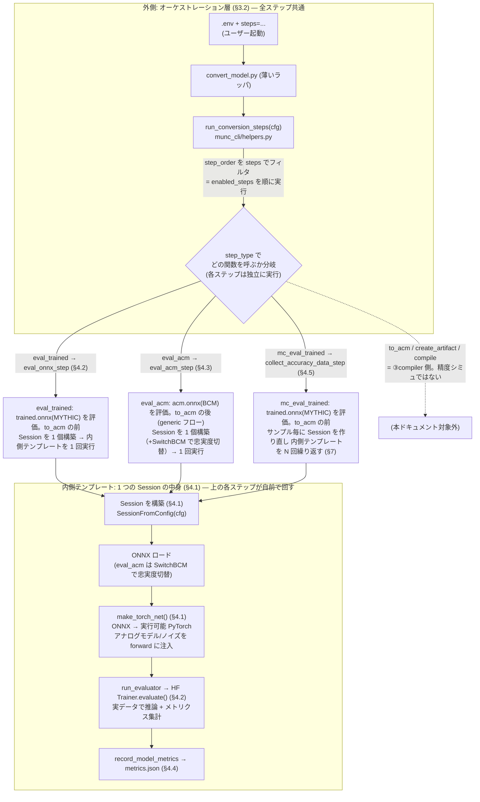

# 03. 精度シミュレーション解析

Mythic M2000 (Denali/ACE) アナログ compute-in-memory AI アクセラレータ SDK の **精度シミュレーション**の解析。対象バージョン `26.05`。

主張はすべて実コードの**ファイルパス:行番号**を根拠に引用する。確定できない箇所は **[推測]** と明記する。抽出ソースの所在は §9 を参照。

---

## 目次

- [1. 精度シミュレーションとは何か（一言で）](#1-精度シミュレーションとは何か一言で)
- [2. 入力と出力](#2-入力と出力)
- [3. 全体像と処理フロー](#3-全体像と処理フロー)
- [4. 処理フローの各ステップ詳細](#4-処理フローの各ステップ詳細)
- [5. 中核モデル①: BCM（Boreas Compute Model）](#5-中核モデル-bcmboreas-compute-model)
- [6. 中核モデル②: アナログノイズモデル（確率的非理想性）](#6-中核モデル-アナログノイズモデル確率的非理想性)
- [7. 中核モデル③: モンテカルロと保証精度](#7-中核モデル-モンテカルロと保証精度)
- [8. アナログ演算とデジタル演算の分割](#8-アナログ演算とデジタル演算の分割)
- [9. 参照ファイルと未解明点](#9-参照ファイルと未解明点)
- [補遺: Compiler コンテナ側の QDQ 量子化との関係](#補遺-compiler-コンテナ側の-qdq-量子化との関係)

---

## 1. 精度シミュレーションとは何か（一言で）

> **学習済み Mythic モデル（ONNX）を、実データセット上で、アナログ非理想性込みで推論し、精度メトリクス（mAP / accuracy 等）を算出する。**

M2000 はフラッシュメモリセルをアナログ乗算器として使う。この物理素子には製造ばらつき・熱雑音・電荷減衰といった**非理想性（ノイズ）**があり、量子化しただけの理想的なモデルより精度が落ちる。精度シミュレーションは、この非理想性を確率的にモデル化して推論に注入し、**「実チップに載せたら精度はどの程度になるか」を実行前に見積もる**ためのものである。

本ドキュメントは SDK コンテナ側（`munc` パッケージ）の実装を解析対象とする。これが精度シミュレーションの本体であり、実行に Compiler コンテナは不要（`munc` は `vnnort` を import しない。§9 で確認）。Compiler コンテナ側にも数学的に対応する仕組み（QDQ 決定論的量子化）があるが、それは別目的（コンパイル時の数値レンジ整合）の独立した仕組みであり、精度シミュレーションから呼ばれるわけではない。この関係は[補遺](#補遺-compiler-コンテナ側の-qdq-量子化との関係)で整理する。

### 位置づけ — SDK の 4 エントリーポイントとの関係

本 SDK のエントリーポイントは「①再学習 / ②**精度シミュレーション** / ③compiler / ④PPA estimator」の 4 つ。②はデータフロー上、①の出力から分岐する末端の枝であり、③・④とは相互依存しない（`00_overview.md` §2）:

```
①再学習 ── train ──▶ trained.onnx ─┬─▶ ②精度シミュ eval_trained / mc_eval_trained ── metrics.json（末端）
                                    │        （MYTHIC を評価。to_acm の前）
                                    └─▶ ③compiler ── to_acm ─▶ acm.onnx ─┬─▶ ②精度シミュ eval_acm ── metrics.json（末端）
                                                    (BCM)               │        （BCM を評価。to_acm の後）
                                                                        └─▶ create_artifact → compile ──▶ ④PPA estimator
```

②精度シミュレーションには**評価する状態の異なる 2 経路**がある。どちらも出力は metrics.json（末端の枝）で、firmware は作らない:

- **`eval_trained` / `mc_eval_trained`**（本ドキュメントの主対象）: ①の成果物 `trained.onnx`（**MYTHIC**）を、`to_acm` より**前**に評価する。③compiler には依存しない。
- **`eval_acm`**（§4.3, generic フロー）: `to_acm` が出力する `acm.onnx`（**BCM/ACM**）を、`to_acm` より**後**・`create_artifact` に渡す前に評価する。`to_acm` は SDK コンテナ内で完結し Compiler コンテナを呼ばないため、これも②の枠内（評価専用で firmware は生成しない）。`create_artifact`(③) が消費するのと同じ BCM を評価に流用する枝。

**起動経路の非対称性**: ②精度シミュレーションには専用 CLI が無く、**オーケストレーション層 `convert_model.py steps=eval_trained` からのみ実行できる**（③コンパイルは `mythic-compiler` を直接叩く経路もあるのと対照的）。各エントリーポイントとオーケストレーション層の対応の全体像は `00_overview.md` §2.5 を参照。

---

## 2. 入力と出力

精度シミュレーションを担う主要ステップは 3 つ（詳細は §4）。いずれも「モデル + 実データ + ノイズ設定」を入力に取り、「メトリクス JSON」を出力する。**モデルの重み・構造は書き換えない**（推論と評価のみ。量子化・アナログ層は推論時 forward の中でのみ効く）。

### 入力

| 入力 | 実体 | 供給元 / 根拠 |
|---|---|---|
| **① 対象モデル（ONNX）** | 学習済み Mythic Node モデル `data/trained.onnx`。ノードは `MythicConv2d` / `MythicLinear`。 | `cfg.src`（`eval_onnx_step`, `conversion_steps.py:433-455`）。前段ステップ **`train`（①再学習）の成果物**。 |
| **② 実データセット** | validation split の実画像・ラベル（ImageNet / COCO / nuScenes 等）。ランダムデータではない。 | `model_setup.dataset[dataset_val_key]`（`evaluate_onnx_model`, §4.2）。 |
| **③ ノイズ / アナログモデル設定** | TorchNet に注入するハードウェア忠実度の指定。`hw_model`（=m2000/denali）・`make_analog_model`・`noise_config`（全 nonideality を有効化）。 | `cfg.torchnet.default_torchnet`（§4.2）。忠実度モデルは §5.2、ノイズ数式は §6。 |
| **④ 評価器の指定** | 精度メトリクスを算出する関数の完全修飾名（例: `mythic.model_zoo.huggingface_classifiers.conversion_steps.evaluate_onnx_model`）。 | `cfg.evaluator_config.evaluator`（`run_evaluator`, `conversion_steps.py:348-369`）。 |
| **⑤ サンプリング設定**（モンテカルロ時のみ） | `num_samples` / `schedule`（チップ間 × チップ内の階層サンプリング）、`nproc`、統計処理用の `prop`（カバレッジ, 既定 0.9999）・`confidence`（信頼度, 既定 0.95）。 | `mc_eval_trained` step 設定（§7）、`process_accuracy_data_step`（`conversion_steps.py:575-606`）。 |

> **変種 `eval_acm_step`**（§4.3）は上記①の代わりに `acm.onnx`（BCM ノード）を、③の代わりに `acm_model`（`munc_fp` / `munc_digital` / `munc_acm_signoff` 等）を入力に取る。これは M2000 標準フローではなく generic フロー側の機能。

### 出力

| 出力 | 実体 | 生成元 / 根拠 |
|---|---|---|
| **メトリクス JSON**（単発評価） | `cfg.metrics_file` が指す JSON。`{model_type: {metric_name: value, ...}}` の辞書に `model_type` をキーとして**追記マージ**（上書きではない）。中身のメトリクスは §4.4 参照。 | `record_model_metrics`（`munc_cli/helpers.py:250-265`）。 |
| **サンプル別 raw JSON**（モンテカルロ時） | `cfg.dest/metrics_XXXX.json`（1 サンプル = 1 ファイル、`XXXX` は 4 桁連番）。各サンプルは重み等を再ランダム化した 1 チップインスタンスの評価結果。 | `collect_accuracy_data_step`（`conversion_steps.py:525-548`）。dest は既存不可（混在防止）。 |
| **統計サマリ**（モンテカルロ時） | サンプル群を集約した「片側許容区間の下限（＝保証精度）」＋ 各メトリクスの mean/std。`metrics_file` に記録し表形式でログ出力。 | `process_accuracy_data_step`（`conversion_steps.py:575-606`）→ `process_accuracy_data`（`monte_carlo.py:100-126`, §7.2）。 |
| **可視化・動画**（オプション、BEVFormer のみ） | 推論結果を検出 box・BEV 図として描画した MP4 / JPEG。精度メトリクスとは別経路だが同じ推論を使う。 | `bevformer_inference.py`（§4.6）。 |

---

## 3. 全体像と処理フロー

精度シミュレーションの処理は **2 つの層**で理解すると分かりやすい。

- **外側 = オーケストレーション層**（§3.2）: `run_conversion_steps` が、config の `step_order` に並んだ多数のステップから、ユーザーが `steps=...` で指定したものだけを選んで順に呼ぶ。ここは精度シミュレーション専用ではなく、再学習・コンパイルも含む全ステップ共通の駆動機構。
- **内側 = 1 ステップの中身**（§4）: 選ばれたステップが `eval_trained` などの精度シミュレーションステップだった場合、その関数の中で `Session` を構築し、`make_torch_net()` で ONNX を PyTorch 化してアナログノイズ込みで推論し、メトリクスを JSON に書く。

この 2 層の全体像:



> **図の読み方**: `eval_trained` / `eval_acm` / `mc_eval_trained` は**合流しない**。`steps=` で指定した**いずれか**が実行され、実行されたステップが**それぞれ独立に**内側テンプレート（Session 構築 → 推論 → メトリクス記録）を回す。`eval_trained`/`eval_acm` はテンプレートを 1 回、`mc_eval_trained` はサンプル毎に Session を作り直してテンプレートを N 回繰り返す点が異なる（§7）。下段の INNERBOX は「1 Session 分の共通処理」を 1 度だけ描いた代表図であり、複数ステップが 1 個の Session を共有するわけではない。
>
> **`to_acm` との前後関係**: `eval_trained`/`mc_eval_trained` は `to_acm` の**前**で MYTHIC（`trained.onnx`）を評価し、`eval_acm` は `to_acm` の**後**で BCM（`acm.onnx`）を評価する（→ 図の点線 `to_acm` の下流に位置する。§1 の位置づけ図・`00_overview.md` §3.5 参照）。3 つとも出力は metrics.json の末端枝で、点線側の firmware 生成（create_artifact/compile）には進まない。

以下、外側（§3.2）→ 内側（§4）の順に詳細を述べる。

### 3.2 外側 — `run_conversion_steps` と `step_order`（どのステップが精度シミュレーションか）

**`step_order` とは**: config（`m2000.yaml`）が定義する「実行しうる全ステップの一覧と順序」。モデル変換〜コンパイルまでの全体パイプラインで、精度シミュレーション以外のステップも含む:

```
to_structural → to_training → train │ eval_trained → summarize_metrics │ to_acm → create_artifact → compile
└──────── ①再学習 ──────────┘ └──── ②精度シミュレーション ────┘ └──────── ③compiler ────────┘
```

これは M2000 標準フロー（`m2000.yaml`）の並び。ここに現れる②精度シミュは `to_acm` の**前**の `eval_trained` のみ。一方 **`eval_acm` はこの標準フローには含まれず、generic フロー側で `to_acm` の後**（`… train → to_acm → eval_acm → create_artifact → compile`）に位置する。`eval_trained` と `eval_acm` は「同じ位置の別モード」ではなく、**評価するモデル状態が違うので step_order 上の位置も異なる**（詳細は §1 の位置づけ図・§4.3、`00_overview.md` §2.1）。

**`run_conversion_steps` の動き**（`munc_cli/helpers.py`, [推測: L369-426 は解析時点、抽出ソースで再確認可]）: ユーザーがコマンドラインで渡す `steps=eval_trained` は「この一覧のうち **どれを有効化するか**」の指定。実行機構は次の通り:

1. config から `step_order`（全体の順序）を取得。
2. `steps` 引数を展開して `enabled_steps`（有効化するステップ集合）を作る。
3. `step_order` の並びを `enabled_steps` でフィルタし、**残ったステップを config が定める順序で**順に実行（コマンドラインで渡した順ではない）。
4. 各ステップは `step_type` に対応する関数（`resolve_function` で解決）を呼ぶ。

したがって `steps=eval_trained` を渡すと、`step_order` のうち `eval_trained` **1 つだけ**が実行される（前段成果物 `trained.onnx` が既存であることが前提）。

**精度シミュレーションに該当するステップ**は、この `step_order` の中で**推論 + メトリクス算出を行う 3 つ**だけ:

| ステップ名 | `step_type` | 呼ばれる関数（内側の実体） | 何をするか | §参照 |
|---|---|---|---|---|
| **`eval_trained`** | `eval_onnx` | `eval_onnx_step` | `trained.onnx` をアナログノイズ込みで 1 回評価（GEN2 標準の「精度シミュレーション」） | §4.2 |
| **`eval_acm`** | `eval_acm` | `eval_acm_step` | `acm.onnx` を、6 階層忠実度モデルの 1 つに切替えて評価（generic フロー） | §4.3 |
| **`mc_eval_trained`** | `mc_eval_onnx` | `collect_accuracy_data_step` | 上記をモンテカルロで多数回繰り返し、保証精度を統計算出（generic / 明示指定時） | §4.5, §7 |

> **ステップ名と `step_type` がずれている点に注意**: `eval_trained` はステップ「名」で、その実装は `step_type: eval_onnx`（= 関数 `eval_onnx_step`）で指定される。config 上は別物だが、標準では `eval_trained` を指定すると `eval_onnx_step` が動く。
>
> **`to_acm` / `create_artifact` / `compile` は精度シミュレーションではない**（③compiler 側）。`step_order` に並んでいるのは列挙上の都合で、`eval_trained`（②）と `to_acm`（③）は互いに依存せず、どちらも `train` の出力 `trained.onnx` を独立に入力とする（`00_overview.md` §2）。上図で点線・「対象外」としているのはこのため。

#### 3.2.1 eval 系ステップの命名は 3 層構造（ステップ名 / step_type / evaluator）

`eval_trained` の実装を追うと `eval_onnx` や `eval_onnx_model` / `eval_mythic_model` といった別名が現れる。これらは同じものの別名ではなく、**3 つの異なる層の名前**である。混同を避けるため層を分けて整理する。

```
steps=eval_trained            ← ① ステップ名   (config トップレベルキー / steps= で選ぶ単位)
  step_type: eval_onnx        ← ② step_type    (実装関数 eval_onnx_step への割り当て)
  evaluator: eval_mythic_model ← ③ evaluator    (run_evaluator が動的解決して呼ぶ、精度を計算する関数)
```

**① ステップ名**（`step_order` / `steps=` で扱う単位）。精度評価に関わるステップは標準フローの `eval_trained` だけではなく、config には次が定義されている（BEVFormer config で確認）。`eval_trained` 以外は `step_order` に入っておらず、`steps=eval_fp32` のように明示指定して単発で走らせる検証用である。

| ステップ名 | 入力モデル状態 | step_type | evaluator | 用途 |
|---|---|---|---|---|
| `eval_fp32` | FP32（ORIGINAL） | `eval_onnx` | `eval_onnx_model` | 変換前の浮動小数点基準値 |
| `eval_structural` | structural | `eval_onnx` | `eval_onnx_model` | 構造整理後・標準 op のまま |
| **`eval_trained`** | trained（MYTHIC） | `eval_onnx` | `eval_mythic_model` | 再学習済み Mythic モデル（ノイズ込み、標準フロー唯一の eval） |
| `eval_fp` / `eval_digital` / `eval_signoff_v0p4` / `eval_signoff_v0p5` | acm（BCM） | `eval_acm` | （プロジェクト evaluator） | 6 階層忠実度モデルを切替えて評価（generic フロー, §4.3） |
| `mc_eval_trained` | trained（MYTHIC） | `mc_eval_onnx` | `eval_mythic_model` | モンテカルロ多数回評価（§4.5, §7） |

**② step_type**（`step_types/*.yaml` が実装関数に割り当てる）。ステップ名の `step_type:` フィールドで決まる。共通の実行ラッパである。

| step_type | 実装関数（`common/conversion_steps.py`） | 役割 |
|---|---|---|
| `eval_onnx` | `eval_onnx_step` | Session を作り `run_evaluator` を呼ぶ汎用ラッパ |
| `eval_acm` | `eval_acm_step` | `SwitchBCM` で忠実度切替後に `run_evaluator`（§4.3） |
| `mc_eval_onnx` | `collect_accuracy_data_step` | モンテカルロで多数サンプル収集（§7） |

**③ evaluator**（`evaluator_config.evaluator` に完全修飾名で指定）。`eval_onnx_step` は中で `run_evaluator` を呼び、この名前を `resolve_function` で動的解決して実行する。**実際に mAP/精度を計算する関数で、モデル種別（プロジェクト）ごとに定義が異なる**。BEVFormer では:

| evaluator | 実体 | 実行経路 | 決定論性 |
|---|---|---|---|
| `eval_onnx_model` | `bevformer_onnx_eval`（`onnx_eval.py`） | onnxruntime, CPU | **決定論的**（ノイズなし） |
| `eval_mythic_model` | `bevformer_torchnet_eval.evaluate` | TorchNet, GPU | **非決定論的**（ノイズ注入, §6） |

同じ `step_type: eval_onnx`（＝同じ `eval_onnx_step`）でも、`evaluator_config` に何を割り当てるかで経路が分岐する。`eval_fp32` / `eval_structural` は標準 op を onnxruntime で回すため `eval_onnx_model`、`eval_trained` は TorchNet でノイズ込みに回すため `eval_mythic_model` を使う。したがって FP32 評価は単発で値が確定し、`eval_trained` は run ごとに変動する（実測は `PLAN_bevformer_ppa_exploration.md` §2.1）。

内側（選ばれたステップ関数の中身）は §4 で詳述する。

---

## 4. 処理フローの各ステップ詳細

本章は §3 の図の**内側ボックス（1 つの eval ステップの中身）**を詳述する。§4.1 が全 eval ステップ共通の実行基盤（`Session` → `make_torch_net`）、§4.2〜§4.5 が §3.2 表の各ステップの中身、§4.6 が同じ経路を流用した可視化である。

### 4.1 共通の実行基盤 — `Session` と `make_torch_net()`

すべての eval 系ステップは `SessionFromConfig(cfg)` で `Session`（`_session.py:33`）を構築し、その `make_torch_net()`（`_session.py:496-508`）で ONNX を**実行可能な PyTorch モデル `TorchNet` に変換**してから推論する。

```python
def make_torch_net(self):
    if get_model_type(self.model) == MODELType.ORIGINAL:
        self.change_opset()
    return TorchNet(self.model, layer_factory=self.torchnet_layer_factory, ...)
```

**この `make_torch_net()` こそがアナログ精度シミュレーションの肝**である。ONNX ノードの `op_type` 文字列（`MythicConv2d` / `BCMConv2d` 等）を対応する PyTorch nn.Module にディスパッチする際、アナログ MAC モデルとノイズが forward に組み込まれる（機構は §5.3）。`eval_trained` も `eval_acm` も BEVFormer 推論動画（§4.6）も、すべてこの同じ経路を通る。

### 4.2 `eval_trained`（＝ `eval_onnx_step`）— GEN2 標準の精度シミュレーション

`eval_onnx_step`（`conversion_steps.py:433-455`）:
```python
with SessionFromConfig(cfg, allow_other_keys=True) as s:
    metrics = run_evaluator(cfg, s)
    record_model_metrics(cfg, cfg.get('model_type', str(get_model_type(s.model))), metrics)
```

config 上、`eval_trained` は `step_type: eval_onnx` を指定し（名前と実装がずれている点に注意）、`torchnet: ${default_torchnet}` を与える。この `default_torchnet` が **`make_analog_model` と `noise_config`（全 nonideality enable）を TorchNet に渡す**ため、推論時にアナログノイズが乗る。

`run_evaluator`（`conversion_steps.py:348-369`）が `evaluator_config.evaluator` の完全修飾名を解決して評価器関数（③ evaluator, §3.2.1）を呼ぶ。**この evaluator はプロジェクトごとに異なる**: resnet50 では `evaluate_onnx_model`、BEVFormer では `eval_mythic_model`（TorchNet でノイズ込み評価）。以下は resnet50 の `evaluate_onnx_model` の内部処理:

1. `session.make_torch_net()` で TorchNet 化（ここでアナログモデル/ノイズが効く）。
2. `training_args.seed == "random"` なら乱数シードを都度変更（毎回異なるノイズ実現で評価）。
3. `eval_dataset = model_setup.dataset[dataset_val_key]`（**実データセットの validation split**）。
4. `train_huggingface(do_train=False, do_eval=True)` → HuggingFace `Trainer.evaluate()` で推論 + メトリクス集計。

つまり `eval_trained` は「**学習済みモデルを、アナログノイズモデル込みの TorchNet で 1 回評価する**」。GEN2 ガイド §8.3 の `convert_model.py steps=eval_trained` がこれに対応する。

### 4.3 `eval_acm`（＝ `eval_acm_step`）— 忠実度モデルを切替えて評価

`eval_acm_step`（`conversion_steps.py:372-401`）:
```python
with SessionFromConfig(cfg, allow_other_keys=True) as s:
    s.run_ops(ops.SwitchBCM(bcm_class_str=cfg.acm_model, bcm_attr_str=cfg.acm_model_config))
    metrics = run_evaluator(cfg, s)
    record_model_metrics(cfg, model_type, metrics)
```

`eval_trained` との違いは、評価前に `SwitchBCM` で **BCM 計算バックエンド（6 階層の忠実度モデル, §5.2）を切替える**点。`acm_model` の値で忠実度が変わる（`munc_fp` / `munc_digital` / `munc_acm_signoff` 等）。入力は `acm.onnx`（BCM ノードを持つ IR）。GEN2 標準フロー（`m2000.yaml`）はこれを含まず、より汎用的な generic フロー側の機能。

### 4.4 メトリクスの記録（出力の実体）

`record_model_metrics`（`munc_cli/helpers.py:250-265`）は既存 JSON を読み込み、`data[model_type] = metrics` で**キー追記マージ**して書き戻す:
```python
def record_model_metrics(cfg, key, metrics):
    data = load_model_metrics(cfg)   # 無ければ {}
    data[key] = metrics
    save_model_metrics(cfg, data)
```

`metrics` の中身は評価器がタスク別に返す値。Compiler コンテナ側と共通の定義（`vnnort/inference/evaluation/`）は次の通り:
- **分類**: Accuracy（`sklearn.metrics.accuracy_score`）
- **検出**: mAP（`torchmetrics` の `MeanAveragePrecision`）
- **セグメンテーション**: mIoU（混同行列ベース）
- **BEVFormer 3D**: nuScenes mAP（BEV 中心距離マッチング, 閾値 `(0.5,1.0,2.0,4.0)` m）

`summarize_metrics_step`（`conversion_steps.py:88-107`）が `metrics_file` を読み、`model_re` / `metric_re` でフィルタした表を logger に出力する。

### 4.5 `mc_eval_trained` — モンテカルロ（保証精度の算出）

`collect_accuracy_data_step`（`conversion_steps.py:525-548`）が `schedule` / `num_samples` に従いハードウェアパラメータを繰り返しランダム化し、各サンプルの評価結果を `dest/metrics_XXXX.json` に保存する。`nproc > 1` なら GPU ごとにサンプルをシャーディングし、自分自身を `subprocess.Popen` で再 spawn（この subprocess は GPU 並列用であって Compiler コンテナ起動ではない）。

その後 `process_accuracy_data_step`（`conversion_steps.py:575-606`）が全サンプルを集約し、NIST 片側許容区間で**保証精度**を算出する（§7）。統計処理の詳細は §7 を参照。

### 4.6 （オプション）推論結果の可視化・動画生成

`bevformer_inference.py`（BEVFormer 専用）は、`eval_trained` と**同じ `make_torch_net()` 経路**を、メトリクス集計ではなく可視化・動画出力に流用したもの。`torchnet` サブコマンドで実行すると、アナログノイズが乗った推論結果を検出 box・BEV 図として動画で目視確認できる。4 サブコマンド（`pytorch` / `onnx` / `torchnet` / `ground-truth`）が共通パイプラインのバックエンドだけを差し替える。詳細は §9 の参照ファイルおよび `HOWTO_bevformer_carla_video_generation.md`。

---

## 5. 中核モデル①: BCM（Boreas Compute Model）

### 5.1 BCM とは — 「ハードウェア忠実にモデルを数値再現する中間表現」

**BCM = Boreas Compute Model**（block-circulant matrix ではない。根拠: `munc/bcm/bcm_layers.py` docstring `"to be run with the Boreas Compute Model"`）。別名 **ACM (Analog Compute Model)**。

BCM は、ONNX の `Conv` / `Linear` ノードを `BCMConv2d` / `BCMLinear`（`bcm_layers.py`）に置き換えたもので、**M2000 チップが 1 層を計算する様子を数値的に忠実再現する**。モデルの状態遷移の中の 1 段階である（`00_overview.md` §3.5）:

```
ORIGINAL → structural → MYTHIC(MythicConv2d) → BCM(BCMConv2d) → COMPILER
              to_structural   to_training          to_acm         create_artifact
```

BCM は精度評価専用ではない。`to_acm` が生成した BCM ノード入りの ONNX（`on_chip_1_bcm.onnx`）は、`SwitchBCM(munc_digital)` でノイズなしに固定した上で **Compiler コンテナの `dnn_compiler` バイナリの直接入力にもなる**（`00_overview.md` §3.5, 旧 doc の A.12）。ただし本ドキュメント（精度シミュレーション）で扱うのは、BCM を **TorchNet 上で実行してノイズ込み推論する**用途である。

### 5.2 BCM 層の内部構造 — アナログ MAC + デジタルデータパスの 2 段

`BCMConv2d` / `BCMLinear`（親クラス `BCMMMAOp`）は、アナログ MAC 単体ではなく **アナログ + デジタルの 2 段構成**である。`BCMMMAOp.forward`（`bcm_layers.py:85-103`）:

```python
def forward(self, torch_X, weights, biases=None):
    if self._mma is None:
        self.layer_gen(weights, biases)         # mma_class インスタンスを生成
    # ① 符号付き入力なら正負を分離（差動処理）
    if self.duplicate_weight and self.signed_input:
        torch_X = torch.cat([clamp(X, min=0), clamp(-X, min=0)], dim=1)
    # ② アナログ MAC
    y = self.torch_layer_op(torch_X)            # self.mma.randomize() 後 dot 実行
    # ③ デジタル後処理
    y = self.digital_datapath.compute(y, self.dsf_mult, self.dsf_shft, self.activation)
    return y
```

- **② アナログ MAC**（`self._mma` = `mma_class` インスタンス）が **ACE アナログ行列積部分**。ここが §5.4 で選択する 6 階層の忠実度モデル。画像ごとに `self.mma.randomize()` を呼び、ノイズを再サンプルする（`bcm_layers.py:66-79`）。
- **③ デジタルデータパス**（`ace_digital_datapath_factory`）が **DSF（Digital Scale Factor）による乗算・右シフト + 活性化関数**（`relu` / `hardtanh` 等）を担う。`mma_class` に依らず共通。

したがって **BCM 層 ⊋ アナログ MAC モデル**。BCM 層はアナログ MAC を内包しつつ、その前後のデジタル演算（差動処理・DSF スケール・活性化）も含めて 1 層全体を再現する。

### 5.3 なぜグラフ書き換えだけで BCM 計算になるのか（ディスパッチ機構）

「ONNX ノードの `op_type` 文字列を、そのままクラス名として `munc._o2t_ops` から `getattr` 解決する」という設計で実現されている（`_torchnet.py`: `layer_class = getattr(_o2t_ops, node.op_type)`）。

```
ONNX Conv/Gemm
  │ ConvertNodesToMythic:  op_type 文字列を "MythicConv2d" に書き換え
  ▼
MythicConv2d（アナログaware 学習可能グラフ、まだ「文字列」）
  │ ConvertConvsToBCM (to_acm):  op_type を "BCMConv2d" に書き換え + 属性 __mma_class を付与
  │                              is_digital_onchip(node) なら munc_int8 を強制（§8）
  ▼
BCMConv2d（まだ「文字列」）
  │ SwitchBCM (eval_acm/create_artifact):  __mma_class 属性だけを書き換え（6 階層の切替）
  │
  │ make_torch_net() → getattr(_o2t_ops, "BCMConv2d") → bcm_layers.BCMConv2d
  ▼
bcm_layers.BCMConv2d インスタンス（実 PyTorch nn.Module, §5.2）
```

`munc/_o2t_ops/__init__.py` で `BCMConv2d = bcm_layers.BCMConv2d` と再エクスポートされているため、`op_type` が `"BCMConv2d"` になった時点で TorchNet 構築時に自動的にアナログ MAC + デジタルデータパスの層が使われる。**「グラフレベルの文字列書き換え」と「実際の数値計算」がこの 1 点のディスパッチテーブルで接続される。**

さらに BCM 層内部の `mma_class` 選択も同じ「文字列→クラス」パターンで、`__mma_class` 属性を `MMA` レジストリ（`bcm_utils.py`）で実クラスに解決する。

### 5.4 アナログ MAC の 6 階層忠実度モデル（`mma_class`）

`munc/bcm/bcm_models/` に、忠実度の異なる 6 種類のアナログ MAC モデルが実装されている。`SwitchBCM` / `eval_acm` の `acm_model` で選択する（BCM 層の②部分のみを差し替え、③は共通）:

| FACTORY_NAME | ファイル | モデル化する現象 | 位置づけ |
|---|---|---|---|
| `munc_fp` | `fpmodel.py` | 出力の round/clip のみ | 浮動小数点理想（最上位精度） |
| `munc_int8` | `int8model.py` | 量子化のみ（pFSR=iFSR 強制） | 整数理想 |
| `munc_digital` | `digitalmodel.py` | 量子化 + クリップ + マルチサイクル（8bit 分解） | デジタル忠実（ノイズ無しアナログ上限） |
| `munc_simple` | `simplemodel.py` | 上記 + **重み 5 段ノイズ + SAR ADC ノイズ/オフセット/INL** | 物理ベースのフルアナログ（**最も忠実**） |
| `munc_tacm` | `trainingacm.py` | (weights, multicycle, adc) 3 軸を IGNORE/MOCKUP/FULL で切替 | 学習用高速近似（5〜10 倍高速） |
| `munc_acm_signoff` | `acmsignoffmodel.py` | 実測フィット統計モデル（ロバスト回帰） | 製品精度保証（サインオフ）用 |

**ACE アナログ MAC の共通モデル化方法**: uint8 入力を 8bit に分解（`x_bits = input·pows2 // 128`）→ 各ビットで `F.linear`/`F.conv2d` を実行（マルチサイクル）→ ビット毎にクリップ `[-128,127]` → 重み付き加算（`pows1=[128,64,...,1]`）→ `/128` して `clamp(-256,255)`。これが「マルチサイクル・ビットシリアル」動作の再現。`munc_simple` はこの加算部を明示的な 8 サイクル **SAR (Successive Approximation Register) ADC** に置換して非理想性を注入する。

`trainingacm.py` の `tacm_submodel_types` は 3 軸の組合せに名前を付ける: `quantized`≈`munc_fp`、`full`≈`munc_simple`、`acms`≈`munc_acm_signoff`。

---

## 6. 中核モデル②: アナログノイズモデル（確率的非理想性）

§5.4 の忠実度モデルのうち `munc_simple` / `munc_acm_signoff` 等が実際に注入する**確率的ノイズ**の数式。これが「実チップに載せたら精度がどう落ちるか」を決める本質部分である。ノイズは**推論のたびに乱数から再サンプル**される（`bcm_layers.py` の画像単位 `randomize()`、およびモンテカルロのサンプル単位, §7）。

#### 学習側ノイズ（Mythic モデル）と評価側ノイズ（BCM）は別実装

分析上の重要点として、`eval_trained` / `train` が使う **Mythic モデル**（`MythicConv2d` 内部の `analog_model`, §6.1）のノイズと、`eval_acm` が使う **BCM モデル**（`bcm_models/*`, §6.2〜6.3）のノイズは、**コード上まったく別の実装**である。相互 import は双方向とも存在しない（`munc/bcm/` は `_pytorch/noise.py` / `_ace_model.py` を import せず、逆も同様）。同じ物理現象（重みプログラミング誤差・温度・ADC 非理想性・量子化）を狙ってはいるが、忠実度と目的が異なる。

| | Mythic モデル（§6.1） | BCM モデル（§6.2〜6.3） |
|---|---|---|
| 使うステップ | `eval_trained`, `train`, `mc_eval_trained` | `eval_acm`（generic フロー / signoff） |
| 実装 | `_ace_model.py` + `_pytorch/noise.py` | `bcm_models/*.py`（fp/int8/digital/simple/tacm/acm_signoff） |
| 重みノイズ | 加算+乗算ガウス（`WeightNoise`）, 温度（`TempShift`, Boreas のみ） | 電荷減衰・指数温度・比例誤差・**ポップコーン**・線形補正 / ACMS 統計 |
| マルチサイクル | モデル化しない | **8bit SAR ビットシリアルを明示計算**（`munc_digital` 以上） |
| ADC | Boreas: 熱ノイズ（`ADCNoise`）+ 線形補正。Denali: 外部 `ApproximateADCModel`（オフセット・INL・CM2DM・入力ノイズ）（§6.1.1, §6.4） | SAR 参照電圧・オフセット・INL・サイクル毎ノイズ |
| 微分可能性 | **STE backward で微分可能（QAT 用）** | 前向き専用（numpy 経路含む）。学習向けは `munc_tacm` の mockup 系のみ |
| 目的 | 再学習で誤差を織り込む**高速近似** | 評価・製品サインオフ用の**高忠実**モデル |

橋渡しは `munc_tacm`（`trainingacm.py`）で、精度 3 軸（weights / multicycle / adc）を `IGNORE`/`MOCKUP`/`FULL(ACMS)` で切り替えることで `munc_fp`〜`munc_acm_signoff` を近似再現でき、`[mockup, mockup, mockup]` 選択時は「全劣化要因を mockup した学習用高速モデル（signoff 比 5〜10 倍高速）」になる（docstring に明記）。つまり Mythic 側は再学習で勾配を流すための微分可能な近似、BCM 側は評価用の高忠実モデル、という役割分担である。

### 6.1 `munc/_pytorch/noise.py`（ACE モデル / 学習用、autograd + STE）

backward は勾配素通し（Straight-Through Estimator）。乱数は `torch.randn` / `torch.rand`。

`noise.py` は**数式のみを実装したライブラリで、σ 等のパラメータ値は一切保持しない**。全て呼び出し元から引数として渡される。パラメータの所在と、下記 (1)〜(4) がどのハードウェア世代で使われるかは §6.1.1 に整理する。

**ノイズが注入されるのは forward のみで、backward では無視される**。4 つのノイズクラス（下記 (1)〜(4)）はいずれも `torch.autograd.Function` のサブクラスで、backward の実装は全て「入力勾配 = 出力勾配」を返すだけである（`noise.py:37, 108, 142, 179`）:

```python
def backward(ctx, grad_output):
    return grad_output, None, None   # 入力勾配は素通し。ノイズパラメータ側は None（勾配を計算しない）
```

`grad_output` を無変更で返すのは**恒等関数として微分する**ことを意味し（STE）、ノイズ由来の勾配項は存在しない。ノイズパラメータ（`additive_noise`, `mult_sigma`, `global_temp` 等）に `None` を返すのは、ノイズが学習対象パラメータではなく外部から与えられる確率的外乱として扱われるためである。

したがって `train` ステップでの動作は次の非対称な構造になる:

```
forward :  weight → weight + N(0,σ_add) + weight·N(0,σ_mult) → 量子化 → MAC → ADCノイズ   （ノイズあり）
backward:  grad ─────────────────── そのまま素通し ───────────────────→ grad              （ノイズなし）
```

- **forward にノイズが必要な理由**: 損失値がノイズ込みの出力から計算されるため、「ノイズがあっても損失が小さくなる重み」へ最適化が向かう。**ノイズ耐性が学習される経路は forward（損失値）を通じてのみ**であり、backward にノイズを入れる必要はない。
- **backward でノイズを無視する理由**: ノイズおよび量子化の round/clip は微分が 0 かほぼ定義できない。真の勾配を使うと学習が進まないため、恒等近似（STE）で勾配を通す。これは QAT（Quantization-Aware Training）の標準手法である。

`train` と `eval_trained` の差は「ノイズの有無」ではなく「backward を走らせて重みを更新するか」だけである。ノイズは `self.training` で gate されていないため、eval 時も forward には同じようにノイズが乗る（これが `eval_trained` の結果が run ごとに変動する理由。§4.2、実測は `PLAN_bevformer_ppa_exploration.md` §2.1）。

| | forward のノイズ | backward |
|---|---|---|
| `train` | あり | STE で勾配素通し（ノイズ由来の勾配項なし） |
| `eval_trained` | あり（`train` と同じ） | 走らない（推論のみ） |

なお `weight_noise()` ラッパ（`noise.py:42-55`）には `ste` フラグがあり、既定 `ste=True` は `WeightNoise.apply(...)` で autograd グラフに載せる。`ste=False` は `WeightNoise.forward(None, ...)` を直接呼ぶため autograd グラフに載らず、勾配計算から完全に外れる（純粋な推論用）。

以下の (1)〜(4) で共通する前提:

- **`weight` の単位は「整数重みコード」**で、範囲 `[-128, 127]`（`hw_config.weight_min`/`weight_max`）。**pFSR 倍する前の値**であり、物理電流への換算は `flash_w = 200e-9 · w / 128 · pFSR / 2`（`noise.py:71`）。したがって σ_add 等の単位も**この重みコードの LSB** である。
- **`X` / `z` の単位は「ドット積コード」**。ADC ノイズが乗る時点で `_scale_to_adc_output_range()`（`_ace_model.py:120`）により `z ← (pFSR/iFSR) · max_abs_dot_product_value · z` とスケール済みで、単位は ADC 出力 LSB。
- **`pFSR`（programming Full Scale Range）**は重み側フルスケール、**`iFSR`（integration FSR）**は積分（ドット積）側フルスケール。SDK では `half_pFSR_arr` / `half_iFSR_arr`（半値配列）で候補が与えられ、層ごとに選択される。
- 乱数の粒度は関数で決まる: `normal_like()` は**テンソルと同形**（＝重み/活性化の**要素ごとに独立**）、`normal()` / `uniform()` は**サイズ (1,) のスカラー**（＝そのカーネル全体で共通の 1 値）。

**(1) WeightNoise**（重みプログラミング誤差, "monte carlo" ノイズ）— フラッシュセルへの書き込み精度の限界を表す:
```
weight ← weight + N(0, σ_add) + weight · N(0, σ_mult)
                  ~~~~~~~~~~~   ~~~~~~~~~~~~~~~~~~~~
                  加算ノイズ      乗算（比例）ノイズ
```

| 記号 | 引数名 | 意味 | 単位 | 供給元 |
|---|---|---|---|---|
| σ_add | `additive_noise` | **重み値に依存しない**書き込み誤差の標準偏差。セルのフロアノイズ・読み出し回路オフセットに相当 | 重みコード LSB | Boreas: `weight_noise_additive` / Denali: `WEIGHT_ADDITIVE_NOISE_SIGMA/pFSR` |
| σ_mult | `mult_sigma` | **重み値に比例する**書き込み誤差の相対標準偏差（比率。0.1 = 10%）。docstring では "percentage noise" | 無次元（比率） | Boreas: `weight_noise_percentage` / Denali: `WEIGHT_PROPORTIONAL_NOISE_SIGMA`（=0.0） |

両ノイズは**重み要素ごとに独立サンプル**（`normal_like`）。物理的に、加算項は「小さい重みでも一定量ずれる」誤差、乗算項は「大きい重みほど大きくずれる」誤差を表す。Denali の既定値 1.92 は 1.5 nA に対応する（`weight_additive_noise` のコメント; `1.92 · 200e-9/128 · 0.5 = 1.5e-9`）。

`_boreas_ace_model.py:64` および Denali の `apply_programming_errors(adjust_for_bias_split=True)` では、bias 行が分割されない都合上、bias に対しては σ_add を `√bias_rows` 倍、σ_mult を `√bias_rows` で除して渡す（複数行に分散した誤差の合成を近似）。

ノイズ適用後に `torch.where(weight != 0, noisy_weight, weight)` が入るため、**ゼロ重みにはノイズが乗らない**（プログラムされていないセルは誤差を持たない）。

**(2) TempShift**（温度シフト）— フラッシュセルの閾値電圧が温度で変わる効果:
```
temp_delta ~ U(global_temp − local_temp_range, global_temp + local_temp_range)   ← カーネル全体で 1 スカラー
weight ← weight + weight · temp_delta · 0.005
```

| 記号 | 引数名 | 意味 | 単位 | 供給元 |
|---|---|---|---|---|
| `global_temp` | `global_temp` | チップ全体の基準温度シフト量（キャリブレーション温度からのずれ）。計算グラフの一部として上位から渡される | °C | `noise_config.temp_delta`（`training_model` では 30.0） |
| `local_temp_range` | `local_temp_range` | 個々のカーネル（タイル）が `global_temp` から最大どれだけずれるかの幅。**0 ならチップ全体が一様温度** | °C | `noise_config.local_temp_delta` |
| `temp_delta` | （内部変数） | 上記から一様分布でサンプルされた実効温度シフト。**カーネル単位で 1 値**（`uniform()` がサイズ (1,)）で、そのカーネルの全重みに同じ値が掛かる | °C | — |
| `0.005` | （ハードコード） | 温度感度係数 [1/°C]。**ハードウェア実測ではない暫定値** | 1/°C | — |

`0.005` については実装コメントに明示的な注意がある（`noise.py:100-104`）:「この項は hw を表現したものではない。旧 retraining モデルと一致させるために入れている。精度は良くなるが正しくはない。実装の理解が進むまでの暫定対処」。物理由来の理論式は同ファイル L70-72 に導出が残っており、コメントアウトされた `systematic_temp_shift = weight · temp_delta · 2.0928e-2 · exp(−0.00876 · pFSR/2 · |weight|)`（重みが大きいほど感度が下がる指数減衰形）が本来の形である。**現行実装は重み依存性のない線形近似**。

**(3) ADCNonLinearity**（ADC 3 次歪み）— SDK 内に呼び出し元がない（§6.1.1）が、パラメータの意味は次の通り:
```
nl_shift_coeff = nl_shift_perc / (255 · 10)²      ← 正規化: フルスケール入力で歪み量が nl_shift_perc になる
nl_noise_coeff = nl_noise_perc / (255 · 10)²
η ~ Normal(nl_shift_coeff, nl_noise_coeff)        ← カーネル全体で 1 スカラー
X ← X + η · X³
```

| 記号 | 引数名 | 意味 | 単位 |
|---|---|---|---|
| `nl_shift_perc` | `nl_shift_perc` | 3 次歪みの**系統的（決定論的）成分**。全チップに共通して現れる平均的な非線形性の大きさ | フルスケールに対する比率 |
| `nl_noise_perc` | `nl_noise_perc` | 3 次歪み係数の**チップ間ばらつき**（`nl_shift_perc` を平均とする正規分布の σ） | 同上 |
| `η` | （内部変数） | サンプルされた 3 次係数。カーネル単位で 1 値 | 1/コード² |
| `255 · 10` | `maximum_9bit · ifsr_reference` | 正規化の基準となるフルスケール出力コード（9bit 最大値 255 × 基準 iFSR=10） | コード |

`(255·10)²` で割る意味は、`X = 2550`（フルスケール）のとき `η·X³ = nl_shift_perc · X` となるよう正規化することであり、`nl_*_perc` は「フルスケール入力での歪み量が入力の何倍か」を表す。3 次形（`X³`）なのは、差動 ADC が偶数次歪みを打ち消し 3 次が支配的に残るという一般的性質による。

**(4) ADCNoise**（ADC 熱ノイズ）— マルチサイクル（ビットシリアル）8 回実行分を二乗和で合成:
```
rand_sigma = noise_at_ifsr10 · 5.0 · 0.58
X ← X + N(0, rand_sigma)                    ← 活性化の要素ごとに独立サンプル
```

| 記号 | 引数名 | 意味 | 単位 |
|---|---|---|---|
| `noise_at_ifsr10` | `noise_at_ifsr10` (docstring 上は `nlsb`) | **基準 iFSR=10 における ADC 熱ノイズを LSB 単位で表した値**。ハードウェア較正値（docstring: 「3 LSB at iFSR=10 で較正済み」） | LSB @ iFSR=10 |
| `5.0` | （ハードコード） | 基準 iFSR=10 の**半値** `10/2`。σ を half_iFSR 基準の単位系に換算する係数 | — |
| `0.58` | （ハードコード） | マルチサイクル合成係数。ビット b の寄与が `σ/2^b` で、`Σ_{b=1}^{9}(1/2^b)² ≈ 0.333` … 詳細は下記 | — |

`0.58` の由来: docstring の導出（`noise.py:157-159`）は `err² = Σ_b (σ/2^b)² = σ²·0.58` と書いているが、`Σ_{b=0}^{9}(1/2^b)² = 1.333`、`Σ_{b=1}^{9}(1/2^b)² = 0.333` であり、いずれも 0.58 にはならない。0.58 ≈ `√0.333` = 0.577 に一致するため、**docstring の `err²` は実際には σ の係数（標準偏差ベース）を意味しており、実装 `rand_sigma = ... · 0.58` は σ に掛けているので整合する**（`err² = σ²·0.58` を字面どおり取ると σ に `√0.58` を掛けるべきことになり、その場合は不整合になる）。ビット 0（MSB, b=0 の項）が含まれない `Σ_{b=1}^{9}` 側と一致することから、8bit マルチサイクルで実際に加算される ADC サンプルの重み付けを反映していると解釈できる[推測]。

呼び出し側（`_boreas_ace_model.py:98`）は `noise.adc_noise(z, ADC_noise_lsb_at_10ifsr / (iFSR / 2))` として渡す。すなわち**実際に使われている層の iFSR で割ることで、基準 iFSR=10 の較正値を当該層のスケールに換算**している（iFSR が大きい＝レンジが広い層では、同じ絶対ノイズがコード上は小さく見える）。

#### 6.1.1 (1)〜(4) のパラメータ設定箇所と適用範囲（Boreas / Denali の分岐）

パラメータは 3 階層で決まる。`noise.py` には数値がなく、上位のモデルクラスが `noise_config` から読んで引数に渡す。

```
① Hydra config group: munc/hydra_configs/noise_config/*.yaml        ← 数値の所在
       ↓ instantiate → munc.hw_specs.BoreasNoiseConfig / DenaliNoiseConfig
② 呼び出し元モデル: munc/_boreas_ace_model.py / munc/_denali_ace_separable_model.py
       ↓ noise_config.<field> を引数として渡す
③ munc/_pytorch/noise.py の (1)〜(4)                                 ← 数式のみ
```

**(1)〜(4) の呼び出し元は 4 箇所しかない。**(2)(4) は Boreas 専用、(3) は SDK 内に呼び出し元が存在しない:

| 数式 | `noise.py` の公開名 | 呼び出し元 | 適用世代 |
|---|---|---|---|
| (1) WeightNoise | `weight_noise` (`noise.py:42`) | `_boreas_ace_model.py:47` | Boreas |
| (1) WeightNoise | 同上 | `_denali_ace_separable_model.py:240` | Denali（両世代で共有される唯一の数式） |
| (2) TempShift | `temp_shift` (`noise.py:202`) | `_boreas_ace_model.py:46` | Boreas のみ |
| (3) ADCNonLinearity | `adc_nl` (`noise.py:204`) | **なし（未使用コード）** | — |
| (4) ADCNoise | `adc_noise` (`noise.py:203`) | `_boreas_ace_model.py:98` | Boreas のみ |

##### Boreas 経路 — `noise_config/*.yaml` にスカラー値が直書きされる

`BoreasWeightModel.forward` / `BoreasADCModel.forward` が `self.noise_config` の各フィールドを読み、(1)(2)(4) に渡す。`noise_config` 系 yaml の主な値:

| noise.py 側の引数 | `noise_config` フィールド | `boreas_noise_config`（ノイズ無） | `training_model` | `..._signoff_v0_5` |
|---|---|---|---|---|
| (1) `additive_noise` | `weight_noise_additive` | 0.0 | 0.0 | 1.85 |
| (1) `mult_sigma` | `weight_noise_percentage` | 0.0 | 0.1 | 0.0 |
| (2) `global_temp` | `temp_delta` | 0.0 | 30.0 | 20.0 |
| (2) `local_temp_range` | `local_temp_delta` | 0.0 | 0.0 | 10.0 |
| (4) `noise_at_ifsr10` | `ADC_noise_lsb_at_10ifsr` | 0 | 6.0 | 14.0 |

`training_model_pfsr8_ifsr32_signoff_v0_4.yaml` の `weight_noise_percentage: 0.152` にはコメント `# ACM-S sigma_weight_prop * linear_beta1` があり、§6.3 の ACM signoff 実測値から導出されていることが明示されている。

Boreas 経路にはノイズ以外の系統誤差補正もあり、`_linear_transform()`（`_boreas_ace_model.py:108`）が重み側に `weight_linear_slope`/`weight_linear_offset`、ADC 側に `adc_linear_slope`/`adc_linear_offset` を適用する（v0_4 系では `adc_linear_slope: 0.96`, `adc_linear_offset: -0.12`）。

ノイズ強度は `self.noise_scale`（実装既定 1.0）で一括スケールされ、`noise_scale == 0` でノイズ経路全体がスキップされる（`_boreas_ace_model.py:43`）。

##### Denali 経路（M2000 / BEVFormer が使う経路）— 値は Python 側の既定定数

`denali_training_model.yaml` にスカラーが無いのは、Denali が `nonidealities` 辞書を**そのまま `randomize(**kwargs)` に転送する**設計だからである:

```python
# _denali_ace_separable_model.py:34
def _randomize_hw_model(hw_model, nonidealities):
    return hw_model.randomize(**omit(nonidealities, 'enable')) if nonidealities.get('enable') else hw_model
```

`denali_training_model.yaml` は `nonidealities.{weight_model,input_model,adc_model}.enable: True` のみを指定するため、**全パラメータが呼び出し先関数のデフォルト定数値で動作する**。yaml に書けば個別上書きできる（`denali_noise_config.yaml` のコメントに記述例あり）。

(1) `weight_noise` に渡る値（`apply_programming_errors`, `_denali_ace_separable_model.py:225-247`）:

| noise.py 側の引数 | 上書きキー | 既定定数 | 値 |
|---|---|---|---|
| `additive_noise` | `weight_additive_noise` | `WEIGHT_ADDITIVE_NOISE_SIGMA` (L25) | 1.92（= 1.5 nA）を `pFSR` で除算 |
| `mult_sigma` | `weight_proportional_noise` | `WEIGHT_PROPORTIONAL_NOISE_SIGMA` (L27) | 0.0（Denali では比例ノイズ無効） |
| `ste` | `weight_noise_back_prop` | — | 既定 False → `ste=True` |

(2)〜(4) に相当する温度・ADC ノイズは、Denali では `noise.py` ではなく外部パッケージ `mythic.acm.denali.training` の別実装が担当する（§6.4）。

##### Boreas / Denali の選択箇所は `noise_config` ではなく `training_model` config group

実装クラスを決めるのは `munc/hydra_configs/training_model/*.yaml`:

- `boreas.yaml` → `BoreasWeightModel` / `BoreasInputModel` / `BoreasADCModel`（(1)(2)(4) を使用）
- `denali.yaml` → `DenaliWeightModel` / `DenaliInputModel` / `DenaliADCModel`（(1) のみ + Denali 実装）
- `m2000.yaml` は `denali.yaml` のエイリアス。`denali_ref.yaml` / `denali_lut_sar.yaml` / `denali_with_ref_adc.yaml` は ADC モデルのみ差し替えた変種。

いずれも `_target_: munc._ace_model.make_analog_model`（または `make_denali_separable_model`）の `_partial_` で、`make_weight_model` / `make_input_model` / `make_adc_model` を注入する構造になっている（`_ace_model.py:78-90`）。`MythicMMA.__init__`（`_o2t_ops/mythic_mma.py:51`）がこの partial を呼んで層ごとの `analog_model` を生成する。

BEVFormer（`configs/bevformer/bevformer_tiny.yaml`）は `override training_model: denali` + `override noise_config: denali_training_model` なので **Denali 経路**であり、`noise.py` のうち有効なのは (1) のみである。

なお `hw_specs.py:125` の `get_hw_config(node)` は `node.model.hwconfig or boreas_hw_config` を返すため、`hwconfig` 未設定の旧モデルは Boreas にフォールバックする。

### 6.2 `munc_simple`（`simplemodel.py`）— 最も物理的に詳細なモデル

`mod_weights_torch()` がフラッシュ重みに**5 段のノイズを順に適用**:

1. **線形電荷減衰（retention drift）**: `flash ← flash·(1 − decay_rate·decay_hours)`
2. **指数温度変化**: `flash ← flash·(2.0928e-2·exp(−5.6064e6·1e-7·|flash|)·temp_delta + 1)`
3. **比例重み誤差（Flash Monte-Carlo variation）**: `flash ← flash + flash·σ·N(0,1)·8/pFSR + mask·σ_lsb·(1.5625/100)·pFSR·0.5·N(0,1)`
4. **ポップコーンノイズ（RTN/テレグラフ様）**: 対数正規のステップ分布 `exp(N(pop_lognorm_mean, pop_lognorm_sigma))` を二値マスクで一部セルに適用。
5. **線形モデル補正**: `flash ← beta0 + beta1·flash`

**ADC ノイズ/オフセット/INL**: `simple_offset`（入力オフセット）・`simple_inl`（積分非線形性）を `N(0,1)` から生成し、8bit **逐次比較（SAR）**の各サイクルの比較にノイズを加算。

### 6.3 `munc_acm_signoff`（`acmsignoffmodel.py`）— 実測フィット統計モデル

物理機構ではなく**ロバスト回帰でハードウェア実測をフィットした統計モデル**。
- 重みノイズ: `beta0 + beta1·w`（平均）+ 比例 `N(0,σ_prop·|w|)` + 加算 `N(0,σ_add)` + √比例 `N(0,σ_sqrt_prop·√|w|)` + タイル毎比例ノイズ。
- ドット積ノイズ: `beta = gamma0 + gamma1·acc` + `N(0, σ_dot)`。

バージョン別実測パラメータ:
| バージョン | linear_beta1 | σ_weight_add | σ_weight_prop | gamma0 | gamma1 | σ_dot |
|---|---|---|---|---|---|---|
| v0.4 | 0.95 | 0.0 | 0.16 | −0.12 | 0.96 | 2.48 |
| v0.5 | 0.96 | 1.85 | 0.0 | −0.12 | 0.96 | 2.48 |
| v0.8 | 1.0 | 0.637 | 0.073 | 0.0 | 1.0 | 2.32 |

**全 σ=0 にすると `munc_acm_signoff` は `munc_digital` と等価**になる（コード内コメントで明記）。これがノイズモデルの「ゼロノイズ極限＝決定論的デジタル」という構造を示す（補遺の QDQ との接続点）。

### 6.4 ノイズパラメータの管理

- **HW 仕様の設定クラス**（`hw_specs.py`）: 3 段の継承構造になっている。
  - `NoiseConfigBase`（L86）: `temp_delta`, `local_temp_delta`, `ds_trainable_range`, `half_pFSR_arr`, `half_iFSR_arr`
  - `BoreasNoiseConfig`（L103）: 上記に加えて `ADC_noise_lsb_at_10ifsr`, `weight_noise_percentage`, `weight_noise_additive`, `weight_linear_slope`/`offset`, `adc_linear_slope`/`offset` — §6.1 の (1)(2)(4) に直接対応するスカラー群
  - `DenaliNoiseConfig`（L117）: 上記に加えて `nonidealities: dict`, `model_common_mode: bool`, `flash_model_name: Optional[str]` — スカラーではなく**辞書経由**でパラメータを渡す
- **`register_noise_models()`**（`hw_specs.py:298`）: `munc/hydra_configs/noise_config/` 配下の全 yaml を起動時に `compose` + `instantiate` し、モジュールグローバルとして登録する。`boreas_noise_config` などの名前でコードから直接参照できるのはこの仕組みによる。
- **`configure_nonidealities()`**（`DenaliSeparableModel`, `_denali_ace_separable_model.py:434`）: `input_model_nonidealities` / `weight_model_nonidealities` / `adc_model_nonidealities` の 3 辞書を各サブモデルに配り、`_randomize_hw_model()` が `enable` キーを除いた残りを `hw_model.randomize(**params)` にそのまま展開する。したがって**上書き可能なキー名 = `randomize()` の引数名**であり、yaml が空なら関数側の既定値が使われる（§6.1.1）。
- **Denali ノイズの実パラメータと既定値**（外部パッケージ `mythic/acm/denali/training/`、venv 内に実体あり）:

| 対象モデル | `randomize()` 引数 | 既定定数 | 値 |
|---|---|---|---|
| `WeightModel` / `BiasModel` | `sub_threshold_slope_mismatch_sigma` | `SUB_THRESHOLD_SLOPE_MISMATCH_SIGMA` | 0.028 |
| `WeightModel` / `BiasModel` | `uniform_prop_weight_quantization_noise` | `UNIFORM_PROP_WEIGHT_QUANTIZATION_NOISE` | 0.02 |
| `InputModel`（AIDAC） | `vout_sigma` | `VOUT_SIGMA` | 5.0e-3 |
| `ApproximateADCModel` | `adc_input_offset_sigma` | `ADC_INPUT_OFFSET_SIGMA` | 3.36e-9 |
| `ApproximateADCModel` | `adc_non_linearity_sigma_lsb` | `ADC_NON_LINEARITY_SIGMA_LSB` | 0.72 |
| `ApproximateADCModel` | `cm2dm_sigma` | `CM2DM_SIGMA` | 62.38e-6 |
| `ApproximateADCModel` | `effective_input_noise_sigma` | `INPUT_NOISE_SIGMA` | 15e-9 |
| `ApproximateADCModel` | `per_batch_adc_input_offset` | — | True |

  （`polynomial_separable_model.py:18, 34, 88` / `approximate_adc_model.py:11, 12, 164, 168, 175`。`randomize()` に `None` を渡すとその項目はランダム化されない。）
- Denali ADC の非線形性は §6.1 の (3) `ADCNonLinearity` とは別実装で、`adc_non_linearity_sigma_lsb` を他のノイズ項と**二乗和で合成**する（`approximate_adc_model.py:196`）。dataclass 既定値は 0.0 で、`randomize()` 経由でのみ 0.72 が入る。
- **BCM 側 `mma_attr` 既定値**（`registry.py`, `SimpleAttributes`）: `simple_noise=68e-9`, `simple_offset=23e-9`, `simple_inl=-0.04`, `pop_lognorm_mean=-4.6`, `temp_delta=5` 等。

---

## 7. 中核モデル③: モンテカルロと保証精度

単発の `eval_trained` は「あるノイズ実現 1 つでの精度」を返すだけ。製品精度を保証するには、**多数のチップインスタンス・多数のノイズ実現をサンプリングし、統計的な下限を出す**必要がある。これがモンテカルロ（`mc_eval_trained`）である。

### 7.1 スケジュールとサンプリング

- `mc_eval_trained`（[推測: base_config_generic.yaml, コンテナ内確認]）: `step_type: mc_eval_onnx`, `num_samples: 100`, `schedule: ${mc_schedule}`。
- **総サンプル数 = 各スケジュールステップの `repeat` の積**（`get_schedule_num_samples` = `math.prod`）。「**チップ間ばらつき × チップ内ばらつき**」を階層サンプリングする。
- `random_model_instances`（`chip_instance_generator.py`）が各サンプルでハードウェアパラメータをランダム化・凍結した Session を yield → `run_evaluator` で評価 → `metrics_{i:04d}.json` に保存。
- 重みランダム化: `freeze_hardware_parameters` / `unfreeze_hardware_parameters` が 1 チップインスタンス評価中は重みを固定し（サンプル間でのみ変わる）、BCM 側は別経路で画像ごとに再サンプルする（§5.2）。

### 7.2 統計処理 — 片側許容区間（`tolerance.py`）

NIST 工学統計ハンドブック 7.2.6.3 の正規分布**片側許容区間**を実装（`munc_monte_carlo/tolerance.py:15-31`）:

```
compute_k1(n, prop, confidence):
    dof  = n − 1
    z_p  = norm.isf(1 − prop)        # カバレッジ側の臨界値
    z_c  = norm.isf(confidence)      # 信頼側の臨界値
    a = 1 − z_c²/(2·dof)
    b = z_p² − z_c²/n
    k1 = (z_p + √(z_p² − a·b)) / a

compute_lower_tolerance(data, prop, confidence):
    lower = mean(data) − k1 · std(data)
```

「**信頼度 confidence で、母集団の prop% がこの下限値以上**」という保証精度（下側トレランス限界）を算出する。既定値 [推測: コンテナ内確認] `prop=0.9999`（100 PPM）, `confidence=0.95`。`process_accuracy_data`（`monte_carlo.py:100-126`）が全サンプルの `metrics_*.json` を集約し、下限 + mean/std を出力する。

> GEN2 の M2000 標準フロー（`m2000.yaml`）は `step_order` に `mc_eval_trained` を含まない[推測]。GEN2 ガイドの「精度シミュレーション」は単発の `eval_trained`（seed=random で毎回ばらつくが統計処理はしない）を指す可能性が高い。モンテカルロ + トレランスによる製品保証精度の算出は、generic フローか明示的に `steps=mc_eval_trained` を指定したときに使う。

---

## 8. アナログ演算とデジタル演算の分割

M2000 は全演算をアナログで実行できるわけではない。**アナログ MAC（ACE）で実行できる演算とできない演算**があり、精度シミュレーションはこの分割をノード属性のマーキングで扱う。ただし精度シミュレーション側の主眼は**アナログ非理想性の精密なモデル化**にあり、デジタル演算は粗い近似で済ませる、という非対称な役割分担になっている。

### 8.0 Mythic モデル生成時の置換範囲（`to_training` = `ConvertNodesToMythic`）

分析上よくある誤解として「Mythic モデル＝ ORIGINAL ONNX のアナログ実行部分だけをカスタム層に置き換えたもの」があるが、正確には次の 3 点で異なる。

**(1) 起点は ORIGINAL ではなく structural**: `to_training` の入力は `to_structural` を通した後のグラフである。形状推論・定数畳み込み・on/off-chip マーキングが済んだ structural 状態を変換する。

**(2) 置換対象はアナログ MAC 系だけではない**: `ConvertNodesToMythic.DEFAULT_MYTHIC_NODE_MAP`（`_o2t_ops/ops/convert_nodes_to_mythic.py`）が置換する op_type は以下で、アナログ MAC 候補（Conv/Gemm/MatMul）とデジタル量子化演算（Mul/Softmax）が混在する。

| ONNX op | 置換先 Mythic 層 | 性格 |
|---|---|---|
| `Conv` | `MythicConv2d` | アナログ MAC 候補 |
| `Gemm` | `MythicLinear` | アナログ MAC 候補 |
| `MatMul` | `MythicMatMul` | アナログ MAC 候補 |
| `Mul` | `MythicQuantizedMul` | デジタル量子化演算 |
| `Softmax` | `MythicSoftmax` | デジタル量子化演算 |

したがって「`MythicConv2d` になった層＝すべてアナログ」ではない。Conv/Gemm/MatMul のうち後段 `to_acm` で `__digital_onchip` が付いたものは `munc_int8`（デジタル）に落ち（§8.1）、Mul/Softmax は最初から量子化デジタル演算として扱われる。op-type レベルのアナログ/デジタル確定は structural〜to_acm を通じて段階的に決まる。

**(3) off-chip ノードは置換されない**: `_get_info()` の `off_chip: OFFCHIP_IGNORE`（`_base_op.py:222`）により、off-chip とマークされたノードにはこの変換が適用されない。NPU に載らない演算は ORIGINAL の op_type のまま残る。

要約すると、Mythic モデルは「structural 状態の ONNX のうち **on-chip の Conv/Gemm/MatMul/Mul/Softmax を Mythic カスタム層に置換**したもの」であり、置換された層のうち Conv/Gemm/MatMul が**アナログ MAC 候補**（再学習で 8bit 量子化・ノイズ aware にする対象）、Mul/Softmax や digital-onchip マーク付き層は**デジタル量子化演算**、off-chip ノードは元のままである。

### 8.1 分割のマーキング機構（3 種類の属性）

`to_training` / `to_acm` の変換過程で、各ノードに以下の属性が付与される:

| マーキング op | 対象 | 付与属性 | 結果 |
|---|---|---|---|
| `MarkUnsupportedOpsOffChip`（`mark_unsupported_ops_off_chip.py`） | on-chip でサポートされない op_type（`is_op_type_supported_on_chip` が False） | off-chip | チップ外（ホスト/off-chip）で実行。TorchNet 上は標準 ONNX op のまま |
| `MarkDepthwiseConvsAsDigital`（`mark_depthwise_convs_as_digital.py`） | `group == out_channels かつ in_channels/group == 1` の Conv（＝ DepthwiseConv） | `__digital_onchip` | on-chip だが**アナログ MAC ではなく SALU（デジタル）**で処理。詳細は §8.2 |
| （BCM 変換時） | `is_digital_onchip(node)` が True のノード | — | `ConvertConvsToBCM` / `SwitchBCM` が `mma_class` を強制的に `munc_int8` に上書き |

`MarkDepthwiseConvsAsDigital` の docstring が明言する: 「depthwise conv は Mythic チップ上では **SALU、すなわちデジタルで処理される**」。

### 8.2 精度シミュレーションがデジタル演算をどう扱うか（限界）

`munc/bcm/bcm_layers.py` に実装されている BCM 層は **`BCMConv2d` / `BCMLinear` / `BCMSum` / `BCMAdd` / `BCMMul` の 5 種のみ**で、`BCMSoftmax` / `BCMLayerNorm` / `BCMAttention` 相当は**存在しない**。デジタル演算は次のように扱われる:

- **DepthwiseConv**: `__digital_onchip` 属性により `munc_int8`（6 階層中最も単純な「量子化のみ・ノイズなし」）に固定。`BCMConv2d` クラス自体は使われ続けるが、中身は量子化のみの粗い近似。
- **Softmax**: on-chip 版 `MythicSoftmax`（`munc/_o2t_ops/mythic_softmax.py`）は「定数スケール乗算 → `torch.softmax` → 定数スケール乗算 → クリップ」のみ。Compiler 側 `vidSoftmax` の精密なグループ化・reshape 処理は再現しない。
- **Attention 分解 / LayerNorm**（doc 01 の `com.videantis` カスタムオペ）: 対応するグラフ書き換えは精度シミュレーション側に存在せず、TorchNet 上は元の標準 ONNX op のまま量子化・ノイズなしで実行される[推測: `_o2t_ops` に該当クラスが無いことからの推定]。

### 8.3 設計上の役割分担

| 演算の種類 | 性質 | 精密な検証を担う場所 |
|---|---|---|
| **アナログ非理想性**（重み誤差・温度・ADC 熱雑音等） | 製造ばらつき起因で**確率的**にしか予測できない | **精度シミュレーション（本ドキュメント、SDK コンテナ側）**が精密にモデル化 |
| **デジタル演算**（DepthwiseConv・Softmax・LayerNorm・Attention 分解） | **決定論的**（ノイズなし） | Compiler コンテナ側の決定論的ツール（QDQ / funcsim / vidsim, [補遺] 参照）。SDK 側は量子化のみの粗い近似で代用 |

この役割分担が意図的な設計判断であることはコード上の直接的根拠はなく、実装のカバレッジ差からの推定である[推測]。

---

## 9. 参照ファイルと未解明点

### 抽出ソースの所在（`_extracted_sdk/`, ホスト抽出済み）

| 分類 | ファイル |
|---|---|
| ワークフロー駆動 | `conversion_steps.py`, `munc_cli/helpers.py`, `_session.py` |
| ノイズモデル | `munc_pytorch/noise.py` |
| BCM モデル階層 | `munc_bcm/bcm_models/{fpmodel,int8model,digitalmodel,simplemodel,trainingacm,acmsignoffmodel}.py` |
| BCM 基盤 | `munc_bcm/{registry,bcm_layers,bcm_utils,ace_digital_datapath,salu_datapath}.py` |
| モンテカルロ | `munc_monte_carlo/{chip_instance_generator,tolerance}.py`, `munc_cli/monte_carlo.py` |
| ACE モデル | `_ace_model.py`, `_denali_ace_{reference,separable}_model.py`, `_boreas_ace_model.py` |
| HW 仕様定数 | `hw_specs.py` |
| ONNX→TorchNet 変換・分割マーキング | `_torchnet.py`, `munc_ops/{convert_convs_to_bcm,convert_nodes_to_mythic,switch_bcm,mark_depthwise_convs_as_digital,mark_unsupported_ops_off_chip,mythic_conv,mythic_softmax}.py` |
| 可視化・動画（§4.6） | `bevformer_inference.py`, `bevformer_inference_support/` |

> `mythic-model-zoo/configs/*.yaml`（Hydra 設定）・`munc/hydra_configs/{noise_config,training_model}/*.yaml`・`scripts/*.env`・`mythic.acm.denali.training.*` は解析用コンテナ内で `docker exec` により確認したのみで、ホストには未抽出（「コンテナ内確認, 再検証不可」と本文で注記）。§6.1.1 / §6.4 のパラメータ値はこの経路で取得している。

**「精度シミュレーションが SDK コンテナ内で完結する」ことの確認**: `grep -rln vnnort _extracted_sdk/` は空（`munc` は `vnnort` を import しない）。`eval` 経路の唯一の subprocess は Monte Carlo の GPU シャーディング（自分自身の再 spawn, `conversion_steps.py:505`）で、Compiler コンテナ起動ではない。

### 未解明点

1. ~~`hw_model.randomize(**nonidealities)` の実パラメータ名~~ → **解決**（§6.4）。`mythic/acm/denali/training/{polynomial_separable_model,approximate_adc_model}.py` は venv 内に実体があり、引数名と既定定数値を確認した。ホストへの抽出は未実施（コンテナ内確認）。
2. Hydra config の既定スケジュール `repeat` 値、`eval_config.training_args` の具体値（batch size 等）。
3. `munc_acm_signoff` v0.4/v0.5/v0.8 の物理的差異の背景（較正世代の違いか等）。
4. `train_huggingface` の QAT/蒸留詳細（`huggingface_classifiers/train.py`, 未読）。
5. §8.3 の役割分担が意図的設計かはコード上の直接根拠なし（実装カバレッジ差からの推定）。
6. `bevformer_inference.py` が他モデル（ResNet-50/YOLO 系）にも存在するか未確認。

---

## 補遺: Compiler コンテナ側の QDQ 量子化との関係

精度シミュレーション（SDK コンテナ、`munc`）の実行に Compiler コンテナは不要だが、Compiler コンテナ側（`vnnort`）にも**数学的に対応する仕組み**が存在する。混同を避けるため関係を整理する。**両者は実行時に呼び合う関係ではなく、それぞれ別目的の独立した仕組みである。**

### QDQ 決定論的量子化とは

Compiler コンテナ側は、`QUANTIZED` 状態の ONNX に QDQ (Quantize-Dequantize) ノードを挿入し、ONNXRuntime で FP32 実行して固定小数点量子化を数値模擬する。中核は `QDQLayer`（`vnnort/quantizer/qdq_layer.py:8-35`, `com.videantis` ドメインのカスタム ONNX FunctionProto）:

```
Q(x) = clip( round( x · 2^(fraction_bits − max_exponents) ), −2^(n_bits−1), 2^(n_bits−1)−1 )
       / 2^(fraction_bits − max_exponents)
```

Mythic の power-of-two 固定小数点量子化 + 飽和クリップ（対称量子化、ゼロ点なし）の**決定論的**模擬。ノイズは一切注入しない（`vnnort` にノイズ注入コードは無い）。

### 両者の関係（決定論版 ⊂ 確率版）

| 観点 | QDQ（Compiler コンテナ） | アナログノイズモデル（SDK コンテナ） |
|---|---|---|
| 種類 | 決定論的固定小数点量子化（fake-quant） | 確率的ノイズ注入（ガウス/対数正規/一様） |
| 乱数 | 無し（毎回同一） | サンプル毎に変化（モンテカルロ） |
| 重み誤差 | 量子化丸めのみ | プログラミング誤差・温度・電荷減衰・ポップコーン |
| ADC | 理想量子化 | 熱ノイズ・オフセット・INL・3 次歪み・SAR 逐次動作 |
| 目的 | **コンパイル**時のハードウェア数値レンジ整合 | **実チップ精度予測・保証**（モンテカルロ + トレランス） |
| 呼び出し | 精度シミュレーションからは呼ばれない | 精度シミュレーションのエントリーポイント |

**QDQ 量子化は、アナログノイズモデルの「ゼロノイズ極限」に相当する。** 全 σ=0 にすると `munc_acm_signoff` → `munc_digital`（§6.3）となり、両モデルは共通の「マルチサイクル・ビット分解・`[−256,255]` クリップ・pFSR/iFSR スケーリング」というデジタルデータパス土台を共有する。SDK 側はその上に確率的アナログ層を積む。つまり **QDQ = 決定論的な下部構造、SDK 側ノイズモデル = その上に載る確率的上部構造**という数学的関係であって、実行時のモジュール依存ではない。

> なお、ドキュメント群が精度シミュレーションを「2 コンテナに跨る」と記す（`00_overview.md`）のは、この**概念的対応**を解析対象に含めるためであり、`eval_trained` の**実行が両コンテナを必要とする**という意味ではない。実行は SDK コンテナで完結する（§9 で確認）。
