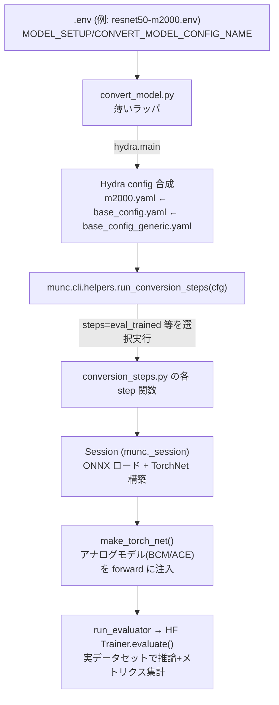

# 03. 精度シミュレーション解析

Mythic M2000 (Denali/ACE) AI アクセラレータ SDK の **精度シミュレーション**についての解析。
対象バージョン: `26.05`。すべての主張は実コードのファイルパス:行番号を根拠として引用する。
推測は明示的に「[推測]」と記載する。

---

## 0. 本ドキュメントの構成

精度シミュレーションは 2 つのコンテナにまたがる。本ドキュメントは以下の 3 部構成で解析する:

- **Part A**: SDK コンテナ側 — 精度シミュレーションの**本体**（駆動ワークフロー・BCM・確率的ノイズモデル・モンテカルロ）。BCM = **Boreas Compute Model**（block-circulant matrix ではない）。
- **Part B**: Compiler コンテナ側 — 精度評価の**部品**（QDQ 量子化・推論エンジン・評価メトリクス・モデル別後処理）。
- **Part C**: Part A と Part B の関係（QDQ 決定論的量子化とアナログノイズモデルの接続）。

精度シミュレーションを駆動する本体は SDK コンテナ側（`convert_model.py`→`munc`→`conversion_steps.py`）にあり、実データセット（ImageNet/COCO/nuScenes 等）を使う。SDK コンテナの `munc` パッケージには確率的アナログ非理想性モデルが実在する（`munc/_pytorch/noise.py`, `munc/bcm/bcm_models/`, `munc/_monte_carlo/`）。Compiler コンテナ側（`vnnort`）の QDQ 決定論的量子化は、この確率モデルの「ゼロノイズ極限」に相当する下部構造であり、Part A の確率モデルの一部として成立する。§C でこの関係を整理する。

### 解析手法とソースの所在
- **Part A**: SDK コンテナ（`mythic-sdk-ubuntu-24.04:m2000-v26.05.0`）由来。核心コード（約 8,843 行、`munc` の主要サブパッケージ）はホスト `/home/ubuntu/mythic_sdk/26.05/_extracted_sdk/` に抽出済み。ただし `mythic-model-zoo/configs/*.yaml`（Hydra 設定）や `mythic-model-zoo/scripts/*.env` の一部、`mythic.acm.denali.*` 等の外部参照パッケージはホストに抽出されておらず、コンテナ内で内容を確認したのみで再確認できない。これらの箇所は本文中に「(コンテナ内確認, 再検証不可)」と注記する。
- **Part B**: Compiler コンテナ（`compilerd-bin`）由来。ソースはホスト `/home/ubuntu/mythic_sdk/26.05/_extracted_compiler/` に抽出済み。

---

# Part A: SDK コンテナ側 — 精度シミュレーション本体

## A.1 全体アーキテクチャ



- `convert_model.py`（SDK コンテナ内 `mythic-model-zoo/scripts/common/convert_model.py`）は `run_conversion_steps(cfg)` を呼ぶだけの薄いラッパ（抽出ソース: `_extracted_sdk/conversion_steps.py` に対応する呼び出し元）。
- 駆動エンジンは **`munc.cli.helpers.run_conversion_steps`**（`_extracted_sdk/munc_cli/helpers.py`）。
- 個々の処理は **`mythic/model_zoo/common/conversion_steps.py`**（ホスト抽出済み: `_extracted_sdk/conversion_steps.py`）の関数群。

## A.2 ステップ実行機構（`run_conversion_steps`）

`munc_cli/helpers.py` L369-426（[推測: 行番号は解析時点のバージョン。抽出ソースで再確認可能]）:

1. `step_order`（全体の実行順定義）と `step_groups`（グループ名→ステップ列）を config から取得。
2. `steps` 引数（例 `eval_trained`）を `_flatten_step_groups` でグループ展開して集合化、`exclude_steps` も同様に展開して差集合を取り `enabled_steps` を得る。
3. `step_types` 未指定なら `resolve_step_type_definitions(cfg['step_types'])` で `{'step_name': 'module.func'}` 形式を `resolve_function`（`importlib.import_module` + `getattr`）で実際の callable に解決。
4. 未知ステップ・設定欠落・未知タイプを事前検証。
5. **実行順は `step_order` の並びを `enabled_steps` でフィルタしたもの**——コマンドラインで渡した順序ではなく、config が定義する順序が優先される。
6. 各ステップで `cfg[step]` を取り出し、`step_type`（既定=step名）で対応する関数を呼ぶ。関数のシグネチャが 2 引数（`step_config, step`）ならモンテカルロの並列再 spawn に使うステップ名も渡す。

## A.3 `m2000.yaml` の `step_order`（GEN2 標準フロー）

resnet50-m2000.env → `m2000.yaml` の `step_order`:

```
to_structural → to_training → train → eval_trained → summarize_metrics → to_acm → create_artifact → compile
```

`steps=eval_trained` はこのうち **単一ステップだけを実行**する（前段の成果物 `${trained_model}=data/trained.onnx` が既存であることが前提）。GEN2 ユーザーガイド §8.3 の `convert_model.py steps=eval_trained` はまさにこれに対応する。

## A.4 `eval_trained` の正体 — 名前に反して `eval_onnx_step` が実体

`base_config_generic.yaml`（[推測: コンテナ内確認、再検証不可]）:
```yaml
eval_trained:
  step_type: eval_onnx          # ← 実装は eval_onnx_step
  src: ${trained_model}          # data/trained.onnx (学習済み Mythic Node モデル)
  metrics_file: ${metrics_file}
  evaluator_config: ${eval_config}
  torchnet: ${default_torchnet}  # ← ここがアナログ精度シミュレーションの肝
```

`torchnet.default_torchnet`（`torchnet/default.yaml`, [推測: コンテナ内確認]）:
```yaml
hw_model: ${training_model}      # = m2000 = denali
layers:
  default_mma:
    config:
      make_analog_model: ${....hw_model}       # MythicConv2d/Linear をアナログモデルに変換
  default_quantized_mul:
    config:
      noise_config: ${....hw_model.noise_config}  # m2000_training_model = 全 nonideality enable
```

つまり `eval_trained` は「**学習済みモデルを、学習時アナログノイズモデル込みの TorchNet で評価する**」ものであり、これが GEN2 ガイドの言う「精度シミュレーション」の実体である。ここで A.7 のノイズモデルが forward に注入される。

`eval_onnx_step` 本体（`conversion_steps.py` L433-455、ホスト抽出済み）:
```python
with SessionFromConfig(cfg, allow_other_keys=True) as s:
    metrics = run_evaluator(cfg, s)
    record_model_metrics(cfg, cfg.get('model_type', str(get_model_type(s.model))), metrics)
```
`run_evaluator`（L348-369）が `evaluator_config.evaluator` の完全修飾関数名を解決して呼ぶ。resnet50 では `mythic.model_zoo.huggingface_classifiers.conversion_steps.evaluate_onnx_model`。

`evaluate_onnx_model`（HF 側 `conversion_steps.py`, [推測: コンテナ内確認]）の処理:
1. `session.make_torch_net()`（`_session.py` L496-508）で ONNX を TorchNet 実行モデル化——ここでアナログモデル/ノイズが効く。
2. `training_args.seed == "random"` なら乱数シードを都度変更（毎回異なるノイズ実現でサンプル評価）。
3. `eval_dataset = model_setup.dataset[dataset_val_key]`（**実データセットの validation split**。ImageNet/COCO/nuScenes 等）。
4. `train_huggingface(do_train=False, do_eval=True)` → HuggingFace `Trainer.evaluate()` で推論+メトリクス集計。

## A.5 `eval_onnx` と `eval_acm` の使い分け

| ステップ | 評価対象 | アナログ精度の反映方法 |
|---|---|---|
| **`eval_onnx_step`**（`eval_trained` 等） | 素の ONNX + 任意で `torchnet` 付与 | `torchnet.layers.default_mma.make_analog_model` / `noise_config` を通じ TorchNet の analog layer が forward に注入 |
| **`eval_acm_step`**（L372-401） | `acm.onnx`（BCM/ACM IR、A.6 参照） | `ops.SwitchBCM(bcm_class_str=cfg.acm_model, ...)` で **BCM 計算バックエンドを切替**てから評価 |

`eval_acm_step` の中身:
```python
with SessionFromConfig(cfg, allow_other_keys=True) as s:
    s.run_ops(ops.SwitchBCM(bcm_class_str=cfg.acm_model, bcm_attr_str=cfg.acm_model_config))
    metrics = run_evaluator(cfg, s)
```
`acm_model` の値（[推測: コンテナ内 base_config_generic.yaml 確認]）で忠実度が変わる: `eval_fp`(`munc_fp`) / `eval_digital`(`munc_digital`) / `eval_signoff_v0p4`・`v0p5`(`munc_acm_signoff`)。GEN2 標準フロー（`m2000.yaml`）は `eval_trained`（TorchNet 経路）のみを含み、`eval_fp/digital/signoff` 系はより汎用的な generic フロー側の機能。

## A.6 BCM の正体 — Boreas Compute Model

**BCM = Boreas Compute Model**。block-circulant matrix ではない。根拠:
- `munc/bcm/bcm_layers.py` の docstring: "to be run with the **Boreas Compute Model**"
- `munc/bcm/bcm_utils.py`: `"Run BCM validation"`

`munc/bcm/` は ONNX の `Conv`/`Linear` ノードを `BCMConv2d`/`BCMLinear`（`bcm_layers.py`）に置き換える。`convert_convs_to_bcm.py`（`munc/ops/`）がこの変換を行う。artifact 内のステージ名 `on_chip_1_bcm.onnx`（GEN2 コンパイル出力）の "bcm" はこの Boreas Compute Model 表現を指すと考えられる[推測: artifact 生成が `munc/_artifact/` 経由であることとの整合による推定]。

> Compiler コンテナ側（`vnnort`）に "BCM" の文字列が存在しないのは、Compiler コンテナがコンパイル・PPA 推定のバックエンドであり、BCM モデルは SDK コンテナ側（学習・精度評価）だけで使われるためと考えられる。

### A.6.1 BCM 層の内部構造 — 「アナログ MAC」と「デジタルデータパス」の2段（重要）

**BCM 層（`BCMConv2d`/`BCMLinear`, 親クラス `BCMMMAOp`）は、アナログ MAC モデル単体ではなく、アナログ+デジタルの2段構成である**。`BCMMMAOp.forward`（`bcm_layers.py:85-103`）の処理順:

```
① アナログ MAC:  y = self._mma.dot(x)                                    # self._mma = mma_class インスタンス（A.7）
② デジタル後処理: y = self.digital_datapath.compute(y, dsf_mult, dsf_shft, activation)  # DSF スケール(乗算/右シフト) + 活性化
```

- `self._mma`（= `mma_class` のインスタンス, `bcm_layers.py:52`）が **①アナログ行列積（ACE）部分**を担う。これが A.7 で選択する 6 階層のモデル。
- `self.digital_datapath`（`ace_digital_datapath_factory`, `bcm_layers.py:27`）が **②デジタル側データパス**（DSF = Digital Scale Factor による乗算・右シフト、活性化関数適用）を担う。`SALUDatapathInt8` もこの層に属する。
- 符号付き入力の場合は正負を分離して重みを複製する差動処理も BCM 層側で行う（`bcm_layers.py:90-93`）。

したがって **BCM 層 ⊋ アナログ MAC モデル**（BCM 層はアナログ MAC を内包しつつ、その前後のデジタル演算も含む）。「BCM = アナログ MAC そのもの」ではなく「BCM = ACE のアナログ MAC を `mma_class` に委譲しつつ、デジタルデータパスと組み合わせて `Conv`/`Linear` 層全体をハードウェア忠実に再現する層」が正確。次の A.7 が扱う 6 階層は、この①の部分（`mma_class`）の忠実度バリエーションである。

## A.7 `mma_class` のアナログ MAC モデル階層（精度忠実度）

> ここで扱う 6 種類は **BCM 層全体ではなく、A.6.1 の①アナログ MAC 部分（`self._mma` = `mma_class`）の忠実度バリエーション**である。②デジタルデータパス（DSF スケール・活性化）は `mma_class` に依らず共通。

`munc/bcm/bcm_models/` に、忠実度の異なる 6 種類のアナログ MAC モデルが実装されている。BCM 層はノード属性で指定された `mma_class`（FACTORY_NAME）を `self._mma` として生成し、その `dot()` を①で呼ぶ:

| FACTORY_NAME | ファイル | モデル化する現象 | 位置づけ |
|---|---|---|---|
| `munc_fp` | `fpmodel.py` | 出力の round/clip のみ | 浮動小数点理想（最上位精度） |
| `munc_int8` | `int8model.py` | 量子化のみ（pFSR=iFSR 強制） | 整数理想 |
| `munc_digital` | `digitalmodel.py` | 量子化 + クリップ + マルチサイクル（8bit 分解） | デジタル忠実（ノイズ無しアナログ上限） |
| `munc_simple` | `simplemodel.py` | 上記 + **重み 5 段ノイズ + SAR ADC ノイズ/オフセット/INL** | 物理ベースのフルアナログ（**最も忠実**） |
| `munc_tacm` | `trainingacm.py` | (weights, multicycle, adc) 3 軸を IGNORE/MOCKUP/FULL で切替 | 学習用高速近似（5〜10 倍高速） |
| `munc_acm_signoff` | `acmsignoffmodel.py` | 実測フィット統計モデル（ロバスト回帰） | 製品精度保証（サインオフ）用 |

**ACE アナログ MAC の共通モデル化方法**: uint8 入力を 8bit に分解（`x_bits = input·pows2 // 128`）→ 各ビットで `F.linear`/`F.conv2d` を実行（マルチサイクル）→ ビット毎にクリップ `[-128,127]` → 重み付き加算（`pows1=[128,64,...,1]`）→ `/128` して `clamp(-256,255)`。これがアナログ MMA の「マルチサイクル・ビットシリアル」動作の再現。`munc_simple` はこの加算部を明示的な 8 サイクル **SAR (Successive Approximation Register) ADC** で置換し非理想性を注入する。

`trainingacm.py` の `tacm_submodel_types` は 3 軸の組合せに名前を付ける: `quantized`=(IGNORE,IGNORE,IGNORE)≈`munc_fp`、`full`=(BCMSIMPLE,FULLMULTICYCLE,BCMSIMPLE)≈`munc_simple`、`acms`=(ACMS,FULLMULTICYCLE,ACMS)≈`munc_acm_signoff`。

## A.8 確率的アナログノイズモデル（数式）

### A.8.1 `munc/_pytorch/noise.py`（ACE モデル/学習用、`torch.autograd.Function` + STE）

全て backward は勾配素通し（Straight-Through Estimator）。乱数は `torch.randn`/`torch.rand`。

**(1) WeightNoise**（重みプログラミング誤差）— 加算+乗算ガウスノイズ:
```
weight ← weight + N(0, σ_add) + weight · N(0, σ_mult)
```

**(2) TempShift**（温度シフト）— ローカル温度をグローバル温度周りの一様分布からサンプルし重みへ反映:
```
temp_delta ~ U(global_temp - local_temp_range, global_temp + local_temp_range)
weight ← weight + weight · temp_delta · 0.005   （簡略化版。理論式はコメントに別途記載）
```

**(3) ADCNonLinearity**（ADC 3 次歪み）:
```
X ← X + η·X³,   η ~ Normal(nl_shift_coeff, nl_noise_coeff)
nl_noise_coeff = nl_noise_perc / (255·10)²
```

**(4) ADCNoise**（ADC 熱ノイズ）— 8 回のマルチサイクル ADC 実行を二乗和近似:
```
rand_sigma = noise_at_ifsr10 · 5.0 · 0.58     (0.58 ≈ Σ_{b=0}^{9}(1/2^b)²)
X ← X + N(0, rand_sigma)
```

### A.8.2 `munc_simple`（`simplemodel.py`）— 最も物理的に詳細なモデル

`mod_weights_torch()` がフラッシュ重みへ**5 段階のノイズを順に適用**:

1. **線形電荷減衰（retention drift）**: `flash ← flash·(1 − decay_rate·decay_hours)`
2. **指数温度変化**: `flash ← flash·(2.0928e-2·exp(-5.6064e6·1e-7·|flash|)·temp_delta + 1)`
3. **比例重み誤差（Flash Monte-Carlo variation）**:
   ```
   flash ← flash + flash·σ·N(0,1)·8/pFSR + mask·σ_lsb·(1.5625/100)·pFSR·0.5·N(0,1)
   ```
4. **ポップコーンノイズ（RTN/テレグラフ様）**: 対数正規のステップ分布 `exp(N(pop_lognorm_mean, pop_lognorm_sigma))` を二値マスクで一部セルに適用。
5. **線形モデル補正**: `flash ← beta0 + beta1·flash`

**ADC ノイズ/オフセット/INL**: `simple_offset`（ADC 入力オフセット）・`simple_inl`（積分非線形性）を `N(0,1)` から生成し、8bit **逐次比較（SAR）**を明示的にシミュレートする各サイクルの比較にノイズを加算。

### A.8.3 `munc_acm_signoff`（`acmsignoffmodel.py`）— 実測フィット統計モデル

物理機構ではなく**ロバスト回帰でハードウェア実測をフィットした統計モデル**。
- 重みノイズ: `beta0 + beta1·w`（平均）+ 比例ノイズ `N(0,σ_prop·|w|)` + 加算 `N(0,σ_add)` + √比例 `N(0,σ_sqrt_prop·√|w|)` + タイル毎比例ノイズ。
- ドット積ノイズ: `beta = gamma0 + gamma1·acc` + `N(0, sigma_dot)`。

バージョン別実測パラメータ:
| バージョン | linear_beta1 | σ_weight_add | σ_weight_prop | gamma0 | gamma1 | σ_dot |
|---|---|---|---|---|---|---|
| v0.4 | 0.95 | 0.0 | 0.16 | −0.12 | 0.96 | 2.48 |
| v0.5 | 0.96 | 1.85 | 0.0 | −0.12 | 0.96 | 2.48 |
| v0.8 | 1.0 | 0.637 | 0.073 | 0.0 | 1.0 | 2.32 |

全 σ=0 にすると `munc_acm_signoff` は `munc_digital` と等価になる（コード内コメントで明記）——これが **A.9 で示す QDQ との接続点**。

### A.8.4 Denali/Boreas ACE の重みプログラミング誤差

`_denali_ace_separable_model.py` の `apply_programming_errors` が `noise.weight_noise` を呼ぶ。加算 σ=1.92（≈1.5nA 相当）、比例 σ=0.0。

## A.9 非理想性パラメータと `configure_nonidealities()`

モンテカルロ（A.10）はスケジュールに従い各 hw_model の `configure_nonidealities()` を呼ぶ:

- **`DenaliSeparableModel.configure_nonidealities`**: `input_model_nonidealities` / `weight_model_nonidealities` / `adc_model_nonidealities` の 3 辞書を受け取り、各々を `_randomize_hw_model` 経由で `hw_model.randomize(**params)` に渡す。実パラメータ名は外部リファレンスモデル（`mythic.acm.denali.*`、本抽出範囲外）側の定義であり未確認[推測]。
- **重みプログラミング専用キー**: `weight_additive_noise`, `weight_proportional_noise`, `weight_noise_back_prop`。
- **環境非理想性**: `temperature`（既定 20℃）, `inference_temperature`, `inference_veg`（フラッシュゲート電圧コード）, `inference_aidac_gain`。

`hw_specs.py` の設定クラス:
- `DenaliNoiseConfig`: `nonidealities: dict`, `model_common_mode: bool`, `flash_model_name`
- `BoreasNoiseConfig`: `ADC_noise_lsb_at_10ifsr`, `weight_noise_percentage`, `weight_noise_additive`, `weight_linear_slope/offset`, `adc_linear_slope/offset`
- `NoiseConfigBase`（共通）: `temp_delta`, `local_temp_delta`, `ds_trainable_range`, `half_pFSR_arr`, `half_iFSR_arr`

BCM 側の `mma_attr` 既定値（`registry.py`, `SimpleAttributes`）: `simple_noise=68e-9`, `simple_offset=23e-9`, `simple_inl=-0.04`, `pop_lognorm_mean=-4.6`, `pop_lognorm_sigma=1.35`, `pop_fraction=1`, `decay_rate=0`, `decay_hours=0`, `temp_delta=5`, `mc_mult=0.1`, `mc_mult_sigma_lsb=0`。

## A.10 `weight_randomizer` — 重みプログラミング誤差の適用

`chip_instance_generator.py` `_randomize_weights`: スケジュールステップに `weight_randomizer` があり、スケジュール状態が変化した時のみ発火。ONNX モデルの `MYTHIC_CONV`/`MYTHIC_LINEAR` ノード全てに `weight_randomizer(mma)` を適用し initializers を更新する。

実体 `default_weight_randomizer`（`_denali_ace_separable_model.py`）: ノード属性 `__pFSR`/`hwconfig` を取得 → `apply_programming_errors`（加算 σ=1.92/pFSR + 比例 σ）を重み・バイアスに適用 → バイアスは分割補正（`m=√(1+|w|/weight_max)`）→ ゼロ重み（未プログラミングセル）は `torch.where` で保護し変更しない。

`freeze_hardware_parameters`/`unfreeze_hardware_parameters`（`chip_instance_generator.py`）が元 initializer を退避・復元し、1 チップインスタンス評価中は重みを固定する（サンプル間でのみ変わる）。BCM 側は別経路で、画像ごとに `mma.randomize(random_state=np.random.RandomState())` を呼び画像単位で重みノイズを再サンプルする。

## A.11 モンテカルロ駆動と統計処理

### A.11.1 スケジュールとサンプリング

- `mc_eval_trained`（[推測: base_config_generic.yaml, コンテナ内確認]）: `step_type: mc_eval_onnx`, `num_samples: 100`, `nproc: 1`, `schedule: ${mc_schedule}`。
- 総サンプル数 = 各スケジュールステップの `repeat` の**積**（`get_schedule_num_samples` = `math.prod`）。「チップ間ばらつき × チップ内ばらつき」を階層サンプリング。
- `random_model_instances`（`chip_instance_generator.py`）が各サンプルでハードウェアパラメータをランダム化・凍結した Session を yield し、`run_evaluator` で評価、`metrics_{i:04d}.json` に保存。
- GPU 並列（`collect_accuracy_data_parallel`）: 最初のスケジュールステップ単位でサンプルをチャンク分割し、`CUDA_VISIBLE_DEVICES` を設定して自分自身を `subprocess.Popen` で再 spawn（`++start_index` で出力ファイル番号の衝突を回避）。

### A.11.2 統計処理 — 片側許容区間（`tolerance.py`）

NIST 工学統計ハンドブック 7.2.6.3 の正規分布**片側許容区間**を実装:

```
compute_k1(n, prop, confidence):
    dof = n − 1
    z_p  = norm.isf(1 − prop)       # カバレッジ側の臨界値
    z_c  = norm.isf(confidence)     # 信頼側の臨界値
    a = 1 − z_c²/(2·dof)
    b = z_p² − z_c²/n
    k1 = (z_p + √(z_p² − a·b)) / a

compute_lower_tolerance(data, prop, confidence):
    lower = mean(data) − k1 · std(data)
```

「信頼度 confidence で、母集団の prop% がこの下限値以上」という**保証精度（下側トレランス限界）**を算出する。既定値 [推測: コンテナ内確認] `prop=0.9999`（100 PPM）, `confidence=0.95`。`load_accuracy_data`/`process_accuracy_data`（`munc_cli/monte_carlo.py`）が全サンプルの `metrics_*.json` を集約してこれを計算する。

> なお GEN2 の M2000 標準フロー（`m2000.yaml`）は `step_order` に `mc_eval_trained` を含まない[推測: コンテナ内確認]。モンテカルロはより汎用的な generic フローか、明示的に `steps=mc_eval_trained` を指定したときに使う想定と読める。GEN2 ガイドの「精度シミュレーション」は単発の `eval_trained` を指す可能性が高い。

## A.12 学習 → 評価 → コンパイラ入力 artifact の連携

```
structural.onnx --to_training--> mythic.onnx(学習可能Mythic Nodeモデル)
    --train--> trained.onnx(QAT/蒸留学習済み)
    --eval_trained--> [精度評価。A.4]
    --to_acm(convert_training_to_acm)--> acm.onnx(BCM IR)
    --create_artifact--> compiler_ready_artifact.tar.gz(コンパイラ入力)
```

- **`to_training_step`**: `sess.get_original_to_mythic_conversion_ops(...)` で on/off-chip マーキング・スケーリング挿入・FSR 分解（`BreakFSRIntoPFSRAndIFSR`）・Mythic Node 変換（`ConvertNodesToMythic`）を実行。
- **`convert_training_to_acm_step`**: `ConvertConvsToBCM(bcm_class_str="munc_fp")` を含む op 列で `acm.onnx` を生成。
- **`create_training_artifact_step`**: `sess.get_bcm_to_artifact_conversion_ops()` で `SwitchBCM(digitalmodel)`・`verify_compiler_model`（コンパイラ整合検証）等を実行し、`munc._artifact.artifact_writer.Artifact` で tar.gz を書き出す。
- **off/on-chip 遷移の整形**: `munc/_artifact/_prepare_off_on_chip_transitions.py`（`collect_data_formats`）が、グラフ分割後の各ポートのデータ形式（型・レイアウト）を突き合わせ、不一致な遷移エッジに変換を挿入する。これが GEN2 コンパイル出力の `off_chip_0`/`on_chip_1_bcm`/`off_chip_2` の境界整形に対応する[推測: doc 01 で確認したコンパイラ側パーティショニングとの接続点]。

## A.13 推論結果の可視化・デモ動画生成（`bevformer_inference.py`）

`mythic-model-zoo/mythic/model_zoo/bevformer/bevformer_inference.py`（CLI 定義, 459 行）+ `bevformer_inference_impl.py`（実処理, 800 行）+ `bevformer_lib/custom_utils/`（データロード・推論実行・描画・書き出し, 合計約 4,400 行）。BEVFormer Retraining Guide §1.15 の「Generating Inference Videos」に対応する。ソースはホスト `_extracted_sdk/bevformer_inference_support/` に抽出済み。

### A.13.1 4 つのサブコマンド（共通パイプラインをバックエンドだけ差し替え）

| サブコマンド | 入力モデル形式 | 推論実行関数 | 用途 |
|---|---|---|---|
| `pytorch` | `.pth` チェックポイント | `pth_run_frame`（`model.forward_onnx()` を直接呼ぶ純 PyTorch 経路） | FP32 ベースライン |
| `onnx` | `fp32-*.onnx` / `structural-*.onnx` | `onnx_run_frame`（`onnxruntime.InferenceSession.run()`） | Mythic 独自オペ非対応。ロード失敗時は `torchnet` サブコマンドを提案するエラーを出す（`load_onnx_session_or_suggest_torchnet`） |
| `torchnet` | `mythic-*.onnx` / `trained-*.onnx` / `post-training-processed-*.onnx` | `torchnet_run_frame`（`munc.TorchNet`。**A.6-A.10 の BCM アナログノイズモデルが forward に乗る経路**） | アナログノイズ込みの精度シミュレーション結果を動画で確認 |
| `ground-truth` | 不要（config のみ） | 推論なし。nuScenes の正解ラベルを直接描画 | 推論結果との比較用リファレンス動画 |

`torchnet` サブコマンドの内部は `build_torchnet_from_onnx()`（`custom_utils/inference.py:114-184`）が Hydra 設定（`configs/bevformer/bevformer_tiny.yaml` の `default_torchnet`）を読み `SessionFromConfig(...).make_torch_net()` を呼ぶ——これは A.4 で確認した `eval_trained` と**同じ `make_torch_net()` 経路**であり、任意で `.pth` チェックポイントを `strict=False` でオーバーレイできる（TorchNet のサブモジュール名と生 `.pth` のキーが異なりうるため）。

### A.13.2 処理フロー（`run_video_pipeline` → `run_inference_loop`, `bevformer_inference_impl.py:313`）

```
① nuScenes データセット読み込み（--data-type samples=2Hz keyframes / sweeps=~12Hz）
      ↓
② シーン単位でフレームをループ（run_inference_loop, custom_utils/inference.py:575）
      ↓
③ 各フレームでモデル推論 → (bev_embed, cls_scores, bbox_preds)
      backend別: pth_run_frame / onnx_run_frame / torchnet_run_frame
      ↓
④ post_process（score_thr でフィルタ）→ 3D bbox 結果（boxes_3d/scores_3d/labels_3d）
      ↓
⑤ visualize_frame で描画（visualization.py:890）→ 1 枚の合成画像
      ↓
⑥ ResultWriter が JPEG 保存 → シーン終了時に OpenCV で MP4 にエンコード
```

**時系列の一貫性**（`TemporalState`, `process_frame` 内 `bevformer_inference_impl.py:472-527`): 前フレームの `bev_embed` を次フレームの `prev_bev` として渡す。シーンの最初のフレームだけ `prev_bev` をゼロ・`use_prev_bev=False` にリセットする（BEVFormer の TemporalSelfAttention が `prev_bev=None` 分岐にマッチするよう `get_prev_bev` で明示的にゼロを返す設計、`custom_utils/inference.py:253-268`）。3 バックエンド（pth/onnx/torchnet）は入出力の型・軸順を統一しており（`cls`/`box` はデコーダ層を先頭に転置）差し替え可能。

### A.13.3 描画（`visualize_frame`, `visualization.py:890-1011`）

1 フレームにつき:
- **6 カメラ画像を 2×3 グリッドに配置**（前方 3 枚 + 後方 3 枚は `cv2.flip` で左右反転、`visualization.py:997-1005`）
- 各カメラ画像へ `lidar2img` 投影行列で **3D bbox をカメラ座標に投影して描画**（`_draw_boxes_on_image`）
- 右側に **BEV（鳥瞰図）インセット**を合成。検出 box に加え、オプションで LiDAR 点（`overlay_lidar_bev`）・レーダー点（`overlay_radar_bev`）・HD マップ（`overlay_map_bev`, ポリライン or ラスター選択可）を重畳（`_draw_bev_map`, `visualization.py:508`）
- LiDAR/レーダーはカメラ画像側にも投影オーバーレイ可能（`overlay_lidar_cam`/`overlay_radar_cam`）

`ground-truth` サブコマンドは推論をスキップし、`extract_gt_result`（samples）または `nusc.get_boxes` 補間（sweeps + `--interpolate-sweep-annotations`）で得た正解ラベルを同じ `visualize_frame` に渡す。

### A.13.4 動画化（`ResultWriter`, `custom_utils/result_writer.py`）

- `write_frame()` が各フレームを JPEG として `<scene>/images/frame_NNNNNN.jpg` に保存（`output_resolution_scale` で解像度スケール、既定 0.5）。
- シーン終了時に `_make_video()`（OpenCV `VideoWriter`, `mp4v` コーデック, `result_writer.py:33-77`）が画像を時系列に連結して `<scene>/scene.mp4` を生成。
- FPS は `--data-type` の既定値（samples→2fps, sweeps→12fps）または `--fps` で明示指定。
- `--save-json` でnuScenes 提出形式の検出結果 `results.json` も出力可能（`_to_nuscenes_fmt`, ground-truth モードでは無効）。

出力先: `bevformer-inference-results/<subcommand>-<stem>-<W>x<H>-<samples|sweeps>-mod-<overlay-tags>-<timestamp>/<scene_idx>-<scene_token>/scene.mp4`

### A.13.5 精度シミュレーション（A.1-A.12）との関係

このスクリプトは `eval_trained`（A.4）の**数値評価と同じ推論経路（`make_torch_net()`）を、メトリクス集計ではなく可視化・動画出力に流用したもの**である。`torchnet` サブコマンドで実行すれば、A.8 の確率的アナログノイズモデル（重みプログラミング誤差・ADC 熱雑音等）が乗った推論結果を実際の検出box・BEV として目視確認できる——精度メトリクス（mAP 等）は数値でしか見えないが、このツールは「アナログノイズがどのフレームでどう検出結果を崩すか」を動画で直接観察する手段を提供する[推測: ドキュメント上の位置づけからの解釈]。

---

# Part B: Compiler コンテナ側 — 精度評価エンジンの部品

> Part B は Compiler コンテナ側（`vnnort`）の精度評価の部品（QDQ 量子化・推論エンジン・評価メトリクス）を扱う。これらは精度シミュレーション全体ではなく、その構成部品である。

対象ルート: `/home/ubuntu/mythic_sdk/26.05/_extracted_compiler/`

## B.1 この部品が「何を」シミュレートするか

`QUANTIZED` 状態の ONNX モデル（`vnnort/models/vid_model.py:26-33`, `class ModelState`: `INITIALIZED=0`→`OPTIMIZED=1`→`QUANTIZED=3`→`COMPILED=4`）に QDQ (Quantize-Dequantize) ノードを挿入し、ONNXRuntime で FP32 数値実行することで、固定小数点量子化挙動を数値的に模擬する。`COMPILED` 状態（SIMULATOR/HARDWARE 実行）は本抽出コードで未実装（`vnnort/inference/engine.py:44,80-81,152-153`）。

## B.2 Compiler コンテナ同梱サンプルスクリプトの位置づけ

`vnnsdk_scripts/*_postprocessing.py` は **後処理グラフを Mythic 演算に変換する検証＋性能プロファイリング用のサンプル**であり、入力はランダム（`np.random.randn(*shape)*20.0`）、`DummyDataset`（`mythic_utils.py:234-255`）を使う。これらは Compiler コンテナに同梱された一部のサンプルであり、精度シミュレーション全体を代表するものではない。

実データセットローダは同じ Compiler コンテナの `vnnort/data/datasets/` に**実在**する（`coco.py`=torchvision `CocoDetection`、`imagenet.py`=torchvision `ImageNet`、`nuscenes.py`/`nuimages.py`=PIL 実画像読込、`pascalvoc.py`, `squad.py` 等）。これらのローダをどう使うかは Part A の SDK コンテナ側ワークフローが規定する。

## B.3 全体フロー（`run_vnn_flow`, `mythic_utils.py:156-231`）

1. 数値等価性チェック（`_sample_onnx_inputs`, seed=42 固定, `atol=1e-3`）。
2. `model.optimize()` → 最適化パイプライン。
3. ダミー量子化: `model.quantize(QuantizationConfig(calibration_dataset_size=1))`。
4. `explore_model()` で性能メトリクス（サイクル数/FPS/電力/MAC 利用率）取得。
5. `run_full_flow=True` のときのみ compile→codegen→vidsim（resnet50 のみ）。

## B.4 精度評価フロー（`BenchmarkBase.run()`, `benchmark_base.py:63-82`）

```
for input_data, model_input in dataloader:
    input_data, model_input = _prepare_model_input(...)
    model_outputs = engine.run(model_input)
    output_data   = _prepare_output_data(...)
    self.update(input_data, output_data)
results = self.compute()
self.setup_and_reset()
```

## B.5 QDQLayer — 決定論的量子化の完全な forward 式

中核は `vnnort/quantizer/qdq_layer.py:8-35` の `QDQLayer`（onnxscript でカスタム ONNX FunctionProto として定義、`com.videantis` ドメイン、opset19）。

```
if skip:
    result = x
else:
    scale      = 2^(-max_exponents)
    resolution = 2^(fraction_bits)
    scaled     = x * scale * resolution
    quantized  = round(scaled)
    quant_max  = 2^(n_bits - 1)
    clipped    = clip(quantized, -quant_max, quant_max - 1)
    dequantized = clipped / (scale * resolution)
```

数式:
```
Q(x) = clip( round( x · 2^(fraction_bits - max_exponents) ), -2^(n_bits-1), 2^(n_bits-1)-1 )
       / 2^(fraction_bits - max_exponents)
```

Mythic の **power-of-two 固定小数点量子化 + 飽和クリップ**の数値模擬。対称量子化（ゼロ点なし）。`skip` 入力は graph input としても追加され、実行時に量子化を ON/OFF できる（レイヤ別誤差評価の基盤、`quantizer/qdq_helper.py`）。

## B.6 推論エンジン構造

| 層 | クラス | ファイル | 役割 |
|----|--------|----------|------|
| 制御 | `InferenceEngine` | `inference/engine.py:30` | preprocess/batch/unbatch/postprocess の統括 |
| 実行 | `ONNXRuntime` | `inference/runtime/onnx_runtime.py:25` | ONNXRuntime InferenceSession ラッパ |
| 評価 | `BenchmarkBase` サブクラス | `inference/evaluation/*.py` | メトリクス集計 |

`InferenceType` enum は `ONNX_RUNTIME=0/SIMULATOR=1/HARDWARE=2` を定義するが SIMULATOR/HARDWARE は未実装。CUDA/CPU 選択は `VNNORT_DEVICE` 環境変数と `libcudnn.so.9` の存在確認で決まる（`onnx_runtime.py:151-189`）。

## B.7 評価メトリクス（式）

- **分類 — Accuracy**（`image_classification.py`）: `sklearn.metrics.accuracy_score`
- **検出 — mAP**（`image_detection.py`）: `torchmetrics.detection.mean_ap.MeanAveragePrecision`
- **セグメンテーション — mIoU**（`image_segmentation.py`）: 混同行列ベースの純 numpy 実装
  ```
  IoU_c = confusion[c,c] / (Σ_pred confusion[:,c] + Σ_gt confusion[c,:] - confusion[c,c])
  mIoU  = mean over classes with union_c > 0 ( IoU_c )
  ```
- **BEVFormer 3D — nuScenes mAP**（`bevformer_3d.py`, 純 numpy 再実装）:
  - BEV 中心距離マッチング（閾値 `(0.5,1.0,2.0,4.0)` m）で TP/FP 判定
  - AP 積分: `keep_from=11`（recall>0.1 のみ）、`AP = mean(max(precision-0.1, 0)) / 0.9`
  - `mAP = mean over classes( mean over 4 thresholds( AP ) )`

## B.8 量子化のキャリブレーション（`VidQuantizer`）

`TensorStatisticCollector`（`calibrator/calibrator.py`）が `DynamicNDHistogram`（channel-wise, 絶対値）でヒストグラム収集 → `calculate_quantization_range_from_histogram`（percentile ベース、既定 100.0）→ `round_up_to_power_of_two` → `power_of_two_values_to_exponents` で `max_exponents`（INT8）を算出。最終層は `disable_last_layer_channelwise`（既定 True）で per-tensor に強制。

**レイヤ別 max_exponent 整合**（`layer_handlers.py`）: `VidConvHandler` が入力・重み・出力の指数を強制的に桁合わせ（`_adjust_max_exponents`）。重み 8bit・バイアス 16bit（2s14 フォーマット）。

## B.9 確率的アナログノイズについて

Compiler コンテナ側（`vnnort`/`qdq_layer.py`/`funcsim`/`vidsim`）にはノイズ注入コードは無く、決定論的量子化のみを行う。確率的アナログノイズモデルは SDK コンテナ側（`munc`）に存在する（Part A §A.8 参照: `noise.py`, `bcm_models/simplemodel.py` 等）。

Compiler コンテナと SDK コンテナは役割が異なる:
- **Compiler コンテナ（`vnnort`）**: コンパイル・PPA 推定用の決定論的量子化模擬。ハードウェアが実際に実行する固定小数点演算の**数値レンジ整合**が目的。
- **SDK コンテナ（`munc`）**: 学習・精度評価用の確率的非理想性モデル。**実チップの精度分布**（歩留まり・製造ばらつき）を予測するのが目的。

funcsim/vidsim（strings 解析）も同様にビットトゥルー決定論的シミュレータであり、この 2 つのバイナリの役割にはノイズモデルが含まれない（性能/ビットトゥルー検証専用）。

## B.10 モデル別後処理（グラフ書き換え）概要

`onnxscript.rewriter.pattern.RewriteRuleClassBase` で `com.videantis` ドメインのカスタムオペ（`vidConv`/`vidSoftmax`/`Shortcut`/`vidLayerNorm` 等）へグラフを書き換える。

- **YOLOv8**（`yolov8_postprocessing.py`）: DFL パスを `vidSoftmax(group=[4])` + 4 本の `vidConv` に、クラスパスを `Shortcut`+`Sigmoid` に変換。
- **YOLOv8-Pose**（`yolov8pose_postprocessing.py`）: bbox 処理 + 51ch→72ch パディング + conv 3 分割。
- **YOLOPX**（`yolopx_postprocessing.py`）: 全 `vidConv` の出力チャネルを 8 の倍数にパディング。
- **ResNet-50**（`resnet50_postprocessing.py`）: グラフ書き換え無し。`run_full_flow=True` で唯一 codegen+vidsim まで走る。
- **BEVFormer-tiny**（`bevformer/`）: モデル本体を onnxscript でビルド。in-graph 後処理（`vidConv→vidLayerNorm→Shortcut→Relu`）+ numpy 後処理（sigmoid デコード + 円形 NMS）。

---

# Part C: Part A と Part B の関係（統合的な結論）

## C.1 QDQ 決定論的量子化とアナログノイズモデルの関係

| 観点 | Part B: QDQ（Compiler コンテナ） | Part A: アナログノイズモデル（SDK コンテナ） |
|---|---|---|
| 種類 | 決定論的固定小数点量子化（fake-quant） | 確率的ノイズ注入（ガウス/対数正規/一様乱数） |
| 乱数 | 無し（毎回同一） | サンプル毎に変化（モンテカルロ） |
| 重み誤差 | 量子化丸めのみ | プログラミング誤差、温度、電荷減衰、ポップコーンノイズ |
| ADC | 理想量子化 | 熱ノイズ・オフセット・INL・3 次歪み・SAR 逐次動作 |
| 目的 | ハードウェア数値レンジとの整合（コンパイル用） | 実チップ精度予測・保証（モンテカルロ+トレランス） |

**関係性**: QDQ 量子化は、アナログノイズモデルの**ゼロノイズ極限**に相当する。全 σ=0 にすると `munc_acm_signoff`→`munc_digital`（A.8.3 参照）、`munc_simple` のノイズ無し版も `munc_digital` に近似的に一致する。両モデルとも共通の「マルチサイクル・ビット分解・`[-256,255]` クリップ・pFSR/iFSR スケーリング」というデジタルデータパス土台の上に、SDK 側は確率的アナログ層を追加している。**QDQ は決定論的下部構造、SDK 側ノイズモデルはその上に載る確率的上部構造**。

## C.2 GEN2 ユーザーガイドの精度シミュレーションはどちらか

GEN2 ガイド §8.3 の `convert_model.py steps=eval_trained` は **Part A の `eval_onnx_step`（torchnet 付き）**を実行する。これは:
- 実データセット（COCO/ImageNet/nuScenes 等）を使用
- `torchnet.noise_config` 経由で **A.8 の確率的ノイズモデルが forward に注入される**
- 単発評価（モンテカルロではない。乱数シード `seed=random` により毎回のばらつきはあるが統計的トレランス計算まではしない）

つまり GEN2 ガイドの精度シミュレーションは「**アナログノイズを含む評価を 1 回実行**」であり、モンテカルロ＋トレランス（A.11）による製品保証精度の算出は、より本格的な `mc_eval_trained` ステップ（GEN2 標準フローには含まれない）を使う場合に限られる[推測]。

---

## D. 未解明点と限界

### Part A（SDK コンテナ側）
1. **`hw_model.randomize(**nonidealities)` の実パラメータ名**: 外部パッケージ `mythic.acm.denali.ref.*`/`mythic.acm.denali.training.polynomial_separable_model` 側に定義され、抽出範囲に含まれないため詳細キーは不明。
2. **スケジュール/noise_config の実 YAML**: `munc.hydra_configs.noise_config`/`training_model` 内のYAMLが未取得。既定スケジュールの `repeat` 値・`prop`/`confidence` 推奨値・既定 `weight_randomizer` は未確認。
3. **`munc_acm_signoff` v0.4/v0.5/v0.8 の物理的差異の背景**（較正世代の違いか等）は未確認。
4. **`train_huggingface` の QAT/蒸留詳細**（`huggingface_classifiers/train.py`）は未読。
5. **`eval_config.training_args` の具体値**（batch size, workers 等）は未確認。
6. **BCM ステージ名 "bcm" と Boreas Compute Model の対応関係**: artifact 内 `on_chip_1_bcm.onnx` の命名が BCM を指すという整理は [推測] であり、`dnn_compiler`（doc 01）側での直接的な参照は確認できていない。
7. **`bevformer_inference.py` が他モデル（ResNet-50/YOLO 系）にも存在するか**: 未確認。ドキュメント上 BEVFormer 専用スクリプトとして案内されているため、他モデルの推論動画生成手段は別途調査が必要[推測]。
8. **A.13 の可視化ツールとモンテカルロ（A.11）の統合**: `bevformer_inference.py` は単発推論の可視化であり、モンテカルロのスケジュール（重みランダム化を複数サンプル回す）との統合は確認していない——`torchnet` サブコマンドは `build_torchnet_from_onnx` で1つの TorchNet インスタンスを構築するのみで、サンプル間の再ランダム化ループは呼ばない。

### Part B（Compiler コンテナ側）
1. `ImageClassificationBenchmark` の gt/pred 代入が名前と逆に見える（`accuracy_score` は対称なので結果に影響しないが要確認）。
2. `_adjust_max_exponents` の grouped convolution 対応に `FIXME`（`layer_handlers.py:211`）。
3. funcsim/vidsim の `OperationPrecision`/`ClipValue` が QDQ 式とビット単位で一致するかは strings からは断定できない。

---

## E. 参照ファイル一覧

### Part A（SDK コンテナ、ホスト抽出済み: `_extracted_sdk/`）
- ノイズモデル: `munc_pytorch/noise.py`
- BCM モデル階層: `munc_bcm/bcm_models/{simplemodel,acmsignoffmodel,trainingacm,int8model,digitalmodel,fpmodel}.py`
- BCM 基盤: `munc_bcm/{registry,bcm_layers,bcm_utils,ace_digital_datapath,salu_datapath}.py`
- モンテカルロ: `munc_monte_carlo/{chip_instance_generator,tolerance}.py`, `munc_cli/monte_carlo.py`
- ACE モデル: `_ace_model.py`, `_denali_ace_{reference,separable}_model.py`, `_boreas_ace_model.py`
- ワークフロー: `conversion_steps.py`, `munc_cli/helpers.py`, `_session.py`
- HW 仕様定数: `hw_specs.py`
- 推論結果の可視化・デモ動画生成（A.13）: `bevformer_inference_support/bevformer_inference_impl.py`, `bevformer_inference_support/custom_utils/{inference,visualization,result_writer,processing,data_loading,ground_truth,nuscenes_cache,nuscenes_gt}.py`

> 上記以外（`mythic-model-zoo/configs/*.yaml`, `scripts/*.env`, `mythic.acm.denali.*`）は解析用コンテナ内で `docker exec` により確認したのみで、ホストには未抽出。コンテナは解析完了後に削除済み。

### Part B（Compiler コンテナ、ホスト抽出済み: `_extracted_compiler/`）
- 推論: `vnnort/inference/engine.py`, `runtime/onnx_runtime.py`, `runtime/base_runtime.py`
- 量子化: `vnnort/quantizer/{qdq_layer,qdq_helper,quant_utils,vid_quantizer,quantization_config,layer_handlers,quantization_evaluation}.py`
- キャリブレーション: `vnnort/quantizer/calibrator/{calibrator,histogram_hook,min_max_hook}.py`
- 評価: `vnnort/inference/evaluation/{benchmark_base,image_classification,image_detection,image_segmentation,bevformer_3d}.py`
- モデル別後処理: `vnnsdk_scripts/{mythic_utils,yolov8_postprocessing,yolov8pose_postprocessing,yolopx_postprocessing,resnet50_postprocessing}.py`, `vnnsdk_scripts/bevformer/{bevformer_tiny,utils}.py`, `vnnsdk_scripts/bevformer/modeling/postprocessing.py`
- 実データセットローダ（部品として実在）: `vnnort/data/datasets/{coco,imagenet,nuscenes,nuimages,pascalvoc,squad,mmlu,pope}.py`
