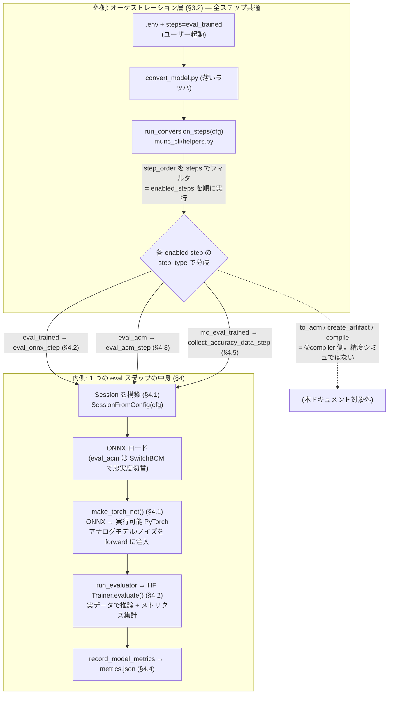

# 03. 精度シミュレーション解析

Mythic M2000 (Denali/ACE) アナログ compute-in-memory AI アクセラレータ SDK の **精度シミュレーション**の解析。対象バージョン `26.05`。

主張はすべて実コードの**ファイルパス:行番号**を根拠に引用する。確定できない箇所は **[推測]** と明記する。抽出ソースの所在は §9 を参照。

---

## 目次

- [1. 精度シミュレーションとは何か（一言で）](#1-精度シミュレーションとは何か一言で)
- [2. 入力と出力](#2-入力と出力)
- [3. 全体像と処理フロー](#3-全体像と処理フロー)
- [4. 処理フローの各ステップ詳細](#4-処理フローの各ステップ詳細)
- [5. 中核モデル①: BCM（Boreas Compute Model）](#5-中核モデル-bcmboreas-compute-model)
- [6. 中核モデル②: アナログノイズモデル（確率的非理想性）](#6-中核モデル-アナログノイズモデル確率的非理想性)
- [7. 中核モデル③: モンテカルロと保証精度](#7-中核モデル-モンテカルロと保証精度)
- [8. アナログ演算とデジタル演算の分割](#8-アナログ演算とデジタル演算の分割)
- [9. 参照ファイルと未解明点](#9-参照ファイルと未解明点)
- [補遺: Compiler コンテナ側の QDQ 量子化との関係](#補遺-compiler-コンテナ側の-qdq-量子化との関係)

---

## 1. 精度シミュレーションとは何か（一言で）

> **学習済み Mythic モデル（ONNX）を、実データセット上で、アナログ非理想性込みで推論し、精度メトリクス（mAP / accuracy 等）を算出する。**

M2000 はフラッシュメモリセルをアナログ乗算器として使う。この物理素子には製造ばらつき・熱雑音・電荷減衰といった**非理想性（ノイズ）**があり、量子化しただけの理想的なモデルより精度が落ちる。精度シミュレーションは、この非理想性を確率的にモデル化して推論に注入し、**「実チップに載せたら精度はどの程度になるか」を実行前に見積もる**ためのものである。

本ドキュメントは SDK コンテナ側（`munc` パッケージ）の実装を解析対象とする。これが精度シミュレーションの本体であり、実行に Compiler コンテナは不要（`munc` は `vnnort` を import しない。§9 で確認）。Compiler コンテナ側にも数学的に対応する仕組み（QDQ 決定論的量子化）があるが、それは別目的（コンパイル時の数値レンジ整合）の独立した仕組みであり、精度シミュレーションから呼ばれるわけではない。この関係は[補遺](#補遺-compiler-コンテナ側の-qdq-量子化との関係)で整理する。

### 位置づけ — SDK の 4 エントリーポイントとの関係

本 SDK のエントリーポイントは「①再学習 / ②**精度シミュレーション** / ③compiler / ④PPA estimator」の 4 つ。②はデータフロー上、①の出力から分岐する末端の枝であり、③・④とは相互依存しない（`00_overview.md` §2）:

```
①再学習 ── train ──▶ trained.onnx ─┬─▶ ②精度シミュレーション（本ドキュメント）── metrics.json（末端）
                                    └─▶ ③compiler ── to_acm → artifact → compile ──▶ ④PPA estimator
```

精度シミュレーションの入力は①再学習の成果物 `trained.onnx` であり、③compiler 側の `to_acm`/`acm.onnx` には依存しない。

---

## 2. 入力と出力

精度シミュレーションを担う主要ステップは 3 つ（詳細は §4）。いずれも「モデル + 実データ + ノイズ設定」を入力に取り、「メトリクス JSON」を出力する。**モデルの重み・構造は書き換えない**（推論と評価のみ。量子化・アナログ層は推論時 forward の中でのみ効く）。

### 入力

| 入力 | 実体 | 供給元 / 根拠 |
|---|---|---|
| **① 対象モデル（ONNX）** | 学習済み Mythic Node モデル `data/trained.onnx`。ノードは `MythicConv2d` / `MythicLinear`。 | `cfg.src`（`eval_onnx_step`, `conversion_steps.py:433-455`）。前段ステップ **`train`（①再学習）の成果物**。 |
| **② 実データセット** | validation split の実画像・ラベル（ImageNet / COCO / nuScenes 等）。ランダムデータではない。 | `model_setup.dataset[dataset_val_key]`（`evaluate_onnx_model`, §4.2）。 |
| **③ ノイズ / アナログモデル設定** | TorchNet に注入するハードウェア忠実度の指定。`hw_model`（=m2000/denali）・`make_analog_model`・`noise_config`（全 nonideality を有効化）。 | `cfg.torchnet.default_torchnet`（§4.2）。忠実度モデルは §5.2、ノイズ数式は §6。 |
| **④ 評価器の指定** | 精度メトリクスを算出する関数の完全修飾名（例: `mythic.model_zoo.huggingface_classifiers.conversion_steps.evaluate_onnx_model`）。 | `cfg.evaluator_config.evaluator`（`run_evaluator`, `conversion_steps.py:348-369`）。 |
| **⑤ サンプリング設定**（モンテカルロ時のみ） | `num_samples` / `schedule`（チップ間 × チップ内の階層サンプリング）、`nproc`、統計処理用の `prop`（カバレッジ, 既定 0.9999）・`confidence`（信頼度, 既定 0.95）。 | `mc_eval_trained` step 設定（§7）、`process_accuracy_data_step`（`conversion_steps.py:575-606`）。 |

> **変種 `eval_acm_step`**（§4.3）は上記①の代わりに `acm.onnx`（BCM ノード）を、③の代わりに `acm_model`（`munc_fp` / `munc_digital` / `munc_acm_signoff` 等）を入力に取る。これは M2000 標準フローではなく generic フロー側の機能。

### 出力

| 出力 | 実体 | 生成元 / 根拠 |
|---|---|---|
| **メトリクス JSON**（単発評価） | `cfg.metrics_file` が指す JSON。`{model_type: {metric_name: value, ...}}` の辞書に `model_type` をキーとして**追記マージ**（上書きではない）。中身のメトリクスは §4.4 参照。 | `record_model_metrics`（`munc_cli/helpers.py:250-265`）。 |
| **サンプル別 raw JSON**（モンテカルロ時） | `cfg.dest/metrics_XXXX.json`（1 サンプル = 1 ファイル、`XXXX` は 4 桁連番）。各サンプルは重み等を再ランダム化した 1 チップインスタンスの評価結果。 | `collect_accuracy_data_step`（`conversion_steps.py:525-548`）。dest は既存不可（混在防止）。 |
| **統計サマリ**（モンテカルロ時） | サンプル群を集約した「片側許容区間の下限（＝保証精度）」＋ 各メトリクスの mean/std。`metrics_file` に記録し表形式でログ出力。 | `process_accuracy_data_step`（`conversion_steps.py:575-606`）→ `process_accuracy_data`（`monte_carlo.py:100-126`, §7.2）。 |
| **可視化・動画**（オプション、BEVFormer のみ） | 推論結果を検出 box・BEV 図として描画した MP4 / JPEG。精度メトリクスとは別経路だが同じ推論を使う。 | `bevformer_inference.py`（§4.6）。 |

---

## 3. 全体像と処理フロー

精度シミュレーションの処理は **2 つの層**で理解すると分かりやすい。

- **外側 = オーケストレーション層**（§3.2）: `run_conversion_steps` が、config の `step_order` に並んだ多数のステップから、ユーザーが `steps=...` で指定したものだけを選んで順に呼ぶ。ここは精度シミュレーション専用ではなく、再学習・コンパイルも含む全ステップ共通の駆動機構。
- **内側 = 1 ステップの中身**（§4）: 選ばれたステップが `eval_trained` などの精度シミュレーションステップだった場合、その関数の中で `Session` を構築し、`make_torch_net()` で ONNX を PyTorch 化してアナログノイズ込みで推論し、メトリクスを JSON に書く。

この 2 層の全体像:



以下、外側（§3.2）→ 内側（§4）の順に詳細を述べる。

### 3.2 外側 — `run_conversion_steps` と `step_order`（どのステップが精度シミュレーションか）

**`step_order` とは**: config（`m2000.yaml`）が定義する「実行しうる全ステップの一覧と順序」。モデル変換〜コンパイルまでの全体パイプラインで、精度シミュレーション以外のステップも含む:

```
to_structural → to_training → train │ eval_trained → summarize_metrics │ to_acm → create_artifact → compile
└──────── ①再学習 ──────────┘ └──── ②精度シミュレーション ────┘ └──────── ③compiler ────────┘
```

**`run_conversion_steps` の動き**（`munc_cli/helpers.py`, [推測: L369-426 は解析時点、抽出ソースで再確認可]）: ユーザーがコマンドラインで渡す `steps=eval_trained` は「この一覧のうち **どれを有効化するか**」の指定。実行機構は次の通り:

1. config から `step_order`（全体の順序）を取得。
2. `steps` 引数を展開して `enabled_steps`（有効化するステップ集合）を作る。
3. `step_order` の並びを `enabled_steps` でフィルタし、**残ったステップを config が定める順序で**順に実行（コマンドラインで渡した順ではない）。
4. 各ステップは `step_type` に対応する関数（`resolve_function` で解決）を呼ぶ。

したがって `steps=eval_trained` を渡すと、`step_order` のうち `eval_trained` **1 つだけ**が実行される（前段成果物 `trained.onnx` が既存であることが前提）。

**精度シミュレーションに該当するステップ**は、この `step_order` の中で**推論 + メトリクス算出を行う 3 つ**だけ:

| ステップ名 | `step_type` | 呼ばれる関数（内側の実体） | 何をするか | §参照 |
|---|---|---|---|---|
| **`eval_trained`** | `eval_onnx` | `eval_onnx_step` | `trained.onnx` をアナログノイズ込みで 1 回評価（GEN2 標準の「精度シミュレーション」） | §4.2 |
| **`eval_acm`** | `eval_acm` | `eval_acm_step` | `acm.onnx` を、6 階層忠実度モデルの 1 つに切替えて評価（generic フロー） | §4.3 |
| **`mc_eval_trained`** | `mc_eval_onnx` | `collect_accuracy_data_step` | 上記をモンテカルロで多数回繰り返し、保証精度を統計算出（generic / 明示指定時） | §4.5, §7 |

> **ステップ名と `step_type` がずれている点に注意**: `eval_trained` はステップ「名」で、その実装は `step_type: eval_onnx`（= 関数 `eval_onnx_step`）で指定される。config 上は別物だが、標準では `eval_trained` を指定すると `eval_onnx_step` が動く。
>
> **`to_acm` / `create_artifact` / `compile` は精度シミュレーションではない**（③compiler 側）。`step_order` に並んでいるのは列挙上の都合で、`eval_trained`（②）と `to_acm`（③）は互いに依存せず、どちらも `train` の出力 `trained.onnx` を独立に入力とする（`00_overview.md` §2）。上図で点線・「対象外」としているのはこのため。

内側（選ばれたステップ関数の中身）は §4 で詳述する。

---

## 4. 処理フローの各ステップ詳細

本章は §3 の図の**内側ボックス（1 つの eval ステップの中身）**を詳述する。§4.1 が全 eval ステップ共通の実行基盤（`Session` → `make_torch_net`）、§4.2〜§4.5 が §3.2 表の各ステップの中身、§4.6 が同じ経路を流用した可視化である。

### 4.1 共通の実行基盤 — `Session` と `make_torch_net()`

すべての eval 系ステップは `SessionFromConfig(cfg)` で `Session`（`_session.py:33`）を構築し、その `make_torch_net()`（`_session.py:496-508`）で ONNX を**実行可能な PyTorch モデル `TorchNet` に変換**してから推論する。

```python
def make_torch_net(self):
    if get_model_type(self.model) == MODELType.ORIGINAL:
        self.change_opset()
    return TorchNet(self.model, layer_factory=self.torchnet_layer_factory, ...)
```

**この `make_torch_net()` こそがアナログ精度シミュレーションの肝**である。ONNX ノードの `op_type` 文字列（`MythicConv2d` / `BCMConv2d` 等）を対応する PyTorch nn.Module にディスパッチする際、アナログ MAC モデルとノイズが forward に組み込まれる（機構は §5.3）。`eval_trained` も `eval_acm` も BEVFormer 推論動画（§4.6）も、すべてこの同じ経路を通る。

### 4.2 `eval_trained`（＝ `eval_onnx_step`）— GEN2 標準の精度シミュレーション

`eval_onnx_step`（`conversion_steps.py:433-455`）:
```python
with SessionFromConfig(cfg, allow_other_keys=True) as s:
    metrics = run_evaluator(cfg, s)
    record_model_metrics(cfg, cfg.get('model_type', str(get_model_type(s.model))), metrics)
```

config 上、`eval_trained` は `step_type: eval_onnx` を指定し（名前と実装がずれている点に注意）、`torchnet: ${default_torchnet}` を与える。この `default_torchnet` が **`make_analog_model` と `noise_config`（全 nonideality enable）を TorchNet に渡す**ため、推論時にアナログノイズが乗る。

`run_evaluator`（`conversion_steps.py:348-369`）が `evaluator_config.evaluator` の完全修飾名を解決して評価器関数を呼ぶ。resnet50 では `evaluate_onnx_model`。その内部処理:

1. `session.make_torch_net()` で TorchNet 化（ここでアナログモデル/ノイズが効く）。
2. `training_args.seed == "random"` なら乱数シードを都度変更（毎回異なるノイズ実現で評価）。
3. `eval_dataset = model_setup.dataset[dataset_val_key]`（**実データセットの validation split**）。
4. `train_huggingface(do_train=False, do_eval=True)` → HuggingFace `Trainer.evaluate()` で推論 + メトリクス集計。

つまり `eval_trained` は「**学習済みモデルを、アナログノイズモデル込みの TorchNet で 1 回評価する**」。GEN2 ガイド §8.3 の `convert_model.py steps=eval_trained` がこれに対応する。

### 4.3 `eval_acm`（＝ `eval_acm_step`）— 忠実度モデルを切替えて評価

`eval_acm_step`（`conversion_steps.py:372-401`）:
```python
with SessionFromConfig(cfg, allow_other_keys=True) as s:
    s.run_ops(ops.SwitchBCM(bcm_class_str=cfg.acm_model, bcm_attr_str=cfg.acm_model_config))
    metrics = run_evaluator(cfg, s)
    record_model_metrics(cfg, model_type, metrics)
```

`eval_trained` との違いは、評価前に `SwitchBCM` で **BCM 計算バックエンド（6 階層の忠実度モデル, §5.2）を切替える**点。`acm_model` の値で忠実度が変わる（`munc_fp` / `munc_digital` / `munc_acm_signoff` 等）。入力は `acm.onnx`（BCM ノードを持つ IR）。GEN2 標準フロー（`m2000.yaml`）はこれを含まず、より汎用的な generic フロー側の機能。

### 4.4 メトリクスの記録（出力の実体）

`record_model_metrics`（`munc_cli/helpers.py:250-265`）は既存 JSON を読み込み、`data[model_type] = metrics` で**キー追記マージ**して書き戻す:
```python
def record_model_metrics(cfg, key, metrics):
    data = load_model_metrics(cfg)   # 無ければ {}
    data[key] = metrics
    save_model_metrics(cfg, data)
```

`metrics` の中身は評価器がタスク別に返す値。Compiler コンテナ側と共通の定義（`vnnort/inference/evaluation/`）は次の通り:
- **分類**: Accuracy（`sklearn.metrics.accuracy_score`）
- **検出**: mAP（`torchmetrics` の `MeanAveragePrecision`）
- **セグメンテーション**: mIoU（混同行列ベース）
- **BEVFormer 3D**: nuScenes mAP（BEV 中心距離マッチング, 閾値 `(0.5,1.0,2.0,4.0)` m）

`summarize_metrics_step`（`conversion_steps.py:88-107`）が `metrics_file` を読み、`model_re` / `metric_re` でフィルタした表を logger に出力する。

### 4.5 `mc_eval_trained` — モンテカルロ（保証精度の算出）

`collect_accuracy_data_step`（`conversion_steps.py:525-548`）が `schedule` / `num_samples` に従いハードウェアパラメータを繰り返しランダム化し、各サンプルの評価結果を `dest/metrics_XXXX.json` に保存する。`nproc > 1` なら GPU ごとにサンプルをシャーディングし、自分自身を `subprocess.Popen` で再 spawn（この subprocess は GPU 並列用であって Compiler コンテナ起動ではない）。

その後 `process_accuracy_data_step`（`conversion_steps.py:575-606`）が全サンプルを集約し、NIST 片側許容区間で**保証精度**を算出する（§7）。統計処理の詳細は §7 を参照。

### 4.6 （オプション）推論結果の可視化・動画生成

`bevformer_inference.py`（BEVFormer 専用）は、`eval_trained` と**同じ `make_torch_net()` 経路**を、メトリクス集計ではなく可視化・動画出力に流用したもの。`torchnet` サブコマンドで実行すると、アナログノイズが乗った推論結果を検出 box・BEV 図として動画で目視確認できる。4 サブコマンド（`pytorch` / `onnx` / `torchnet` / `ground-truth`）が共通パイプラインのバックエンドだけを差し替える。詳細は §9 の参照ファイルおよび `HOWTO_bevformer_carla_video_generation.md`。

---

## 5. 中核モデル①: BCM（Boreas Compute Model）

### 5.1 BCM とは — 「ハードウェア忠実にモデルを数値再現する中間表現」

**BCM = Boreas Compute Model**（block-circulant matrix ではない。根拠: `munc/bcm/bcm_layers.py` docstring `"to be run with the Boreas Compute Model"`）。別名 **ACM (Analog Compute Model)**。

BCM は、ONNX の `Conv` / `Linear` ノードを `BCMConv2d` / `BCMLinear`（`bcm_layers.py`）に置き換えたもので、**M2000 チップが 1 層を計算する様子を数値的に忠実再現する**。モデルの状態遷移の中の 1 段階である（`00_overview.md` §3.5）:

```
ORIGINAL → structural → MYTHIC(MythicConv2d) → BCM(BCMConv2d) → COMPILER
              to_structural   to_training          to_acm         create_artifact
```

BCM は精度評価専用ではない。`to_acm` が生成した BCM ノード入りの ONNX（`on_chip_1_bcm.onnx`）は、`SwitchBCM(munc_digital)` でノイズなしに固定した上で **Compiler コンテナの `dnn_compiler` バイナリの直接入力にもなる**（`00_overview.md` §3.5, 旧 doc の A.12）。ただし本ドキュメント（精度シミュレーション）で扱うのは、BCM を **TorchNet 上で実行してノイズ込み推論する**用途である。

### 5.2 BCM 層の内部構造 — アナログ MAC + デジタルデータパスの 2 段

`BCMConv2d` / `BCMLinear`（親クラス `BCMMMAOp`）は、アナログ MAC 単体ではなく **アナログ + デジタルの 2 段構成**である。`BCMMMAOp.forward`（`bcm_layers.py:85-103`）:

```python
def forward(self, torch_X, weights, biases=None):
    if self._mma is None:
        self.layer_gen(weights, biases)         # mma_class インスタンスを生成
    # ① 符号付き入力なら正負を分離（差動処理）
    if self.duplicate_weight and self.signed_input:
        torch_X = torch.cat([clamp(X, min=0), clamp(-X, min=0)], dim=1)
    # ② アナログ MAC
    y = self.torch_layer_op(torch_X)            # self.mma.randomize() 後 dot 実行
    # ③ デジタル後処理
    y = self.digital_datapath.compute(y, self.dsf_mult, self.dsf_shft, self.activation)
    return y
```

- **② アナログ MAC**（`self._mma` = `mma_class` インスタンス）が **ACE アナログ行列積部分**。ここが §5.4 で選択する 6 階層の忠実度モデル。画像ごとに `self.mma.randomize()` を呼び、ノイズを再サンプルする（`bcm_layers.py:66-79`）。
- **③ デジタルデータパス**（`ace_digital_datapath_factory`）が **DSF（Digital Scale Factor）による乗算・右シフト + 活性化関数**（`relu` / `hardtanh` 等）を担う。`mma_class` に依らず共通。

したがって **BCM 層 ⊋ アナログ MAC モデル**。BCM 層はアナログ MAC を内包しつつ、その前後のデジタル演算（差動処理・DSF スケール・活性化）も含めて 1 層全体を再現する。

### 5.3 なぜグラフ書き換えだけで BCM 計算になるのか（ディスパッチ機構）

「ONNX ノードの `op_type` 文字列を、そのままクラス名として `munc._o2t_ops` から `getattr` 解決する」という設計で実現されている（`_torchnet.py`: `layer_class = getattr(_o2t_ops, node.op_type)`）。

```
ONNX Conv/Gemm
  │ ConvertNodesToMythic:  op_type 文字列を "MythicConv2d" に書き換え
  ▼
MythicConv2d（アナログaware 学習可能グラフ、まだ「文字列」）
  │ ConvertConvsToBCM (to_acm):  op_type を "BCMConv2d" に書き換え + 属性 __mma_class を付与
  │                              is_digital_onchip(node) なら munc_int8 を強制（§8）
  ▼
BCMConv2d（まだ「文字列」）
  │ SwitchBCM (eval_acm/create_artifact):  __mma_class 属性だけを書き換え（6 階層の切替）
  │
  │ make_torch_net() → getattr(_o2t_ops, "BCMConv2d") → bcm_layers.BCMConv2d
  ▼
bcm_layers.BCMConv2d インスタンス（実 PyTorch nn.Module, §5.2）
```

`munc/_o2t_ops/__init__.py` で `BCMConv2d = bcm_layers.BCMConv2d` と再エクスポートされているため、`op_type` が `"BCMConv2d"` になった時点で TorchNet 構築時に自動的にアナログ MAC + デジタルデータパスの層が使われる。**「グラフレベルの文字列書き換え」と「実際の数値計算」がこの 1 点のディスパッチテーブルで接続される。**

さらに BCM 層内部の `mma_class` 選択も同じ「文字列→クラス」パターンで、`__mma_class` 属性を `MMA` レジストリ（`bcm_utils.py`）で実クラスに解決する。

### 5.4 アナログ MAC の 6 階層忠実度モデル（`mma_class`）

`munc/bcm/bcm_models/` に、忠実度の異なる 6 種類のアナログ MAC モデルが実装されている。`SwitchBCM` / `eval_acm` の `acm_model` で選択する（BCM 層の②部分のみを差し替え、③は共通）:

| FACTORY_NAME | ファイル | モデル化する現象 | 位置づけ |
|---|---|---|---|
| `munc_fp` | `fpmodel.py` | 出力の round/clip のみ | 浮動小数点理想（最上位精度） |
| `munc_int8` | `int8model.py` | 量子化のみ（pFSR=iFSR 強制） | 整数理想 |
| `munc_digital` | `digitalmodel.py` | 量子化 + クリップ + マルチサイクル（8bit 分解） | デジタル忠実（ノイズ無しアナログ上限） |
| `munc_simple` | `simplemodel.py` | 上記 + **重み 5 段ノイズ + SAR ADC ノイズ/オフセット/INL** | 物理ベースのフルアナログ（**最も忠実**） |
| `munc_tacm` | `trainingacm.py` | (weights, multicycle, adc) 3 軸を IGNORE/MOCKUP/FULL で切替 | 学習用高速近似（5〜10 倍高速） |
| `munc_acm_signoff` | `acmsignoffmodel.py` | 実測フィット統計モデル（ロバスト回帰） | 製品精度保証（サインオフ）用 |

**ACE アナログ MAC の共通モデル化方法**: uint8 入力を 8bit に分解（`x_bits = input·pows2 // 128`）→ 各ビットで `F.linear`/`F.conv2d` を実行（マルチサイクル）→ ビット毎にクリップ `[-128,127]` → 重み付き加算（`pows1=[128,64,...,1]`）→ `/128` して `clamp(-256,255)`。これが「マルチサイクル・ビットシリアル」動作の再現。`munc_simple` はこの加算部を明示的な 8 サイクル **SAR (Successive Approximation Register) ADC** に置換して非理想性を注入する。

`trainingacm.py` の `tacm_submodel_types` は 3 軸の組合せに名前を付ける: `quantized`≈`munc_fp`、`full`≈`munc_simple`、`acms`≈`munc_acm_signoff`。

---

## 6. 中核モデル②: アナログノイズモデル（確率的非理想性）

§5.4 の忠実度モデルのうち `munc_simple` / `munc_acm_signoff` 等が実際に注入する**確率的ノイズ**の数式。これが「実チップに載せたら精度がどう落ちるか」を決める本質部分である。ノイズは**推論のたびに乱数から再サンプル**される（`bcm_layers.py` の画像単位 `randomize()`、およびモンテカルロのサンプル単位, §7）。

### 6.1 `munc/_pytorch/noise.py`（ACE モデル / 学習用、autograd + STE）

backward は勾配素通し（Straight-Through Estimator）。乱数は `torch.randn` / `torch.rand`。

**(1) WeightNoise**（重みプログラミング誤差）— 加算 + 乗算ガウスノイズ:
```
weight ← weight + N(0, σ_add) + weight · N(0, σ_mult)
```

**(2) TempShift**（温度シフト）— ローカル温度をグローバル温度周りの一様分布からサンプルし重みに反映:
```
temp_delta ~ U(global_temp − local_temp_range, global_temp + local_temp_range)
weight ← weight + weight · temp_delta · 0.005   （簡略版。理論式はコメントに別途）
```

**(3) ADCNonLinearity**（ADC 3 次歪み）:
```
X ← X + η·X³,   η ~ Normal(nl_shift_coeff, nl_noise_coeff)
```

**(4) ADCNoise**（ADC 熱ノイズ）— 8 回のマルチサイクル ADC 実行を二乗和近似:
```
rand_sigma = noise_at_ifsr10 · 5.0 · 0.58     (0.58 ≈ Σ_{b=0}^{9}(1/2^b)²)
X ← X + N(0, rand_sigma)
```

### 6.2 `munc_simple`（`simplemodel.py`）— 最も物理的に詳細なモデル

`mod_weights_torch()` がフラッシュ重みに**5 段のノイズを順に適用**:

1. **線形電荷減衰（retention drift）**: `flash ← flash·(1 − decay_rate·decay_hours)`
2. **指数温度変化**: `flash ← flash·(2.0928e-2·exp(−5.6064e6·1e-7·|flash|)·temp_delta + 1)`
3. **比例重み誤差（Flash Monte-Carlo variation）**: `flash ← flash + flash·σ·N(0,1)·8/pFSR + mask·σ_lsb·(1.5625/100)·pFSR·0.5·N(0,1)`
4. **ポップコーンノイズ（RTN/テレグラフ様）**: 対数正規のステップ分布 `exp(N(pop_lognorm_mean, pop_lognorm_sigma))` を二値マスクで一部セルに適用。
5. **線形モデル補正**: `flash ← beta0 + beta1·flash`

**ADC ノイズ/オフセット/INL**: `simple_offset`（入力オフセット）・`simple_inl`（積分非線形性）を `N(0,1)` から生成し、8bit **逐次比較（SAR）**の各サイクルの比較にノイズを加算。

### 6.3 `munc_acm_signoff`（`acmsignoffmodel.py`）— 実測フィット統計モデル

物理機構ではなく**ロバスト回帰でハードウェア実測をフィットした統計モデル**。
- 重みノイズ: `beta0 + beta1·w`（平均）+ 比例 `N(0,σ_prop·|w|)` + 加算 `N(0,σ_add)` + √比例 `N(0,σ_sqrt_prop·√|w|)` + タイル毎比例ノイズ。
- ドット積ノイズ: `beta = gamma0 + gamma1·acc` + `N(0, σ_dot)`。

バージョン別実測パラメータ:
| バージョン | linear_beta1 | σ_weight_add | σ_weight_prop | gamma0 | gamma1 | σ_dot |
|---|---|---|---|---|---|---|
| v0.4 | 0.95 | 0.0 | 0.16 | −0.12 | 0.96 | 2.48 |
| v0.5 | 0.96 | 1.85 | 0.0 | −0.12 | 0.96 | 2.48 |
| v0.8 | 1.0 | 0.637 | 0.073 | 0.0 | 1.0 | 2.32 |

**全 σ=0 にすると `munc_acm_signoff` は `munc_digital` と等価**になる（コード内コメントで明記）。これがノイズモデルの「ゼロノイズ極限＝決定論的デジタル」という構造を示す（補遺の QDQ との接続点）。

### 6.4 ノイズパラメータの管理

- **`configure_nonidealities()`**（`DenaliSeparableModel`）: `input_model_nonidealities` / `weight_model_nonidealities` / `adc_model_nonidealities` の 3 辞書を各 `hw_model.randomize(**params)` に渡す。実パラメータ名は外部パッケージ（`mythic.acm.denali.*`, 抽出範囲外）側の定義で未確認[推測]。
- **HW 仕様の設定クラス**（`hw_specs.py`）: `DenaliNoiseConfig` / `BoreasNoiseConfig`（`ADC_noise_lsb_at_10ifsr`, `weight_noise_percentage` 等）/ `NoiseConfigBase`（`temp_delta`, `half_pFSR_arr` 等）。
- **BCM 側 `mma_attr` 既定値**（`registry.py`, `SimpleAttributes`）: `simple_noise=68e-9`, `simple_offset=23e-9`, `simple_inl=-0.04`, `pop_lognorm_mean=-4.6`, `temp_delta=5` 等。

---

## 7. 中核モデル③: モンテカルロと保証精度

単発の `eval_trained` は「あるノイズ実現 1 つでの精度」を返すだけ。製品精度を保証するには、**多数のチップインスタンス・多数のノイズ実現をサンプリングし、統計的な下限を出す**必要がある。これがモンテカルロ（`mc_eval_trained`）である。

### 7.1 スケジュールとサンプリング

- `mc_eval_trained`（[推測: base_config_generic.yaml, コンテナ内確認]）: `step_type: mc_eval_onnx`, `num_samples: 100`, `schedule: ${mc_schedule}`。
- **総サンプル数 = 各スケジュールステップの `repeat` の積**（`get_schedule_num_samples` = `math.prod`）。「**チップ間ばらつき × チップ内ばらつき**」を階層サンプリングする。
- `random_model_instances`（`chip_instance_generator.py`）が各サンプルでハードウェアパラメータをランダム化・凍結した Session を yield → `run_evaluator` で評価 → `metrics_{i:04d}.json` に保存。
- 重みランダム化: `freeze_hardware_parameters` / `unfreeze_hardware_parameters` が 1 チップインスタンス評価中は重みを固定し（サンプル間でのみ変わる）、BCM 側は別経路で画像ごとに再サンプルする（§5.2）。

### 7.2 統計処理 — 片側許容区間（`tolerance.py`）

NIST 工学統計ハンドブック 7.2.6.3 の正規分布**片側許容区間**を実装（`munc_monte_carlo/tolerance.py:15-31`）:

```
compute_k1(n, prop, confidence):
    dof  = n − 1
    z_p  = norm.isf(1 − prop)        # カバレッジ側の臨界値
    z_c  = norm.isf(confidence)      # 信頼側の臨界値
    a = 1 − z_c²/(2·dof)
    b = z_p² − z_c²/n
    k1 = (z_p + √(z_p² − a·b)) / a

compute_lower_tolerance(data, prop, confidence):
    lower = mean(data) − k1 · std(data)
```

「**信頼度 confidence で、母集団の prop% がこの下限値以上**」という保証精度（下側トレランス限界）を算出する。既定値 [推測: コンテナ内確認] `prop=0.9999`（100 PPM）, `confidence=0.95`。`process_accuracy_data`（`monte_carlo.py:100-126`）が全サンプルの `metrics_*.json` を集約し、下限 + mean/std を出力する。

> GEN2 の M2000 標準フロー（`m2000.yaml`）は `step_order` に `mc_eval_trained` を含まない[推測]。GEN2 ガイドの「精度シミュレーション」は単発の `eval_trained`（seed=random で毎回ばらつくが統計処理はしない）を指す可能性が高い。モンテカルロ + トレランスによる製品保証精度の算出は、generic フローか明示的に `steps=mc_eval_trained` を指定したときに使う。

---

## 8. アナログ演算とデジタル演算の分割

M2000 は全演算をアナログで実行できるわけではない。**アナログ MAC（ACE）で実行できる演算とできない演算**があり、精度シミュレーションはこの分割をノード属性のマーキングで扱う。ただし精度シミュレーション側の主眼は**アナログ非理想性の精密なモデル化**にあり、デジタル演算は粗い近似で済ませる、という非対称な役割分担になっている。

### 8.1 分割のマーキング機構（3 種類の属性）

`to_training` / `to_acm` の変換過程で、各ノードに以下の属性が付与される:

| マーキング op | 対象 | 付与属性 | 結果 |
|---|---|---|---|
| `MarkUnsupportedOpsOffChip`（`mark_unsupported_ops_off_chip.py`） | on-chip でサポートされない op_type（`is_op_type_supported_on_chip` が False） | off-chip | チップ外（ホスト/off-chip）で実行。TorchNet 上は標準 ONNX op のまま |
| `MarkDepthwiseConvsAsDigital`（`mark_depthwise_convs_as_digital.py`） | `group == out_channels かつ in_channels/group == 1` の Conv（＝ DepthwiseConv） | `__digital_onchip` | on-chip だが**アナログ MAC ではなく SALU（デジタル）**で処理。詳細は §8.2 |
| （BCM 変換時） | `is_digital_onchip(node)` が True のノード | — | `ConvertConvsToBCM` / `SwitchBCM` が `mma_class` を強制的に `munc_int8` に上書き |

`MarkDepthwiseConvsAsDigital` の docstring が明言する: 「depthwise conv は Mythic チップ上では **SALU、すなわちデジタルで処理される**」。

### 8.2 精度シミュレーションがデジタル演算をどう扱うか（限界）

`munc/bcm/bcm_layers.py` に実装されている BCM 層は **`BCMConv2d` / `BCMLinear` / `BCMSum` / `BCMAdd` / `BCMMul` の 5 種のみ**で、`BCMSoftmax` / `BCMLayerNorm` / `BCMAttention` 相当は**存在しない**。デジタル演算は次のように扱われる:

- **DepthwiseConv**: `__digital_onchip` 属性により `munc_int8`（6 階層中最も単純な「量子化のみ・ノイズなし」）に固定。`BCMConv2d` クラス自体は使われ続けるが、中身は量子化のみの粗い近似。
- **Softmax**: on-chip 版 `MythicSoftmax`（`munc/_o2t_ops/mythic_softmax.py`）は「定数スケール乗算 → `torch.softmax` → 定数スケール乗算 → クリップ」のみ。Compiler 側 `vidSoftmax` の精密なグループ化・reshape 処理は再現しない。
- **Attention 分解 / LayerNorm**（doc 01 の `com.videantis` カスタムオペ）: 対応するグラフ書き換えは精度シミュレーション側に存在せず、TorchNet 上は元の標準 ONNX op のまま量子化・ノイズなしで実行される[推測: `_o2t_ops` に該当クラスが無いことからの推定]。

### 8.3 設計上の役割分担

| 演算の種類 | 性質 | 精密な検証を担う場所 |
|---|---|---|
| **アナログ非理想性**（重み誤差・温度・ADC 熱雑音等） | 製造ばらつき起因で**確率的**にしか予測できない | **精度シミュレーション（本ドキュメント、SDK コンテナ側）**が精密にモデル化 |
| **デジタル演算**（DepthwiseConv・Softmax・LayerNorm・Attention 分解） | **決定論的**（ノイズなし） | Compiler コンテナ側の決定論的ツール（QDQ / funcsim / vidsim, [補遺] 参照）。SDK 側は量子化のみの粗い近似で代用 |

この役割分担が意図的な設計判断であることはコード上の直接的根拠はなく、実装のカバレッジ差からの推定である[推測]。

---

## 9. 参照ファイルと未解明点

### 抽出ソースの所在（`_extracted_sdk/`, ホスト抽出済み）

| 分類 | ファイル |
|---|---|
| ワークフロー駆動 | `conversion_steps.py`, `munc_cli/helpers.py`, `_session.py` |
| ノイズモデル | `munc_pytorch/noise.py` |
| BCM モデル階層 | `munc_bcm/bcm_models/{fpmodel,int8model,digitalmodel,simplemodel,trainingacm,acmsignoffmodel}.py` |
| BCM 基盤 | `munc_bcm/{registry,bcm_layers,bcm_utils,ace_digital_datapath,salu_datapath}.py` |
| モンテカルロ | `munc_monte_carlo/{chip_instance_generator,tolerance}.py`, `munc_cli/monte_carlo.py` |
| ACE モデル | `_ace_model.py`, `_denali_ace_{reference,separable}_model.py`, `_boreas_ace_model.py` |
| HW 仕様定数 | `hw_specs.py` |
| ONNX→TorchNet 変換・分割マーキング | `_torchnet.py`, `munc_ops/{convert_convs_to_bcm,convert_nodes_to_mythic,switch_bcm,mark_depthwise_convs_as_digital,mark_unsupported_ops_off_chip,mythic_conv,mythic_softmax}.py` |
| 可視化・動画（§4.6） | `bevformer_inference.py`, `bevformer_inference_support/` |

> `mythic-model-zoo/configs/*.yaml`（Hydra 設定）・`scripts/*.env`・`mythic.acm.denali.*` は解析用コンテナ内で `docker exec` により確認したのみで、ホストには未抽出（「コンテナ内確認, 再検証不可」と本文で注記）。

**「精度シミュレーションが SDK コンテナ内で完結する」ことの確認**: `grep -rln vnnort _extracted_sdk/` は空（`munc` は `vnnort` を import しない）。`eval` 経路の唯一の subprocess は Monte Carlo の GPU シャーディング（自分自身の再 spawn, `conversion_steps.py:505`）で、Compiler コンテナ起動ではない。

### 未解明点

1. `hw_model.randomize(**nonidealities)` の実パラメータ名（外部パッケージ `mythic.acm.denali.*` 側で定義、抽出範囲外）。
2. Hydra config の既定スケジュール `repeat` 値、`eval_config.training_args` の具体値（batch size 等）。
3. `munc_acm_signoff` v0.4/v0.5/v0.8 の物理的差異の背景（較正世代の違いか等）。
4. `train_huggingface` の QAT/蒸留詳細（`huggingface_classifiers/train.py`, 未読）。
5. §8.3 の役割分担が意図的設計かはコード上の直接根拠なし（実装カバレッジ差からの推定）。
6. `bevformer_inference.py` が他モデル（ResNet-50/YOLO 系）にも存在するか未確認。

---

## 補遺: Compiler コンテナ側の QDQ 量子化との関係

精度シミュレーション（SDK コンテナ、`munc`）の実行に Compiler コンテナは不要だが、Compiler コンテナ側（`vnnort`）にも**数学的に対応する仕組み**が存在する。混同を避けるため関係を整理する。**両者は実行時に呼び合う関係ではなく、それぞれ別目的の独立した仕組みである。**

### QDQ 決定論的量子化とは

Compiler コンテナ側は、`QUANTIZED` 状態の ONNX に QDQ (Quantize-Dequantize) ノードを挿入し、ONNXRuntime で FP32 実行して固定小数点量子化を数値模擬する。中核は `QDQLayer`（`vnnort/quantizer/qdq_layer.py:8-35`, `com.videantis` ドメインのカスタム ONNX FunctionProto）:

```
Q(x) = clip( round( x · 2^(fraction_bits − max_exponents) ), −2^(n_bits−1), 2^(n_bits−1)−1 )
       / 2^(fraction_bits − max_exponents)
```

Mythic の power-of-two 固定小数点量子化 + 飽和クリップ（対称量子化、ゼロ点なし）の**決定論的**模擬。ノイズは一切注入しない（`vnnort` にノイズ注入コードは無い）。

### 両者の関係（決定論版 ⊂ 確率版）

| 観点 | QDQ（Compiler コンテナ） | アナログノイズモデル（SDK コンテナ） |
|---|---|---|
| 種類 | 決定論的固定小数点量子化（fake-quant） | 確率的ノイズ注入（ガウス/対数正規/一様） |
| 乱数 | 無し（毎回同一） | サンプル毎に変化（モンテカルロ） |
| 重み誤差 | 量子化丸めのみ | プログラミング誤差・温度・電荷減衰・ポップコーン |
| ADC | 理想量子化 | 熱ノイズ・オフセット・INL・3 次歪み・SAR 逐次動作 |
| 目的 | **コンパイル**時のハードウェア数値レンジ整合 | **実チップ精度予測・保証**（モンテカルロ + トレランス） |
| 呼び出し | 精度シミュレーションからは呼ばれない | 精度シミュレーションのエントリーポイント |

**QDQ 量子化は、アナログノイズモデルの「ゼロノイズ極限」に相当する。** 全 σ=0 にすると `munc_acm_signoff` → `munc_digital`（§6.3）となり、両モデルは共通の「マルチサイクル・ビット分解・`[−256,255]` クリップ・pFSR/iFSR スケーリング」というデジタルデータパス土台を共有する。SDK 側はその上に確率的アナログ層を積む。つまり **QDQ = 決定論的な下部構造、SDK 側ノイズモデル = その上に載る確率的上部構造**という数学的関係であって、実行時のモジュール依存ではない。

> なお、ドキュメント群が精度シミュレーションを「2 コンテナに跨る」と記す（`00_overview.md`）のは、この**概念的対応**を解析対象に含めるためであり、`eval_trained` の**実行が両コンテナを必要とする**という意味ではない。実行は SDK コンテナで完結する（§9 で確認）。
