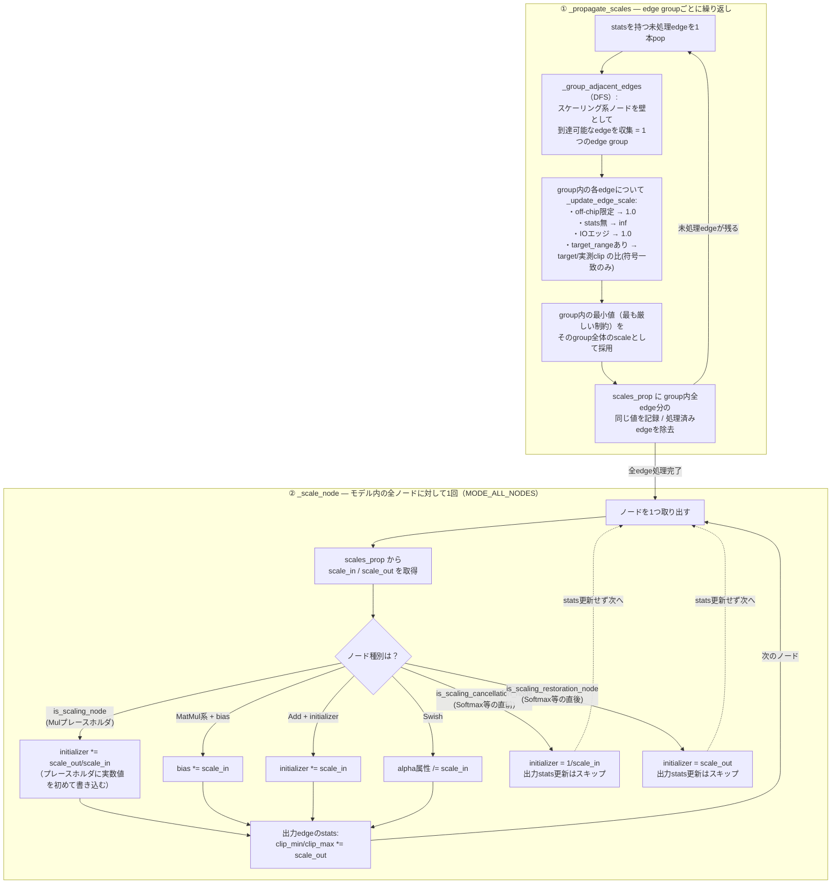

# 04. `to_training` ステップ解析

Mythic M2000 (Denali/ACE) アナログ compute-in-memory AI アクセラレータ SDK の **`to_training` ステップ**の解析。対象バージョン `26.05.2`（SDK コンテナ `mythic-sdk-ubuntu-24.04:m2000-v26.05.2`, `mythic-model-zoo` の venv 内 `munc` パッケージ）。[to_structural.md](to_structural.md) の直後段にあたる。

主張はすべて実コードの**ファイルパス:行番号**を根拠に引用する。確定できない箇所は **[推測]** と明記する。パスは特記なき限りコンテナ内 `/root/mythic_sdk/v26.05.2/mythic-model-zoo/` からの相対（`munc/...` は実体としては同ディレクトリ下 `.venv/lib/python3.12/site-packages/munc/...` に存在するpipパッケージだが、[to_structural.md](to_structural.md) と表記を揃えて `munc/...` と記す）。抽出ソースの所在は §11 を参照。

**本ドキュメントの範囲**: `step_order` 上の `to_training` ステップ（structural → MYTHIC の変換）のみを対象とする。後続の `train`（重み学習ループ・QAT・蒸留の実行）は範囲外（[00_overview.md](../00_overview.md) §7 の残課題）。

---

## 目次

- [1. `to_training` とは何か（一言で）](#1-to_training-とは何か一言で)
- [2. 入力と出力](#2-入力と出力)
- [3. 位置づけ — `to_structural` との対比](#3-位置づけ--to_structural-との対比)
- [4. ディスパッチ機構 — `to_structural` と真逆の共通実装](#4-ディスパッチ機構--to_structural-と真逆の共通実装)
- [5. `get_original_to_mythic_conversion_ops` — 45個超のopの固定シーケンス](#5-get_original_to_mythic_conversion_ops--45個超のopの固定シーケンス)
- [6. off-chip / depthwise-digital の扱い](#6-off-chip--depthwise-digital-の扱い)
- [7. 「量子化」の実体 — 数値変更されるのはスケールのみ、丸め・ノイズ注入は実行時](#7-量子化の実体--数値変更されるのはスケールのみ丸め・ノイズ注入は実行時)
- [8. モデル横断比較 — 実装は完全共通、config数値だけが違う](#8-モデル横断比較--実装は完全共通config数値だけが違う)
- [9. 設定（config）の全体像](#9-設定configの全体像)
- [10. 実測 — BEVFormer-Tiny 1600x900](#10-実測--bevformer-tiny-1600x900)
- [11. 参照ファイルと未解明点](#11-参照ファイルと未解明点)

---

## 1. `to_training` とは何か（一言で）

> **structural ONNX（標準op構成、[to_structural.md](to_structural.md)）を、アナログaware再学習可能な `MythicConv2d`/`MythicLinear` 等のノードで構成された ONNX に変換する。ハードウェアスケール因子（FSR/DSF）を数値的に確定させるが、8bit power-of-two丸めとアナログノイズの注入は行わない。**

`step_order`（`configs/common/base_config_generic.yaml:37-50`）上で `to_structural` の直後に位置する。[00_overview.md](../00_overview.md) §3.5 の状態遷移表が「structural → to_training → **MYTHIC**」と描く、実際に状態を進める4ステップの1つである。`to_structural` とは対照的に、**`__type` メタデータが実際に書き込まれる**（`self._model.set_meta_data('__type', MODELType.MYTHIC)`, `munc/_session.py:330`）。§10 の実測でこれを直接確認済み。

本ステップの本質は3点:

1. **標準opからMythic opへのノード変換**（`Conv`→`MythicConv2d`、`Gemm`→`MythicLinear`、`Mul`→`MythicQuantizedMul`、`MatMul`→`MythicMatMul`、`Softmax`→`MythicSoftmax`）。ただし off-chip ノードには適用されない（§6）。
2. **ハードウェアスケール因子（iFSR/pFSR/DSF）の数値確定**。重みを実際にリスケールし、ノード属性として `__iFSR`/`__pFSR`/`__multiplier`/`__shift` 等を付与する。重みのdtypeは float32 のまま変わらない（§7）。
3. **学習可能パラメータのマーキング**（`__trainable_dsf`, QATタグ等）。実際の重み学習ループは次段の `train` ステップが担う。

---

## 2. 入力と出力

| 項目 | 実体 | 根拠 |
|---|---|---|
| 入力 (`src`) | structural ONNX（`to_structural` の出力） | `configs/common/base_config_generic.yaml:73` `src: ${structural_model}` |
| 出力 (`dest`) | MYTHIC ONNX | `configs/common/base_config_generic.yaml:74` `dest: ${mythic_model}` |

load/save の機構は `to_structural` と共通（`SessionFromConfig`, `munc/cli/helpers.py:43-121`）。加えて `to_training` は `dataloader`/`torchnet` キーを config に持つ（`base_config_generic.yaml:75-78`）— 統計収集（アクティベーション範囲のクリッピング用）に実データが必要なため。`stat_n_samples_default: 100`, `stat_clipping_percentile: 0.03` が既定値。

---

## 3. 位置づけ — `to_structural` との対比

| 項目 | `to_structural`（[to_structural.md](to_structural.md)） | `to_training`（本ドキュメント） |
|---|---|---|
| `__type` メタデータ | 書かれない（推論により ORIGINAL と判定される） | **書かれる**（`MODELType.MYTHIC`, `_session.py:330`） |
| `model.hwconfig` | 常に `None`（`SessionFromConfig` が `hwconfig` キーを禁止） | **設定される**（`set_hwconfig_metadata`, `_session.py:222-224`。ハードウェア名は `to_training.torchnet.hw_model.hardware_config_name` 経由） |
| モデル間の実装 | 6モデルすべて別実装（§4.2 に詳述） | **1個の共通関数**（§4） |
| off-chip自動判定（`MarkUnsupportedOpsOffChip`） | 実行不可（`hwconfig is None` で `ValueError`） | **実行される**（`hwconfig` 設定後、`_get_process_original_graph_ops` 内, `_session.py:199`） |
| 量子化・アナログノード変換 | 行わない | **行う**（ノード変換は本ドキュメントの主題。ただし丸め・ノイズ注入は実行時, §7） |

`assert_model_is(self._model, MODELType.ORIGINAL)`（`get_original_to_mythic_conversion_ops` 冒頭, `_session.py:216` 相当の呼び出し）は、[to_structural.md](to_structural.md) §3 で述べた「structural は `__type` 未設定のため ORIGINAL と推論される」という事実に依拠して成立している。すなわち **`to_training` が読める入力は「ORIGINAL相当」と判定されるファイルのみ**であり、structural ONNX はこの条件を満たすからこそ入力として通る。

---

## 4. ディスパッチ機構 — `to_structural` と真逆の共通実装

### 4.1 munc 側の共通実装が主役

[to_structural.md](to_structural.md) §4.2 は「`to_structural` は munc 側に共通実装が無く、6モデルの束縛が互いに無関係」と結論した。**`to_training` はこれと正反対**である。

`configs/common/step_types/common.yaml` に明記:

```yaml
to_training: mythic.model_zoo.common.conversion_steps.to_training_step
```

`step_types/main.yaml` で `to_training` を上書きしているモデルは **yolov8 のみ**（全6モデル中5モデルはこの共通実装をそのまま使う）:

```yaml
# configs/yolov8/training/step_types/main.yaml:8
to_training: mythic.model_zoo.yolov8.conversion_steps.to_training
```

```python
# mythic/model_zoo/yolov8/conversion_steps.py:127-128
def to_training(config):
    to_training_step(add_default_image_size(config))
```

`add_default_image_size`（同ファイル内）は config に既定の画像サイズを補完するだけの前処理で、実変換ロジックは同じ `to_training_step` に委譲される。つまり **6モデル全てが最終的に同一の `to_training_step`（`mythic/model_zoo/common/conversion_steps.py:175-207`）を実行する**。

### 4.2 `to_training_step` の実体

```python
# mythic/model_zoo/common/conversion_steps.py:175-207（要約）
def to_training_step(config):
    hardware_config_name = config.torchnet.hw_model.hardware_config_name

    def convert(sess):
        ops = sess.get_original_to_mythic_conversion_ops(
            hardware_config_name=hardware_config_name,
            **config.conversion_parameters.options)
        sess.run_ops(*configure_model_conversion_ops(ops, config.conversion_parameters.ops))

    run_conversion(config, convert)
```

`run_conversion`（`common/conversion_steps.py:143-166`）が `dataloader` config から実データローダを構築し `SessionFromConfig` を開く。実変換の中身は `Session.get_original_to_mythic_conversion_ops()`（`munc/_session.py:215-332`）が返す**固定の op シーケンス**であり、モデル側が制御できるのは:

- `hardware_config_name`（`Boreas`/`Denali`。§9.3）
- `config.conversion_parameters.options`（関数のキーワード引数 `scale_offchip_nodes`/`scale_concat_inputs`/`optimize_wsf`）
- `config.conversion_parameters.ops`（個々のopの `enabled`/パラメータを `configure_model_conversion_ops` 経由で上書き。§8）

の3点のみ。**opシーケンス自体の構成・順序を変えることはできない**（`to_structural` の6実装が処理内容そのものを自由に組んでいたのとは対照的）。

---

## 5. `get_original_to_mythic_conversion_ops` — 45個超のopの固定シーケンス

`munc/_session.py:215-332`。全体は `op_conf_seq(...)` で1本につながれた munc `ops.*` の列（`munc/ops/` ディレクトリに個別ファイルとして実装、全体で100種類超あるopカタログのうち約45個をこのシーケンスで使用）。役割ごとに分類する。

### 5.1 前段: 標準グラフ整備（`_get_process_original_graph_ops` の再利用）

`_session.py:184-206`。`to_structural` の後にもう一段、**同じグラフ整備関数**が走る（[to_structural.md](to_structural.md) §5.2 で予告した「op種別による自動off-chip判定はここで動く」の箇所）:

```python
# munc/_session.py:190-206
return op_conf_seq(
    *self.get_change_opset_ops(),      # opset変更＋SanityCheckOffChipMarking等（:462-481）
    ops.RemoveDanglingNodes,
    ops.RemoveShapeInferenceNodes,
    ops.GeneralizeBatchSize,
    ops.PostBatchNormFolding,
    ops.PreBatchNormFolding,
    ops.InferStoreTensorShapes,
    ops.MarkUnsupportedOpsOffChip,      # ← §6.1 で詳述。ここで初めて実行可能になる
    ops.AddNetworkOutputsForIntermediateNodes,
    ops.FixDefaultResizeROI,
    ops.RenameNodesAndEdges,
    op_do(self.stats.reset_stats),
    op_do(check_model),                 # onnx.checker.check_model(full_check=True)
)
```

`to_structural` の各モデル実装がすでに opset 変更・BN folding・shape 推論を行っていることが多いため（[to_structural.md](to_structural.md) §8 比較表）、ここでの多くのopは冪等的に「何もしない」か軽微な差分になる。ただし **`MarkUnsupportedOpsOffChip` はここで初めて有効になる**唯一のop（`hwconfig` が未設定だと `to_structural` 内では `ValueError` になっていたもの、[to_structural.md](to_structural.md) §5.2）。

### 5.2 サインネス・入力シフト・スケーリング準備（`_session.py:230-260`付近）

```
ConvertMatMulToGemm, ReplaceSiluPatternWithNode, CloneConvWeights,
MarkSignedNodes(hwconfig.signed),
AddInputShifting, AddInputScaling, AddOutputScaling,
MoveLastBiasOffChip(既定disabled),
AddOnOffChipTransitionScaling(既定 trainable=not scale_offchip_nodes),
MarkSignedNodes(再実行),
MarkQATNodes(self.qat),
MarkDepthwiseConvsAsDigital,           # ← §6.2
InsertReluForPositiveValues, MoveReLUBeforeMaxPoolOp,
SplitInputs(split_bias_fp=True),
FuseAddToSum(既定disabled),
InjectInputClippings,
ConvGemmWeightScaling,                 # ← 重みの実数値スケーリング。§7
RandomizeWeightsAndBiases(既定disabled),
```

`MarkSignedNodes`（`munc/ops/mark_signed_nodes.py`）は Conv/Gemm/Add/Sum/Mul を対象に、統計収集済みの最小値を見て「負の入力を受け取るノードか」を判定し `__signed`/`__mix_signed` 属性を付与する。`AddInputShifting`（`munc/ops/add_input_shifting.py`）はこの判定結果を使い、非signedのConv/Gemmの手前でバイアスシフトを行う（アナログMACが符号なし8bit入力を前提とするための補正）。

### 5.3 スケーリングノードの注入（`_session.py:262-282`付近）

```
InjectScalingOnMulInputs, InjectScalingOnMatMulInputs, InjectScalingOnSoftmaxInputs,
InjectScalingOnAddOutput, InjectScalingOnMatMulOutput, InjectScalingOnMulOutput, InjectScalingOnSoftmaxOutput,
InjectScalingOnAddInputs,
InjectScalingOnConcatInputs(既定 scale_concat_inputs=False で無効),
EqualizeConcatInputs(同上),
```

コメント（`_session.py` 内）曰く、前半4個（Add/MatMul/Mul/Softmax output）は「Mythicノードに吸収されるため必ず必要」、後半（Add input等）は「吸収されないため既存スケーリングノードの有無をチェックしてから注入」という2群に分かれる。

### 5.4 FSR/DSF分解（`_session.py:290-296`）

```
BreakCompositeScaleIntoFSRAndDigitalScales,
ScaleAllNodes(scale_offchip_nodes=scale_offchip_nodes),
BreakFSRIntoPFSRAndIFSR(clip_weights=not optimize_wsf),
RemoveMulByOne(既定 [1.0, -1.0] で無効化),
BreakDigitalScalesIntoFactors(break_into_attrs=True),
```

- `BreakCompositeScaleIntoFSRAndDigitalScales`（`munc/ops/break_composite_scale_into_FSR_and_digital_scales.py:7-15`）: 「複合スケール因子(CSF)をFSRとデジタルスケールに分割する処理群の最初の1手」。`MYTHICType.COMPOSITE_SCALE` ノードの後に値1.0の `Mul(Digital Scale)` を挿入する。
- `ScaleAllNodes`（`munc/ops/scale_all_nodes.py`）: グラフをスキャンしてスケーリングノード／打ち消しノードのグルーピングを行う（詳細実装は本解析で未深掘り、§11）。
- `BreakFSRIntoPFSRAndIFSR`（`munc/ops/break_FSR_into_pFSR_and_iFSR.py:12-24`）: 「ヒューリスティックによりFSRをACEハードウェアスケール因子(WSF・iFSR・pFSR)の集合に分割する。`CSF = (DSF * WSF * pFSR) / iFSR`。重み・バイアス・（必要なら）DSFを更新し、クリッピングを回避する」。**この op が重みを数値的に書き換える**（§7）。

#### 5.4.1 CSF/FSR/WSF/DSFの相互関係 — これは「量子化スケール」そのものである

`CompositeScale`（`MYTHICType.COMPOSITE_SCALE = "CompositeScale"`, `munc/_constants.py:107`）ノードが保持する **CSF（Composite Scale Factor）は、論理的には「このノードに必要な量子化スケール」そのもの**である。通常のソフトウェア量子化（例: 対称INT8量子化の `scale = max(|x|) / 127`）であれば1レイヤー1スケール値で済むが、Mythicのアナログcompute-in-memoryパイプラインには物理的に別々のスケール設定点が複数あるため、CSFはそれらのハードウェアノブの積/商として分解される:

```
CSF = (DSF * WSF * pFSR) / iFSR
```

- **WSF**（Weight Scale Factor）: NVMセルへの重み書き込み時のスケール。
- **pFSR**（**p**rogramming Full Scale Range）: 重み書き込み側（NVMセルに重みを物理的に"programする"側）のフルスケールレンジ。[03_accuracy_simulation.md:537](../03_accuracy_simulation.md)で確定済み。
- **iFSR**（**i**ntegration Full Scale Range）: 積分＝ドット積（入力×重みの積和）側のフルスケールレンジ。同上で確定済み。
- **DSF**（Digital Scale Factor）: デジタル側の後段乗数。`MakeDSFsTrainable`（§5.6）が学習可能パラメータとして`train`ステップに引き渡す対象。

4つの用語の物理的な意味・具体的な計算手順は §5.4.3 で数値例とともに深掘りする。

この分解が「量子化スケールの計算」であることは、`get_weight_scale`（`munc/_session_tools.py:779-781`）の関数シグネチャに直接現れている:

```python
def get_weight_scale(weight, bias, use_sigma=False, correct_mean=True, n_sigma=3, pctl=0.997, num_bias_splits=6,
                     protect_biases=False, protect_filters=False, hw_weight_min=-128, hw_weight_max=127,
                     use_histogram=False):
```

`hw_weight_min=-128, hw_weight_max=127` は符号付き8bit整数の表現範囲そのものであり、percentile/sigma/histogramヒューリスティックで「FP32の重みをこの範囲に収めるスケール」を求める処理は、古典的な対称量子化のスケール計算と同一である。**FSR系のハードウェアスケール因子は量子化スケールの実体であり、Mythicのアナログハードウェアが持つ複数の物理スケール設定点（重み書き込み・クロスバー入力・ADC出力・デジタル後段）に対応させて分解されたもの**、と理解して良い。

### 5.4.2 `ScaleAllNodes` の内部アルゴリズム深掘り（§11 旧・未解明点1の解消）

実際の呼び出しは `ScaleAllNodes(scale_offchip_nodes=scale_offchip_nodes)`（§5.4引用のとおり、`munc/_session.py:292`付近）であり、`mode` 引数は渡されない。`__init__` の既定値は `mode=MODE_ALL_NODES`（`munc/ops/scale_all_nodes.py:144`）で、本SDK内で `ScaleAllNodes(...)` が呼ばれている箇所はモデル共通でこの1箇所のみ（grep確認済み）。したがって**`MODE_ALL_PATHS`（`_scale_path_fwd`, :475-497）はこのSDKバージョンの実行パス上では到達しない**。実装自体は存在するが、実質デッドコードである[推測: テスト用または将来の再帰制御用の残置]。

#### 一般的なソフトウェア量子化との対比 — 「量子化」ではなく「スケール値の配線」

このopの名前・docstringの「スケーリング」「グルーピング」という語は、一般的な量子化（例: 対称INT8 PTQ、`scale = max(|x|)/127` を計算して `x_int8 = round(x/scale)` で丸める処理）とは**別の階層の処理**を指している。混同しやすい3点を対比する。

| 観点 | 一般的なソフトウェア量子化 | Mythic `ScaleAllNodes` |
|---|---|---|
| 「スケール」が指すもの | テンソル1個（per-tensor）または1チャネル（per-channel）に対して独立に決める1つの数値。量子化の最終産物そのもの | グラフ上で「スケーリングノード（Mulプレースホルダ）に区切られた到達可能なエッジの集合（edge group）」が共有する1つの数値。すでに§5.3で構造的に挿入済みのMulノード（初期値1.0のプレースホルダ）に、後から正しい数値を書き込むだけの中間生成物 |
| 「グルーピング」の意味 | （一般の量子化では使わない語。per-channel量子化の「チャネル分割」とは無関係） | グラフ構造上の連結成分探索（DFS）。「物理的に同じスケールしか取れない区間」をノード・エッジを辿って求める処理で、ノードやエッジの実体（グラフ構造）は一切変更しない |
| 「スケーリング」で実際に書き換わるもの | activation/weightの**実データ**を整数格子へ写像（丸め・クリッピングがこの時点で発生＝量子化誤差の発生源） | 既存のFP32 initializer（Mul乗数・bias・Add初期化子・Swish alpha属性）に比率を**乗算するだけ**。丸め・整数キャスト・ノイズ注入は一切行わない（§7「量子化の実体」で述べた、dtypeがfloat32のまま変化しないという実測結果と同じ理由）。activationの実データ自体は触らず、統計（`clip_min`/`clip_max`というメタ情報）だけ更新する |

要するに、一般的な量子化が「1テンソルの値をどの整数に丸めるか」を決める処理であるのに対し、`ScaleAllNodes`は「ハードウェア的にスケールを変更できる地点（スケーリングノード）の間で、どの数値を使えば全エッジが目標レンジに収まるか」というグラフ全体の制約解決問題を解き、その答えを既存のプレースホルダに書き込む処理である。丸め・ノイズ注入という「本当の量子化誤差」が入るのは、§7で述べた通りこのopより後（`train`ステップでの実行時）になる。

#### 処理フロー（抽象化）



①は「どのエッジがどの数値を共有すべきか」を決めるフェーズ、②は「決まった数値を実際のグラフ（initializer/属性）に書き込む」フェーズであり、コード上もこの2フェーズに明確に分離されている（`_run`:159-189 で①→②の順に1回ずつ実行）。

#### 全体の4段構成

`_run`（:159-189）はクラスdocstring（:87-141）の4ステップをそのまま実装している。

1. `_propagate_scales`（:342-373）が、全statsエッジを「スケーリングノードを跨がない連結成分（edge group）」単位にグルーピングする。
2. （1の内部で）`_update_edge_scale`（:203-267）が各エッジ単体の目標スケールを計算する。
3. （1の内部で）`_update_edge_scales`（:269-277）がedge group内の最厳しいスケール（最小値）を採用し、group全体に伝播する。
4. `_scale_node`（:375-473）が、確定したスケールを使って実際にノードのinitializer（重み・バイアス・乗数相当）を書き換える。

#### ステップA: `_update_edge_scale` — エッジ単体のスケール計算

- off-chipで両端が完全off-chipのエッジかつ `scale_offchip_nodes=False`（既定）なら無条件に `1.0`（:205-206, `_is_edge_fully_offchip`:191-201）。ただし `MYTHICType.INPUT_CLIP` ノードへの入力エッジは例外として対象に含める（off-chip扱いだが元のグラフに属さない遷移ノードのため、:197-199）。
- statsが存在しないエッジ（新規生成されたエッジなど）は `inf`。
- モデルの入出力エッジ（`get_input_names`/`get_output_names`）は `1.0` 固定（IO_SCALE, :219-222）。
- `hwconfig.target_range_fcn(model, edge)` が `None` でない場合のみ実質的な計算が走る。target_rangeを持つエッジは `_BOREAS_TARGET_RANGES`/`_DENALI_TARGET_RANGES`（`hw_specs.py:131-190`）に登録された述語（MM入出力、活性化関数の入出力、CompositeScale出力等）にマッチするエッジに限られる:
  - `use_histogram=False`（既定）: 統計収集済みの `clip_min`/`clip_max`（percentileクリッピング済み実測値、`_stats_collector.py:277-305` の `make_histogram_post_processor`経由）と `target_range` の全組み合わせについて `target/measured` の比を取り、**符号が一致する組み合わせのみ**を候補にして最小値を採用する（:250-261）。符号一致を要求するのは、負の実測値を正のtargetで割るなど無意味な比を除外するため。
  - `use_histogram=True`: PyTorch標準の `torch.ao.quantization.observer.HistogramObserver.calculate_qparams()`（`_observers.py:6` で import）を使う。target_rangeから対称量子化範囲（`quant_min`/`quant_max`、`assert -quant_min == quant_max + 1` でゼロ対称を強制）を作り、ヒストグラムベースの最適qparamsを計算する。`noise_bits` はコード上常に `0`（:242）であり、ノイズビット分の追加シフトは実質未使用のフックである[推測]。
  - 得られた `edge_scale` と既存の `current_scale`（IOエッジなら`1.0`、それ以外は`inf`）の `min` を最終スケールとする。

#### ステップB: `_group_adjacent_edges`/`_scan_node` — 「スケーリングノードを跨がない連結成分」の探索

ONNXグラフを無向グラフとみなし、スケーリング系ノード（`is_scaling_node`/`is_scaling_cancellation_node`/`is_scaling_restoration_node`、`munc/_pattern_detector.py:10-38`、下記参照）を"壁"とした連結成分分解を行う。

```
is_scaling_node:               INPUT_SCALE, COMPOSITE_SCALE, DIGITAL_SCALE, OUTPUT_SCALE,
                                ADD_SCALE_INPUT, ADD_SCALE_OUTPUT,
                                ONCHIP_TRANSITION_SCALE, OFFCHIP_TRANSITION_SCALE
is_scaling_cancellation_node:  SOFTMAX_SCALE_CANCEL_INPUT, MUL_SCALE_CANCEL_INPUT, MATMUL_SCALE_CANCEL_INPUT
is_scaling_restoration_node:   SOFTMAX_SCALE_OUTPUT_RESTORATION, MUL_SCALE_OUTPUT_RESTORATION,
                                MATMUL_SCALE_OUTPUT_RESTORATION
```
（`munc/_constants.py:107-164` の `MYTHICType` 定義。これらのノードは§5.3の `InjectScalingOn*` 系opが挿入する。）

- `_scan_node(node, new_territory, old_territory)`（:20-36）: あるエッジに隣接するノード `node` を調べる。
  - `node` がスケーリング系（自由スケール/打ち消し/復元のいずれか）**でなければ**、「来た方向と反対側」のエッジ集合（`new_territory`）も探索対象に加える（壁でなければ素通り）。
  - `node` がスケーリング系なら `new_territory` は追加しない（壁の先には進まない）。
  - いずれの場合も「来た方向」のエッジ集合（`old_territory`）は無条件に追加する（呼び出し元エッジ自身を含むことで探索を閉じる）。
  - 呼び出し元の `_group_adjacent_edges` は、上流ノードに対して `new_territory=入力側, old_territory=出力側`、下流各ノードに対して `new_territory=出力側, old_territory=入力側` を渡す。エッジから見た「進む方向」をノードの入出力に応じて正しく反転させている。
- `_group_adjacent_edges(model, stats, edge, edges_checked)`（:39-70）: 典型的な再帰DFSによる連結成分探索。現在のエッジを訪問済み集合に追加 → 上流ノード・下流ノード各々に対して `_scan_node` を呼び候補エッジを収集 → まだ訪問していないエッジのみ再帰的に訪問、を繰り返し、最終的に成分全体のエッジ集合を返す。
- `_propagate_scales`（:342-373）はこれをworklist方式で「statsを持つ全エッジ」に適用する: 1本popして連結成分（edge group）を求める → `_update_edge_scales` で成分内の最小スケールを求める → 成分内の全エッジに同じ値を割り当てる（＝最も厳しい制約をgroup全体に適用） → 処理済みエッジをremaining集合から除去 → remainingが空になるまで繰り返す。

直感的には、クラスdocstringのExample 1/2（:98-114）が示す「スケーリングノードで区切られた区間」が1つのedge groupになる。Add等による分岐・合流を含むサブグラフも、スケーリングノードに触れない限り1つのgroupに融合される（Example 2のパターン）。

ここでの「グルーピング」は§11（旧・未解明点3）の `GroupMMAOps`等（グラフをノード単位で融合しMythic表現に単純化するop群、§5.5）とは**無関係の別概念**である。`ScaleAllNodes`のグルーピングはスケール値を伝播するための一時的な集合演算であり、グラフ構造（ノード・エッジの実体）そのものは変更しない。

#### ステップC: `_scale_node` — ノードごとの実書き込み

`scales_prop`（propagate済み辞書）から各ノードの入出力の「絶対値最大スケール」（`scale_in`/`scale_out`）を取得し、見つからない場合は例外を投げる（:388-392, 401-405 — 例外メッセージ「target rangeに接続されたエッジが必要」が仕様をそのまま表している）。

その上でノード種別ごとに以下の数値書き換えを行う。

| 条件 | 書き換え内容 | 行 |
|---|---|---|
| `is_scaling_node` | `initializer(node.input[1]) *= scale_out/scale_in`（Mul乗数相当） | :408-417 |
| `MYTHICType.MATRIXMULTIPLY` かつbias存在 | `bias(node.input[2]) *= scale_in` | :425-430 |
| `ADD` かつ片方の入力がinitializer | `initializer *= scale_in` | :433-441 |
| `SWISH` | `alpha属性 /= scale_in`（ゲート関数の実効レンジ保持） | :444-449 |
| `is_scaling_cancellation_node` | `initializer = 1/scale_in`（上流スケールの打ち消し）。出力stats更新をスキップ | :451-458 |
| `is_scaling_restoration_node` | `initializer = scale_out`（打ち消し分の復元）。出力stats更新をスキップ | :460-468 |

最後に `should_update_scale_out` が真の場合のみ、出力エッジのstatsを `clip_min`/`clip_max *= scale_out` で更新する（`StatsCollector.update_stats_with_scale`, `_stats_collector.py:196-200`）。cancellation/restorationノードだけがこの更新をスキップするのは、これらのノードの出力が「意図的にスケールを1に戻した／戻す前」の値であり、見かけ上の`scale_out`をそのまま後続のstats計算に伝播させると以降の計算が破綻するためである。コード中コメント（:452-454, :461-465）が明記する通り、これらのノード対はSoftmax/Sigmoid/Tanh等のrange-sensitiveな非線形関数を挟む構造で挿入され、`ConvertNodesToMythic`での変換時にMythicノードへ吸収される前提になっている。

#### `MODE_ALL_NODES` と `MODE_ALL_PATHS` の違い

- `MODE_ALL_NODES`（:172-176, 既定）: `model.get_nodes()` が返す静的なノード列順にすべてのノードへ `_scale_node` を適用する。到達可能性を問わないため、孤立ノードや複雑な分岐を含むグラフでも漏れなく処理される。
- `MODE_ALL_PATHS`（:177-183, `_scale_path_fwd`:475-497）: 外部入力エッジ群から出力方向へDFSで辿りながら `_scale_node` を呼ぶ。`registered_scaled` リストで訪問済みノードを管理し重複処理を防ぐが、コード中コメントが「非常に深い再帰が予想される」(:495)と自己警告している。外部入力から到達不能なノードは処理されない。

両モードとも最終的な数値計算は共通の `scales_prop`（`_propagate_scales` の出力）を参照するだけであり、モードの違いは「どの順序でノードを訪問するか」に閉じている[推測: 同一initializerを複数ノードが共有するような特殊ケースで訪問順序が結果に影響する可能性は理論上あるが、本解析ではそのようなケースの存在を確認していない]。本SDKの実行パスでは `MODE_ALL_PATHS` 自体が到達しないため、この差異は実質的に意味を持たない。

### 5.4.3 WSF・pFSR・iFSR・DSFの具体例 — 1層の量子化処理を数値でたどる

§5.4.1で導入した `CSF = (DSF × WSF × pFSR) / iFSR` の4要素について、「それぞれ何のために存在し、どう計算されるか」を、実際のBEVFormer実行で確認した値（§10.3関連）を使いながら数値でたどる。

#### 1. 物理的に何を表しているか

Mythicのアナログコア（ACE）は、重みをNVM（フラッシュ）セルにアナログ的な電流レンジとして物理的に書き込み、入力をその上に流して、積和結果を電流としてADCで読み取る。このとき2つの独立したフルスケールレンジ（FSR）が物理的に存在する（`munc/_denali_ace_separable_model.py`, `03_accuracy_simulation.md:537`で確定済み）。

- **pFSR（programming Full Scale Range）= 重み書き込み側のフルスケール**。重みコード`w`（int8相当, `[-128,127]`）が実際にNVMセルに流す電流は `flash_w = 200nA × w/128 × pFSR/2`（`munc_pytorch/noise.py:71`）。**pFSRが大きいほど、同じ重みコードに対してより大きな物理電流（＝信号強度）に対応する**。
- **iFSR（integration Full Scale Range）= 積分（ドット積）側のフルスケール**。ADCモデルは`fsr=iFSR`で初期化され（`_denali_ace_separable_model.py:63`）、ADC熱雑音の較正値もiFSRに応じて再スケールされる（`ADC_noise_lsb_at_10ifsr / (iFSR/2)`, `_boreas_ace_model.py`）。**iFSRが大きいほど、ADCは広いレンジを読み取れる（クリップしにくいが1LSBあたりの粗さが増す＝ノイズに弱くなる）**。

この2つの比`pFSR/iFSR`が、理想的な正規化ドット積を実際のADC出力コードへ変換する係数になる（`_ace_model.py:120-121`）:

```python
def _scale_to_adc_output_range(self, z, iFSR):
    return (self.pFSR / iFSR) * self.hw_config.max_abs_dot_product_value * z
```

**WSF（Weight Scale Factor）**は重みテンソルそのものに掛けて書き換えるスケール（FP32のまま、クリップ込みで実際の数値を変える）。**DSF（Digital Scale Factor）**はADCの後、純デジタル領域で掛かる後段乗数で、`__multiplier`/`__shift`という「整数乗算＋ビットシフト」のペアとしてハードウェアに実装される（`BreakDigitalScalesIntoFactors`, `_session_tools.py:157-176`）。

#### 2. なぜ1つのスケールに分けず、4つに分解するのか

一般的なソフトウェア量子化なら「`scale = max(|x|)/127`」という1つの数値を求めれば終わりだが、Mythicのハードウェアには**pFSR・iFSRという、どちらも離散的な候補リストからしか選べない物理ノブ**しかない（Denaliでは `pFSR ∈ {1.0, 3.0, 5.0, 10.0}`, `iFSR ∈ {1.25, 2.5, ..., 20.0}`、`hw_specs.py:276-277`）。この2値だけでは、ScaleAllNodes/ConvGemmWeightScalingが要求する「この層に必要なスケール（CSF）」をピッタリ実現できることはまず無い。そこで:

1. まず離散候補の中から`pFSR/iFSR`が目標CSFに最も近い組を選ぶ（下記）。
2. 選んだ組とCSFの"ずれ"（余り）を、**WSFとして重みに吸収**（安全な場合、重みを縮小するだけなのでクリッピングのリスクがない）するか、**DSFとして後段のデジタル乗数に吸収**（重みを拡大するとクリップの危険があるため、デジタル乗算器に逃がす）するかを、クリッピングを避ける方向で振り分ける。

この「2つの離散的な物理ノブ＋連続的に調整できる重みスケール＋連続的に調整できるデジタル乗数」という4点セットで、本来1個で済むはずの量子化スケールを無理やり実現しているのが、このアルゴリズムの正体である。

#### 3. (pFSR, iFSR) の選び方 — `calculate_half_pfsr_ifsr_and_digital_scale`

`BreakFSRIntoPFSRAndIFSR`（`munc/ops/break_FSR_into_pFSR_and_iFSR.py:88-190`）が、`ConvGemmWeightScaling`が注入した`CompositeScale`ノードの値（§5.4.1、`ScaleAllNodes`で伝播済み）を実際のpFSR/iFSR/WSF/DSFへ分解する。核心部分（`_session_tools.py:202-243`）を実際に動かして再現した結果:

| 目標の合成スケール（CSF） | 選ばれるpFSR | 選ばれるiFSR | pFSR/iFSR | 余り（w_scale） |
|---|---|---|---|---|
| 2.0 | 10.0 | 5.0 | **2.0000**（完全一致） | 1.0000（補正不要） |
| 0.6 | 10.0 | 16.25 | 0.6154 | 0.9750 |

CSF=2.0の例では候補の比がピッタリ2.0になり、WSF/DSFの補正は不要（＝重みはそのまま、デジタル乗数も1）。CSF=0.6の例では、最も近い候補ペアでも`pFSR/iFSR=0.6154`までしか詰められず、`0.6/0.6154≈0.975`という"余り"が発生する。この0.975は`w_scale ≤ 1`（安全に重みを縮小するだけで済む）なので、**WSFとしてそのまま重みに掛けられる**（`break_FSR_into_pFSR_and_iFSR.py:146-148`「Scaling weights down is always safe」）。

選択アルゴリズムのスコア関数（`_session_tools.py:228-237`）は「候補比とCSFの対数誤差を最小化しつつ、僅差ならpFSRが大きい候補を優先（信号/ノイズ比が有利）、`pFSR/iFSR`がCSFを下回る（＝クリップが起きうる）候補は実質排除（ペナルティ1000）」という方針を取る。

**重要: 実際のBEVFormer実行では、この"選択"は事実上無効化されている。** 実行時のHydra設定（`outputs/.../.hydra/config.yaml`、`conversion_parameters.ops.BreakFSRIntoPFSRAndIFSR`）を確認すると:

```yaml
BreakFSRIntoPFSRAndIFSR:
  half_pFSR_arr: [2.5]   # → pFSR候補は 5.0 の1個だけ
  half_iFSR_arr: [10]    # → iFSR候補は 20.0 の1個だけ
  max_dsf: 3
```

候補が各1個しかないため、`calculate_half_pfsr_ifsr_and_digital_scale`は実質「選択」をせず、**モデル全体のon-chipレイヤー全てに同じ `pFSR=5.0, iFSR=20.0` を固定で割り当てる**だけになる。§6の実測（複数レイヤーの属性ダンプ）で、実際にどのConvノードを見てもpFSR/iFSRが一切変化しないことを確認済み。つまり「層ごとに必要なスケールを吸収する自由度」は、pFSR/iFSRには実質無く、**WSFとDSFの2つに全て集約されている**。4要素のうち実際に"層ごとに動く"のはWSFとDSFだけ、という理解が実態に近い。`half_pFSR_arr`/`half_iFSR_arr`をなぜこの1点に固定しているのか（ノイズ特性上の理由と推定されるが未確認）は、既存の§11未解明点（旧版の項目4）として残っている。

#### 4. 余りをWSFとDSFのどちらに振り分けるか

`BreakFSRIntoPFSRAndIFSR._run`（:143-183）の分岐はこうなっている:

- **余り ≤ 1**: そのままWSFとして重みに乗算（縮小方向なのでクリップの危険がなく常に安全）。
- **余り > 1 だが `余り × 既存DSF < safe_dsf`（既定1.0）**: 重みは一切変えず（WSF=1）、全てDSFに上乗せする（重みを拡大するとクリップするリスクがあるが、デジタル乗数を増やすのはタダで安全）。
- **それ以外（信号がハードウェアレンジに対して小さすぎる）**: 重みの実際のクリッピング安全限界（`get_weight_scale`のpercentile/sigmaヒューリスティック、§5.4.1）まで重みを拡大し、それでも残る分を`max_dsf`の上限までDSFに積む。

#### 5. DSFの実装: `multiplier / 2^shift`

DSFは連続値だが、ハードウェアは「整数乗算＋ビットシフト」でしか実装できない（`ds_max_mult=255, ds_max_shift=7`, Denali）。`calculate_digital_scale_factors`の挙動を再現した例:

| DSF（目標値） | multiplier | shift | 実装される値（multiplier/2^shift） | 誤差 |
|---|---|---|---|---|
| 0.975 | 125 | 7 | 0.9765625 | 約0.16% |
| 3.0 | 3 | 0 | 3.0（誤差なし） | 0% |

DSF=3.0のように元々整数ならshift=0で誤差ゼロになるが、一般の小数値は2進固定小数点近似による微小な誤差を伴う。これも「power-of-two（2の冪）スケール固定小数点」というMythic全体の設計方針（`00_overview.md`§3）の一部である。

#### 6. 実測: BEVFormer `n_ResNet_conv1_Conv` で確認された実際の値

`mythic-1600x900-untrained.onnx`（§10.1の実測ファイル）から該当ノードの属性を直接抽出した結果:

```
__pFSR = 5.0
__iFSR = 20.0
__multiplier = 3
__shift = 0
__activation = relu
__activation_clip = [0, 255]
__trainable_dsf = 3
```

`pFSR=5.0`・`iFSR=20.0`は、いずれもDenaliの離散候補リスト（`pFSR_values=[1.0,3.0,5.0,10.0]`, `iFSR_values=[...,20.0]`）に実在する値であり、§3で述べた「離散集合から選ぶ」という設計が実際に動いていることが確認できる。`pFSR/iFSR = 0.25`。`__multiplier=3, __shift=0` → `DSF = 3/2^0 = 3.0`（整数なので誤差なし、§5と整合）。

**注意**: `__trainable_dsf=3` は（値が偶然DSFと同じ`3`だが）DSFの数値そのものではなく、`ConvertNodesToMythic`（`ops/convert_nodes_to_mythic.py:33-65`、`trainable_dsfs`引数、既定値`_constants.DEFAULT_DSF_PARAMETER_GROUP`）が**ノードを`Conv`→`MythicConv2d`等にリネームする瞬間に**付与する**学習パラメータのグループID**であり、別物である（§6.3既述、:510）。`MakeDSFsTrainable`（§5.6）が付与するのは`MythicSum`/`MythicQuantizedMul`/`MythicMatMul`の初期化子に対する別の属性`__trainable`（マスクのリスト）であり、`__trainable_dsf`とは異なるノード・異なる属性である。混同しないこと。

**複数レイヤーを比較すると`max_dsf`キャップの効果が見える。** 同じモデル内の`MythicConv2d`ノードを15個サンプルして属性を比較した結果:

| ノード | pFSR | iFSR | multiplier | shift | DSF |
|---|---|---|---|---|---|
| `n_ResNet_conv1_Conv` | 5.0 | 20.0 | 3 | 0 | **3.0** |
| `n_ResNet_layer1_0_Bottleneck_conv1_Conv`〜`layer2_0_..._conv3_Conv`（11ノード） | 5.0 | 20.0 | 3 | 0 | **3.0** |
| `n_ResNet_layer2_0_Bottleneck_downsample_downsample_0_Conv` | 5.0 | 20.0 | **79** | **5** | **2.46875** |

pFSR/iFSRは上記の通り**全ノードで完全に固定**（§3の指摘の直接証拠）。DSFはほとんどのノードで**ちょうど`max_dsf=3`に一致**しており、これは`BreakFSRIntoPFSRAndIFSR._run`（:149-157）の「`w_scale * digital_scale / allowed_w_scale > max_dsf` ならば `allowed_w_scale` を `w_scale*digital_scale/max_dsf` に強制的に下げる」というクランプが働いた結果と解釈できる。つまりこれらのレイヤーは、**本来「数値的に欲しかったDSF」が3を超えていたため、設定上限の3で頭打ちにされ、その代わり重みをより強く拡大（WSFをより大きく）する側に押し戻された**、ということを意味する。

一方`downsample_0_Conv`のDSF=`79/2^5=2.46875`は**キャップに達していない「生」の値**で、クランプが働かなかった数少ない例である。`shift=5`（除数32）という、他ノードの`shift=0`とは異なる値が付いている点も、§5の「`multiplier/2^shift`による近似」が実際にレイヤーごとに異なる精度で行われていることの直接証拠になっている。

**WSFについての限界**: WSFは専用の属性として残らず、重みの数値に直接畳み込まれてしまうため、変換前後の重みテンソルを単純に比較する（`structural-1600x900.onnx`の`model.ResNet.conv1.weight` と見比べる）だけでは値を再現できなかった。実際に比較すると、要素ごとの比が163〜590まで広く分布しており、単一スカラーのWSFでは説明できない。これは`CreateActivationCompensation`（§5.5の変換op列）等、本解析で深掘りしていない別の重み補正opがチャネル単位の補正を重畳させているためと考えられる[推測: 未追跡]。WSF単体の値を実測で分離するには、`ConvGemmWeightScaling`直後・`BreakFSRIntoPFSRAndIFSR`直後の中間グラフをダンプして差分を取る必要があり、本解析の範囲外とする（§11新規未解明点）。

### 5.4.4 4つのスケールのグラフ上の実体 — WSF/pFSR/iFSRとDSFで経路が違う

§5.4.1〜§5.4.3では4つのスケールの意味と計算方法を見た。ここでは「ONNXグラフというデータ構造の中に、この4つが具体的にどう格納されるか」を、実際のop実装（`_insert_node_after_edge`/`_insert_node_before_edge`/`node.attrs[...]`/`remove_node`の呼び出し）を1つずつ辿って確認する。1つのConv層を例に、ノード・エッジの増減を追跡する。

#### ステップ0: `ConvGemmWeightScaling`（§5.2/§7） — 重みを直接書き換え、打ち消し用Mulを挿入

`_scale_weights_and_biases`（`ops/conv_gemm_weight_scaling.py:79-136`）がConvの重み・バイアスのnumpy配列そのものに`scale`を掛けて**上書き**する。**新しいノードは増えない**——既存のConvノードの既存のinitializerを書き換えるだけである。直後に`_inject_composite_scale_node`（:138-151）が`_insert_node_before_edge`でConvの出力エッジの直前に新規Mulノード（`MYTHICType.COMPOSITE_SCALE`, 初期値`1/scale`）を挿入する。

```
Conv(weight *= scale)  →  Mul[CompositeScale](init=1/scale)  →  (以降のグラフ)
```

ここで**WSFの第1段**は「ノードを増やさず、既存ノードのinitializer配列を直接上書きする」という形でグラフに現れる。これが§5.4.3で述べた「WSFは専用の属性として残らない」理由の起点である。

#### ステップ1: `BreakCompositeScaleIntoFSRAndDigitalScales`（§5.4） — `CompositeScale`の直後に`DigitalScale`を新規挿入

`_run`（`ops/break_composite_scale_into_FSR_and_digital_scales.py:27-39`）は`CompositeScale`ノードの出力エッジ（`output = node.output[0]`）に対して`_insert_node_after_edge`を呼び、**初期値1.0の新規Mulノード**（`MYTHICType.DIGITAL_SCALE`）を挿入する。

```
Conv(weight: WSF適用済み) → Mul[CompositeScale](1/scale) → Mul[DigitalScale](init=1.0) → ...
```

この時点で、DSFの"器"（Mulノード）がグラフ上に初めて現れる。まだ値は1.0のプレースホルダで、ノードの実体としては`CompositeScale`とは**別の、独立したノード**である。

#### ステップ2: `ScaleAllNodes`（§5.4.2） — 既存の2つのMulノードの初期値を書き換えるだけ

`is_scaling_node`に`COMPOSITE_SCALE`も`DIGITAL_SCALE`も含まれるため（§5.4.2のリスト）、`_scale_node`が両方のMulノードの`initializer`（float値）を`scaling_mult`倍して上書きする。**ノードの増減は無い**——これは§5.4.2で確認した「`ScaleAllNodes`はグラフ構造を変えない」という性質そのものである。

#### ステップ3: `BreakFSRIntoPFSRAndIFSR`（§5.4.3） — `CompositeScale`を消してConvに属性を直接書く、DSFは`DigitalScale`のinitializerへ

`_run`（`ops/break_FSR_into_pFSR_and_iFSR.py:88-190`）は3つの異なる書き込み先に数値を振り分ける。

1. `node_mm = graph_utils.get_first_preceeding_node_with_op_type(..., [CONV, GEMM])`（:90-91）で`CompositeScale`から**逆方向にConv/Gemmノードを探し**、そのノードの属性に直接書き込む: `node_mm.attrs['__pFSR'] = ...`, `node_mm.attrs['__iFSR'] = ...`（:186-187）。**pFSR/iFSRは最初からConv/Gemmノード自身の属性として生まれる**——これらのために新規ノードが作られることは一度もない。
2. 重みの"余り"（`allowed_w_scale`）はConvの重み・バイアスのnumpy配列に直接掛けて上書きする（:162-172、WSFの第2段）。
3. 重みで吸収しきれない残り（`w_scale`、クリップ回避のためDSFに回す分）は、ステップ1で挿入済みの**別ノードである`DigitalScale`のinitializerに掛けて上書き**する（:182-183、`digital_scale_edge`はConvのものではなく`DigitalScale`ノード自身の入力エッジ）。
4. 最後に`self.model.remove_node(node)`（:190）で**`CompositeScale`ノードをグラフから削除**する。

```
Conv(weight: WSF確定, attrs: __pFSR, __iFSR) → Mul[DigitalScale](init=DSF(float)) → ...
```

`CompositeScale`は中間生成物として消え、`DigitalScale`だけが生き残る。

#### ステップ4: `BreakDigitalScalesIntoFactors`（§5.4.3） — `DigitalScale`ノード自身に`__multiplier`/`__shift`を追加

`_run`（`ops/break_digital_scales_into_factors.py:37-45`）は`DigitalScale`ノードの既存のfloat initializerを読み、同じノードの属性として`__multiplier`/`__shift`を追加する（`node.attrs[...] = ...`、ノードは置き換わらない）。この段階では**`DigitalScale`はまだ独立したMulノードのまま**で、float initializer（シミュレーション用）と`__multiplier`/`__shift`属性（ハードウェア実装用）の両方を同時に保持する。

#### ステップ5: `GroupMMAOps` + `ConvertNodesToMythic`（§5.5） — ここで初めて1ノードに統合される

既存ドキュメント（§5.5）が引用した`GroupMMAOps`のdocstring「Conv/Gemmに付随する活性化・スケーリングノードを吸収し、グラフに単純化する」が指す対象には、ステップ1で挿入された`DigitalScale`ノードと、直後の活性化ノード（例: Relu）が含まれる。これらが**Convノードへ吸収・削除**され、`ConvertNodesToMythic`が残ったConvノードの`op_type`を`MythicConv2d`へリネームする際に、`__trainable_dsf`属性（`trainable_dsfs`引数, 既定値`_constants.DEFAULT_DSF_PARAMETER_GROUP`, `ops/convert_nodes_to_mythic.py:33-65`）を追加する。

```
MythicConv2d（1ノードに統合、属性: __pFSR, __iFSR, __multiplier, __shift, __activation, __activation_clip, __trainable_dsf）
```

これが§5.4.3で実測した「1つのノードに全属性が載っている」最終形の由来である。

#### まとめ: 3者の経路の違い

| スケール | グラフ上の実体 | いつ生まれるか | いつ最終形になるか |
|---|---|---|---|
| **WSF** | 新規ノードは一切作られない。既存Conv/Gemmノードのweight/bias initializer配列を直接・複数回上書き | ステップ0（`ConvGemmWeightScaling`）で第1段、ステップ3（`BreakFSRIntoPFSRAndIFSR`）で第2段 | ステップ3完了時点（以降は書き換えられない） |
| **pFSR/iFSR** | 最初からConv/Gemmノード自身の属性として生まれる。専用ノードは一度も作られない | ステップ3（`BreakFSRIntoPFSRAndIFSR`） | 生まれた時点でそのまま最終形 |
| **DSF** | いったん独立したMulノード（`DigitalScale`）として生まれ、initializerを数回更新された後、同じノードに`__multiplier`/`__shift`属性が追加され、最後にConvノードへ吸収されて消える | ステップ1で誕生 → ステップ2・3で値更新 → ステップ4で属性化 → ステップ5でConvへ吸収・ノード自体は消滅 | ステップ5（`GroupMMAOps`/`ConvertNodesToMythic`）完了時点 |

WSFとpFSR/iFSRは「既存ノードを書き換えるだけ」で済むのに対し、DSFだけが「一度は独立したノードとして生まれ、後から親ノードに吸収される」という回り道をしている。これは、DSFの"器"である`DigitalScale`ノードが、`ScaleAllNodes`の連結成分探索（§5.4.2）における明示的な"壁"（スケーリングノード）としての役割も同時に担っているため——pFSR/iFSRのように最初から確定したConv属性にしてしまうと、`ScaleAllNodes`が伝播計算を終える前の時点ではまだ数値が確定しておらず、グラフ上に残しておく必要があるからだと考えられる[推測: 設計意図の明示的な記述は見つかっていない]。

### 5.5 Mythicノード変換本体（`_session.py:298-317`）

```
AutoNameNodes, ConvertUnsupportedToSupportedActivations,
InferStoreTensorShapes,
CreateActivationCompensation, AbsorbActivationShift,
InjectMulClipping,
GroupMMAOps(group_activations=True),
GroupAddOutputOps(group_mul_nodes=False),
GroupSoftmaxScalingNodes, GroupMulMatMulScalingNodes,
ConvertNodesToMythic,                  # ← 本体。§6.3
GroupSumQMul,
AdjustMythicSumActivation,
```

`GroupMMAOps`（`munc/ops/group_mma_ops.py:11-19`）が「Conv/Gemmに付随する活性化・スケーリングノードを吸収し、Compiler-Ready表現（CRM）相当のグラフに単純化する」役割を担い、その直後に `ConvertNodesToMythic` が標準op名を書き換える。`GroupSumQMul` が Add/Sum と量子化Mulをグループ化して `MythicSum` に変換する（§10.1 の実測で確認）。

### 5.6 後処理・学習可能化（`_session.py:320-330`）

```
RenormalizeOffchipNodes,
OptimizeWSF(既定disabled), ReduceADCClipping(既定disabled), OptimizeIFSR(既定disabled),
MakeDSFsTrainable,
PinLastOnChipConvDSF(既定disabled), PinLastOnChipMul(既定disabled),
set_meta_data('__type', MODELType.MYTHIC)   # :330
```

`RenormalizeOffchipNodes`（`munc/ops/renormalize_offchip_nodes.py:9-15`）は「学習可能なoff-chipノードの重みをon-chipノードと同程度のスケールに再正規化する」— off-chipとon-chipの学習率を実質的に均等化するための数値操作であり、Mythic変換の対象外（off-chip）ノードにも及ぶ数値変更である。

`MakeDSFsTrainable`（`munc/ops/make_dsfs_trainable.py:8-13`）が `MythicSum`/`MythicQuantizedMul` ノードの乗数・バイアスに `__trainable` マスクを付与し、`train` ステップでの勾配更新対象を確定する。

---

## 6. off-chip / depthwise-digital の扱い

### 6.1 `MarkUnsupportedOpsOffChip` — 自動off-chip判定がここで初めて動く

[to_structural.md](to_structural.md) §5.2 の予告どおり、`to_structural` 実行時は `hwconfig is None` のため `ValueError` になっていたこの op（`munc/ops/mark_unsupported_ops_off_chip.py:22-37`）が、`to_training` の `_get_process_original_graph_ops`（§5.1、`_session.py:199`）内で実行される。`set_hwconfig_metadata`（`_session.py:222-224`、`get_original_to_mythic_conversion_ops` 冒頭で呼ばれる）が `self.model.hwconfig = hwconfig` を設定した**後**に走るため、`ValueError` は発生しない。

判定基準はハードウェア対応op一覧（`SUPPORTED_ON_CHIP_NODES_BOREAS`/`_DENALI`, `munc/_constants.py:245-304`）とノード属性の適合性（Conv/Gemm/MaxPool/Slice/Resize等の形状条件）。[to_structural.md](to_structural.md) が整理した「off-chip確定の2段階」（① `to_structural` の手動宣言、② `to_training` の自動判定）の②がこれに当たる。

### 6.2 `MarkDepthwiseConvsAsDigital` — SALU（デジタル）扱いの確定

`munc/ops/mark_depthwise_convs_as_digital.py:9-14`:

> Depthwiseな Conv（`group == 出力チャネル数` かつ `入力チャネル数 == 1`）に `__digital_onchip` 属性を付与する。Mythicチップ上ではこれらはSALU、すなわちデジタルで処理される。

実装（:29-37）は `weight.shape[0] == group and weight.shape[1] == 1` で depthwise を判定し、真の場合のみ属性を付与する（誤判定時は警告ログのみで属性は付けない）。[00_overview.md](../00_overview.md) §3.5 レベルAの表で言及されている「on-chip・デジタル（SALU）」区分の確定はここで行われる。**`__digital_onchip` の付いたConvはこの後 `ConvertNodesToMythic` の対象にも残る**（§6.3 の対象op一覧に `Conv` は含まれるが、`__digital_onchip` 属性の有無でMythic化を除外するロジックは `ConvertNodesToMythic` 自体には無い。デジタル固定化の実効果は後段 `to_acm`/`SwitchBCM` 側、[00_overview.md](../00_overview.md) §3.5 レベルAの表の出典 `convert_convs_to_bcm.py:58-63`, `switch_bcm.py:40-45` を参照）。

### 6.3 `ConvertNodesToMythic` — off-chipノードは対象外（`OFFCHIP_IGNORE`）

`munc/ops/convert_nodes_to_mythic.py`（全文40行）。マッピング表:

```python
DEFAULT_MYTHIC_NODE_MAP = {
    ONNXType.CONV: ONNXType.MYTHIC_CONV,          # "Conv" -> "MythicConv2d"
    ONNXType.GEMM: ONNXType.MYTHIC_LINEAR,         # "Gemm" -> "MythicLinear"
    ONNXType.MUL: ONNXType.MYTHIC_QUANTIZED_MUL,   # "Mul" -> "MythicQuantizedMul"
    ONNXType.SOFTMAX: ONNXType.MYTHIC_SOFTMAX,     # "Softmax" -> "MythicSoftmax"
    ONNXType.MATMUL: ONNXType.MYTHIC_MATMUL,       # "MatMul" -> "MythicMatMul"
}
```

`_get_info()` が `'off_chip': _constants.OFFCHIP_IGNORE` を返す（`munc/_constants.py:198`）。これは munc のopディスパッチ機構における「off-chipノードにはこのopのパターンマッチを適用しない」という設定であり、[to_structural.md](to_structural.md) が主張した「off-chipに宣言されたノードはMythic化されない」を実装レベルで裏付ける。`_run()` は**ノードオブジェクトそのものを書き換える**（新規ノード生成ではない）: `node.op_type = self.mythic_node_map[node.op_type]` に加え `__trainable_dsf` 属性を付与するのみ。ONNXの `domain` は変更されない（`ONNXType.MYTHIC_CONV = "MythicConv2d"` は標準ドメイン内の非標準op名であり、pythiaの `to_structural`（[to_structural.md](to_structural.md) §7.3）が明示的に `mythic` ドメインopset v1を追加したのとは異なる方式）。この非標準op名を含むグラフに対して、変換後に `onnx.checker.check_model` は呼ばれない（§5.1のcheckerはMythic変換より**前**の `_get_process_original_graph_ops` 内でのみ実行される）。

---

## 7. 「量子化」の実体 — 数値変更されるのはスケールのみ、丸め・ノイズ注入は実行時

[00_overview.md](../00_overview.md) の記述（「MYTHIC = アナログaware再学習可能な量子化グラフ（FSR分解・DSF学習可能化済み）」）を実測で裏付けると、**「量子化」には2つの異なる意味が混在している**ことが分かる（FSR/CSF系のスケール因子そのものが量子化スケールの実体であることは§5.4.1で確認済み）:

1. **スケール因子の数値確定**（`to_training` が実行）: `ConvGemmWeightScaling`（`munc/ops/conv_gemm_weight_scaling.py:6-18`、重み・バイアスをハードウェア対応範囲にスケーリング）と `BreakFSRIntoPFSRAndIFSR`（§5.4）が、Conv/Gemmの重みを**実際にnumpy配列レベルで書き換える**。§10.1 の実測で、変換後もMythicノードの重みinitializerは **float32のまま**（int8化されていない）ことを確認済み。代わりにノード属性として `__pFSR`/`__iFSR`/`__multiplier`/`__shift`/`__activation`/`__activation_clip`/`__trainable_dsf` が付与される（§10.1）。
2. **8bit power-of-two丸め・アナログノイズ注入**（`to_training` は行わない）: [03_accuracy_simulation.md](../03_accuracy_simulation.md) が詳述する確率的ノイズモデル（`munc_pytorch/noise.py`）や `MythicConv2d` の `nn.Module` 実装（TorchNet化後、forward時にfake-quantを適用）は、ONNXファイルの静的な変換としては存在しない。これらは `train`/`eval_trained` が ONNX を `make_torch_net()`（[03_accuracy_simulation.md](../03_accuracy_simulation.md) §4.1）でPyTorch化した**実行時**に、`__pFSR`/`__iFSR` 等の属性値を読んでforward pass内で適用される。

**含意**: `to_training` の出力ONNXは「ハードウェアスケール因子は確定済みだが、重み自体はまだFP32連続値」という中間状態であり、実際のアナログ挙動模擬（丸め誤差・熱ノイズ等）はこのファイルを読み込む側（TorchNet）の責務である。[to_structural.md](to_structural.md) が「`to_structural` は量子化を行わない」と結論したのと対比すると、`to_training` は**量子化の「対応表（スケール因子）」を確定する**が、**量子化の「実行（丸め・ノイズ）」はしない**、という中間的な位置づけになる。

---

## 8. モデル横断比較 — 実装は完全共通、config数値だけが違う

[to_structural.md](to_structural.md) §8 の「モデル横断比較表」は実装内容そのものが6モデルで全く異なることを示した。`to_training` については**opシーケンスは全モデル共通**（§4）なので、比較すべきは各モデルの `model_setup.conversion_to_training` config が上書きするパラメータのみである。

| モデル | config ファイル | `options` の上書き | `ops` の主な上書き |
|---|---|---|---|
| 共通既定（generic） | `configs/common/model_setup/generic.yaml:9-16` | `scale_concat_inputs: true`, `optimize_wsf: false` | `BreakFSRIntoPFSRAndIFSR.half_pFSR_arr/half_iFSR_arr` を `noise_config` から注入 |
| huggingface_classifiers (resnet50) | `.../resnet50_imagenet.yaml:16-30` | `scale_offchip_nodes: True`, `scale_concat_inputs: False` | `InjectScalingOnAddInputs.enabled=False`（レイテンシ改善）, `PinLastOnChipConvDSF/PinLastOnChipMul.enabled=False` |
| huggingface_classifiers m2000上書き | `.../resnet50_imagenet_m2000.yaml:6-11` | （継承） | `BreakFSRIntoPFSRAndIFSR.max_dsf=4.0, half_iFSR_arr=[10.0], half_pFSR_arr=[2.5]` |
| huggingface_robot_hand | `.../robot_hand.yaml:26-41` | resnet50と同型 | resnet50と同型 |
| pythia | `configs/pythia/model_setup/pythia.yaml:4-16` | `{}`（関数既定値のまま） | `AddInputScaling.enabled=False`, `GeneralizeBatchSize.enabled=False`, `RemoveShapeInferenceNodes.enabled=False`, `BreakFSRIntoPFSRAndIFSR.max_dsf=4.0` |
| yolopx | `configs/yolopx/model_setup/yolopx.yaml:3-11` | `{}` | `AddOutputScaling.enabled=false`, `BreakFSRIntoPFSRAndIFSR.max_dsf=4.0` |
| yolov8 (yolov8s) | `.../yolov8s.yaml:13-16` | （継承） | `AddOnOffChipTransitionScaling.trainable=true` |
| yolov8 m2000上書き | `.../yolov8s-m2000.yaml:9-14` | （継承） | `BreakFSRIntoPFSRAndIFSR.max_dsf=4.0, half_iFSR_arr=[10.0], half_pFSR_arr=[2.5]` |
| zero_dce | `configs/zero_dce/model_setup/zero_dce.yaml:18-29` | （継承） | `PinLastOnChipConvDSF/PinLastOnChipMul.enabled=true`, `AddOnOffChipTransitionScaling.trainable=true` |
| bevformer | `configs/bevformer/bevformer_tiny.yaml:114-131` | `to_training:` ブロックを直接上書き（`model_setup.conversion_to_training` 経由ではない） | `GeneralizeBatchSize.enabled=false`（コメント: 「batch sizeが常に先頭次元ではないため失敗する」）, `BreakFSRIntoPFSRAndIFSR(half_iFSR_arr=[10], half_pFSR_arr=[2.5], max_dsf=3)`, `AddOnOffChipTransitionScaling.trainable=true` |

**繰り返し現れるパターン**: `BreakFSRIntoPFSRAndIFSR` の `half_iFSR_arr`/`half_pFSR_arr`/`max_dsf` は resnet50(m2000)・pythia・yolov8(m2000)・zero_dce(m2000) の4箇所で**ほぼ同一の値**（`half_iFSR_arr=[10.0], half_pFSR_arr=[2.5], max_dsf=4.0`、bevformerのみ `max_dsf=3`）に固定されている。これはノイズモデル（`noise_config`）とハードウェアの実測特性に由来する共通ヒューリスティックと考えられる[推測]。`AddOnOffChipTransitionScaling.trainable=true` も yolov8s/zero_dce/bevformerの3モデルで共通して有効化されている。

**huggingface_classifiers/robot_hand特有の点**: `off_chip_layers` キーが `conversion_to_training` 名前空間の下にあるが、これは[to_structural.md](to_structural.md) §9.3 で述べた通り**`to_structural` 側が読む**キーであり（`to_structural.conversion_parameters: ${model_setup.conversion_to_training}` という間接参照経由）、`to_training_step` 自身は `config.conversion_parameters.options`/`.ops` しか読まないため `off_chip_layers` は無視される（未知キーとして単に読まれないだけで、エラーにはならない）。**同じconfig名前空間 `conversion_to_training` を `to_structural` と `to_training` の双方が異なる部分集合として共有する**、という設計になっている。

---

## 9. 設定（config）の全体像

### 9.1 generic既定値

`configs/common/base_config_generic.yaml:72-85`:

```yaml
to_training:
  src: ${structural_model}
  dest: ${mythic_model}
  torchnet: ${default_torchnet}
  dataloader: ${conversion_dataloader}
  stat_n_samples_default: 100
  stat_clipping_percentile: 0.03
  conversion_parameters: ${model_setup.conversion_to_training}
  debug: ${oc.decode:${oc.env:DEBUG_N_SAMPLES,100}}
```

### 9.2 `hardware_config_name` の出自 — モデルリポジトリではなく munc パッケージ側

`configs/` 以下（model-zoo リポジトリ全体）を `hardware_config_name`/`Denali`/`Boreas` で grep しても**1件もヒットしない**。実際の値は `munc` パッケージが自前で持つ Hydra structured config（`munc/hydra_configs/training_model/{boreas,denali,denali_ref,...}.yaml`）から来る:

```yaml
# munc/hydra_configs/training_model/denali.yaml（抜粋）
_target_: munc._denali_ace_separable_model.make_denali_separable_model
noise_config: ${noise_config}
hardware_config_name: Denali
name: denali
```

`default_torchnet`（`base_config_generic.yaml:7` `- torchnet@default_torchnet: default` というHydra defaultsグループ経由）が最終的にこの `hw_model` 設定を参照する。**どのモデルが `Boreas` を使い、どのモデルが `Denali` を使うかを決める設定ファイルはmodel-zoo側のconfigsディレクトリには存在せず、Hydra defaultsリストの解決順序に依存する**[推測: BEVFormer は §10 の実測で `Denali` を使用していることを直接確認したが、他モデルの既定値は本解析では未確認]。

### 9.3 `conversion_parameters` の2系統

- `options`: `get_original_to_mythic_conversion_ops` のキーワード引数（`scale_offchip_nodes`/`scale_concat_inputs`/`optimize_wsf`）にそのまま展開される。**未指定キーはエラーになる**（`to_training_step` が `**config.conversion_parameters.options` と無条件展開するため、`options` キー自体が欠けていると `ConfigAttributeError` になる。pythia/yolopxが明示的に `options: {}` を書いているのはこのため）。
- `ops`: `configure_model_conversion_ops`（`munc/cli/helpers.py:552-572`）経由で、op名をキーとした辞書で個々のopの `enabled` やパラメータを上書きする。§5で列挙した約45個のopのうち、config で明示的に触れられていないものは全モデル共通のデフォルト動作のまま実行される。

---

## 10. 実測 — BEVFormer-Tiny 1600x900

### 10.1 実行環境と成果物

[to_structural.md](to_structural.md) §10.1 と**同じ実測ホスト**の `/mnt/nvme_scratch/mythic_untrained_probe/` に、`to_structural` の出力（`structural-1600x900.onnx`）を入力として `steps=to_training` を単体実行した際の成果物が実在する。Hydra起動時オーバーライド（`outputs/2026-08-04/10-23-47/.hydra/overrides.yaml`）:

```yaml
- steps=to_training
- data_dir=/workspace/untrained_probe
- model_setup.mmcv_config=mythic/model_zoo/bevformer/bevformer_lib/projects/configs/bevformer/bevformer_tiny_nuscenes_mini.py
- to_training.dest=/workspace/untrained_probe/mythic-1600x900-untrained.onnx
- to_training.stat_n_samples_default=20
- conversion_dataloader.workers_per_gpu=0
- ++to_training.device_name=cpu
```

| ファイル | サイズ | 所要時間 |
|---|---|---|
| `structural-1600x900.onnx`（入力） | 139,607,407 B | — |
| `mythic-1600x900-untrained.onnx`（出力） | 148,810,703 B | 2026-08-04 10:23:43 起動 → 11:05:24 保存、**約42分**（CPU実行。`to_training.log`〜`to_training_gpu2.log` に残る過去4回の失敗試行を除いた最終成功ログ `to_training_final.log` の実測） |

`to_training_final.log` の進行は §5 で整理したop列と完全に一致する順序で進む（"Marking unsupported off-chip layers..." → "Converting MatMul into Gemm..." → ... → "Converting convs and gemms to Mythic nodes..." → "Making DSF nodes trainable..." → 保存）。特に統計収集（`Collecting required stats...`、20サンプル）が複数回（`MarkSignedNodes`, `ConvGemmWeightScaling`, `EqualizeConcatInputs`, `ScaleAllNodes`, `ConvertNodesToMythic` 直前の `Switch from hardtanh to ReLU` 相当箇所）で繰り返し実行され、うち `ScaleAllNodes` 直後の統計収集1回で**約15分**（1回あたり約45秒 × 20サンプル）を要しており、全体の処理時間の大半を占める。

### 10.2 `onnx.load` による直接比較

```python
import onnx
s = onnx.load("structural-1600x900.onnx")
m = onnx.load("mythic-1600x900-untrained.onnx")
```

| 項目 | structural | mythic（未学習） |
|---|---|---|
| ノード数 | 2,164 | 2,178 |
| initializer数 | 1,851 | 2,232 |
| `__off_chip` 付きノード数 | 1,990 | 2,026 |
| `metadata_props` | 空 | **`hardware_config: Denali`, `__type: MythicModel`**（§3の主張を直接裏付け） |
| opset_import | `[('',20),('',20)]` | `[('',20),('',20)]`（不変） |
| graph 入出力名 | `img,can_bus,lidar2img,prev_bev,use_prev_bev → bev_embed,outputs_classes,outputs_coords` | 完全同一 |

op種別の差分（非ゼロのみ）:

| op_type | structural | mythic | 差分 |
|---|---|---|---|
| Conv | 55 | **0** | −55 |
| BatchNormalization | 53 | **0** | −53 |
| MythicConv2d | 0 | **76** | +76 |
| MythicQuantizedMul | 0 | **12** | +12 |
| MythicSum | 0 | **29** | +29 |
| Relu | 96 | 47 | −49 |
| Add | 272 | 263 | −9 |
| Mul | 165 | 193 | +28 |
| Slice | 116 | 150 | +34 |
| Clip | 2 | 3 | +1 |

**[to_structural.md](to_structural.md) §10.1 との整合性チェック**: doc06 はBEVFormer-Tinyのon-chip側（ResNet backbone）の内訳を「Conv55 / BatchNormalization53 / Relu49 / Add16 / MaxPool1 = 174ノード」、transformer側は `everything_off_chip` で全ノードoff-chipと報告していた。今回の実測で `Conv: 55→0` と `BatchNormalization: 53→0` が**完全に一致**しており、on-chip側のConv・BNが**すべて**`ConvertNodesToMythic`（Conv）と `PostBatchNormFolding`/`PreBatchNormFolding`（BN→Convへ吸収後にMythic化）によって処理されたことが確認できる。新規に現れた `MythicConv2d`(76) が元のon-chip Conv数(55)より多いのは、`CloneConvWeights` によるConv複製や、BN吸収で生成された新規Conv相当ノードがすべてMythic化された結果と考えられる[推測]。同様に `MythicQuantizedMul`(12)・`MythicSum`(29) は、on-chip側にはstructural時点でMul/Sum/Add-groupノードが存在しなかった（doc06実測の174ノード内訳にMul/Sumは無い）ことから、**`to_training` が新規に注入したスケーリング・活性化補正ノード**（§5.3のInjectScalingOn系、§5.2のAddInputShifting系等）のうちon-chip側に属するものが `ConvertNodesToMythic`/`GroupSumQMul` でMythic化された結果である[推測]。

### 10.3 重みは float32 のまま、スケール因子が属性として付与される（§7の裏付け）

代表ノード `n_ResNet_conv1_Conv`（`MythicConv2d`）の実際の属性・入力:

```
attr: __mythic_type, __pFSR, __iFSR, __multiplier, __shift, __activation, __activation_clip, __trainable_dsf
input model_ResNet_conv1_weight  dtype=float32  shape=(64, 3, 7, 7)
input new285                      dtype=float32  shape=(64,)   # bias
```

重みinitializerのdtypeは変換前後で float32 のまま変化がない。§7で述べた「量子化の対応表（スケール因子）は確定するが実行（丸め・ノイズ注入）はしない」という結論を直接裏付ける実測結果である。

### 10.4 未学習MYTHICモデルの評価結果（参考）

この `mythic-1600x900-untrained.onnx` に対して `steps=eval_trained` を実行した結果（`metrics_untrained.json`, 2026-08-04 11:14）は、`car_AP_dist_*` を含む全検出クラスのAPが **0.0**（`car_trans_err=1.2803` 等、誤差指標も大きい）。これは当然の結果である—`to_training` は重みのスケール変換のみを行い、実際のQAT（アナログaware再学習）は次段の `train` ステップの責務であるため、`to_training` の出力を学習なしで評価すれば性能が崩壊するのは想定通りである。この一点は「`to_training` は学習を行わない」ことの動作面での確認材料として記録しておく。

---

## 11. 参照ファイルと未解明点

### 抽出ソースの所在

| 分類 | ファイル |
|---|---|
| ディスパッチ | `mythic/model_zoo/common/conversion_steps.py`（`to_training_step`）、`configs/common/step_types/common.yaml` |
| 変換op列本体 | `munc/_session.py`（`get_original_to_mythic_conversion_ops`, `_get_process_original_graph_ops`） |
| off-chip/depthwise確定 | `munc/ops/mark_unsupported_ops_off_chip.py`, `munc/ops/mark_depthwise_convs_as_digital.py` |
| Mythicノード変換本体 | `munc/ops/convert_nodes_to_mythic.py` |
| スケール因子分解 | `munc/ops/break_composite_scale_into_FSR_and_digital_scales.py`, `munc/ops/break_FSR_into_pFSR_and_iFSR.py`, `munc/ops/scale_all_nodes.py`, `munc/ops/conv_gemm_weight_scaling.py` |
| 学習可能化 | `munc/ops/make_dsfs_trainable.py`, `munc/ops/mark_qat_nodes.py` |
| 定数・型定義 | `munc/_constants.py`（`ONNXType.MYTHIC_*`, `MODELType`, `OFFCHIP_IGNORE`, `SUPPORTED_ON_CHIP_NODES_BOREAS/DENALI`） |
| ハードウェア設定の出自 | `munc/hydra_configs/training_model/{boreas,denali}.yaml` |
| モデル別config | `configs/<model>/model_setup/*.yaml` の `conversion_to_training` ブロック |
| 実測データ | ホスト `/mnt/nvme_scratch/mythic_untrained_probe/`（`structural-1600x900.onnx`, `mythic-1600x900-untrained.onnx`, `to_training_final.log`, `metrics_untrained.json`） |

### 未解明点

1. `hardware_config_name` の既定値がモデルごとに `Boreas`/`Denali` のどちらに解決されるかは、BEVFormer（実測で `Denali` 確認）以外のモデルについて未確認。Hydra defaultsリストの解決順序（`torchnet@default_torchnet: default` が指す実体）を追う必要がある。
2. `GroupMMAOps`/`GroupAddOutputOps`/`GroupSoftmaxScalingNodes`/`GroupMulMatMulScalingNodes` の4つのグルーピングopが `ConvertNodesToMythic` の前後でグラフをどう単純化するか、ノード単位の差分は未取得（§10.2は集計後のop種別カウント差分のみ）。これらは§5.4.2で深掘りした `ScaleAllNodes` のedge groupグルーピング（ノード・エッジの実体は変更しない一時的な集合演算）とは別物で、グラフ構造自体を変形するopである点が異なる。
3. `ConvertNodesToMythic`が付与する`__trainable_dsf`、`MakeDSFsTrainable`が付与する`__trainable`、両者が共有する`_constants.DEFAULT_DSF_PARAMETER_GROUP`という同一のグループID定数が、後続の `train` ステップ（TorchNetのoptimizer構築時）で具体的にどう解釈され、どのパラメータ群がどう束ねられるのかは範囲外（`train.py` 本体の解析が必要、[00_overview.md](../00_overview.md) §7 参照）。`PinLastOnChipConvDSF`/`PinLastOnChipMul`はこのうち特定条件のノードから`__trainable_dsf`を除去して学習対象外に固定する例外処理であることは§5.4.3で確認済み。
4. 5モデル共通の `BreakFSRIntoPFSRAndIFSR` パラメータ（`half_iFSR_arr=[10.0], half_pFSR_arr=[2.5]`）がどのハードウェア特性・ノイズモデルから導出された値かは未調査。**§5.4.3で判明した追加情報**: この設定は候補を各1個に絞っており、結果としてpFSR=5.0/iFSR=20.0をモデル全体で固定する効果を持つ（実測で全Conv/Linearノードにわたり不変であることを確認済み）ことまでは分かったが、「なぜこの1点に固定するのか」という設計意図（ノイズ特性上の理由と推定）自体は依然未調査。
5. §5.4.2で深掘りした `ScaleAllNodes` の `use_histogram=True` 経路（PyTorch標準`HistogramObserver`使用）と`noise_bits`ハードコード（常に`0`）は、grep確認の限り本SDK内で`ScaleAllNodes(...)`に`use_histogram`を渡す呼び出しが1件も無く（`munc/_session.py`は`scale_offchip_nodes`のみ指定）、既定の`False`から外れることがない＝実行パス上到達しない。`MODE_ALL_PATHS`と同様の「実装はあるが到達しない」コードであることは確認済みだが、`BreakFSRIntoPFSRAndIFSR`/`ConvGemmWeightScaling`側の同名フラグ（`use_histogram`, `ops/break_FSR_into_pFSR_and_iFSR.py:30`, `ops/conv_gemm_weight_scaling.py:24`）がモデル別configで有効化される可能性は未調査。
6. §5.4.3で判明: `ConvGemmWeightScaling`/`BreakFSRIntoPFSRAndIFSR`はいずれもWSFを単一スカラーとして計算・適用するコードになっているにもかかわらず、実際の変換前後（`structural-1600x900.onnx`と`mythic-1600x900-untrained.onnx`）で同じ重みテンソル（`model.ResNet.conv1.weight`）を比較すると、要素ごとの比が163〜590まで広く分布しており単一スカラーでは説明できない。`CreateActivationCompensation`/`AbsorbActivationShift`（§5.5）等、本解析で深掘りしていない別の重み補正opがチャネル単位の補正を重畳させている可能性が高いが未追跡。`ConvGemmWeightScaling`直後・`BreakFSRIntoPFSRAndIFSR`直後の中間グラフをダンプして段階ごとの差分を取る必要がある。
